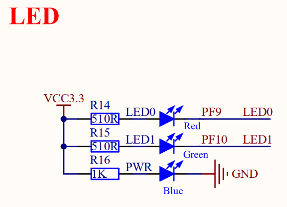
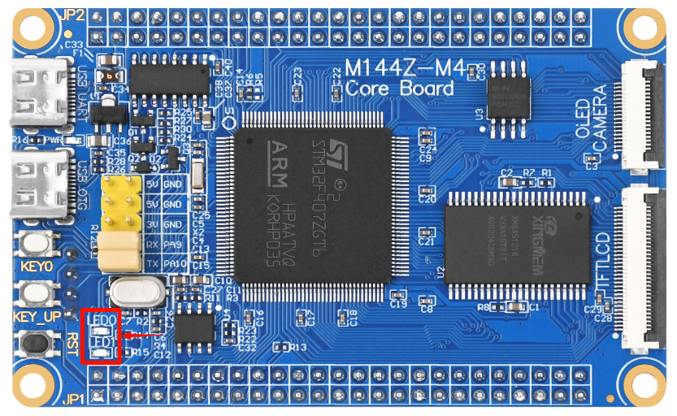
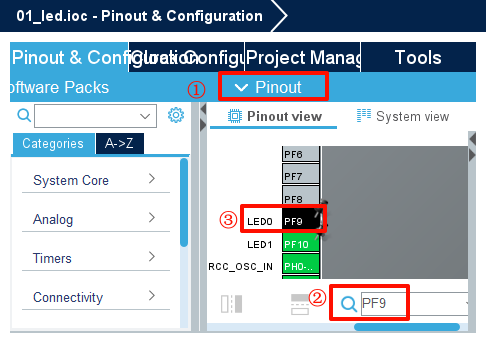
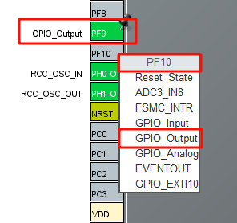
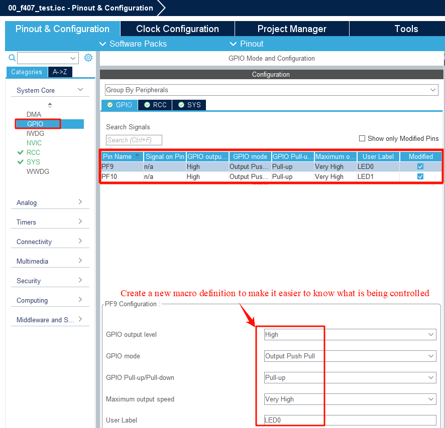
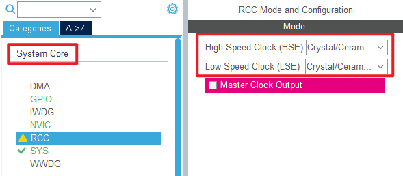
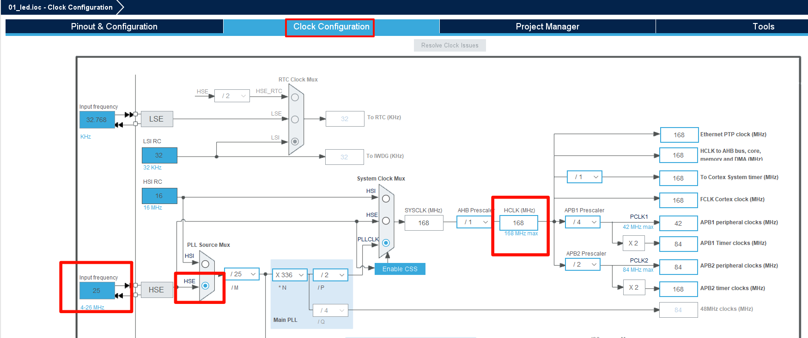
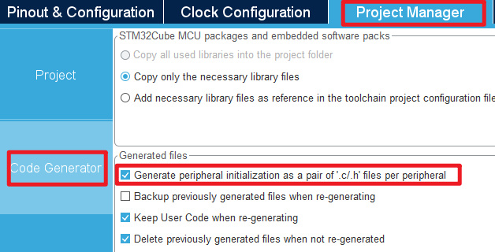
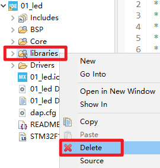

## Led example<a name="catalogue"></a>

### 1 Brief

The main function of this code is to let the onboard LED0 and LED1 blink alternately at a frequency of 500 milliseconds.
### 2 Hardware Hookup
The hardware resources used in this example are:
+ LED0 - PF9
+ LED1 - PF10




Opening the schematic we can see that the LED0 and LED1 pin is connected to the ``PF9`` and ``PF10`` pin of the MCU. The positive terminal of the LED is connected to the voltage positive terminal through the current limiting resistor, while the negative terminal is connected to the pin of the MCU. Therefore, by controlling the PF9 and PF10 pin output low level, the LED can be lit; Output high level, will extinguish the LED.

The position of the LED in the Mini Board is shown as follows:



### 3 STM32CubeIDE Configuration 

In this tutorial, I'll show you how to configure the Led example in STM32CubeIDE. Let's create a STM32CubeIDE project. If you can't do that at this step, check out the [STM32CubeIDE_Usage_Guide](../../1_docs/STM32CubeIDE_Usage_Guide.md) we provided. First, after entering the configuration interface of STM32CubeIDE, enter PF9 in the pin search to find the pin, and click the  ``PF9`` pin.



We click on the PF9 pin that blinks and select ``GPIO_Output`` from the reuse function that pops up.
Similarly, we need to set PF9 as ``GPIO_Output``.




Click **System Core > GPIO** , we can further configure IO.
The working mode of the I/O port is configured in detail here.

``GPIO output level`` is configured to output high level, and the LED state is off after power-on.

``GPIO mode`` is used to set the IO port Output mode to 'Output Push Pull'.

``GPIO Pull-up/Pull-down`` is used to set whether the IO port is pull-up or pull-down or no pull-up. In this experiment, we set it as pull-up.

``Maximum output speed`` is used to set the output speed of the I/O port. We set it to high speed.

``User Label`` is used to set the initial IO port Pin value as our custom macro.



Next configure the clock, first we select the **RCC** option in the **System Core**, here we change to the external crystal/ceramic oscillator.



Enter Modify Clock Settings, in the **Clock Configuration** screen, if the block diagram is blue, it indicates that the clock source is available. If the block diagram is gray, it cannot be used.



Then go to the configuration project format and check the **Generate peripheral initialization as a pair of '.c/.h' files per peripheral** option, so that corresponding.c and.h files can be independently generated. In order not to have the code all piled up in the main.c file, it is also easier to view.



Click **File > Save**, and you will be asked to generate code.Click **Yes**.If you don't know how to generate code here, you can first read the **STM32CubeIDE_Usage_Guide** that we provide.
##### code
Then we added a BSP folder in the file, which stored the led driver file of this example, led.c did not write any content, we only added the relevant macro definition in led.h, here look at the code of led.h.
###### led.h
```c#
/* LED port definition */
#define LED0(x)   do{ x ? \
                      HAL_GPIO_WritePin(LED0_GPIO_Port, LED0_Pin, GPIO_PIN_SET) : \
                      HAL_GPIO_WritePin(LED0_GPIO_Port, LED0_Pin, GPIO_PIN_RESET); \
                    }while(0)      /* turn over LED0 */

#define LED1(x)   do{ x ? \
                      HAL_GPIO_WritePin(LED1_GPIO_Port, LED1_Pin, GPIO_PIN_SET) : \
                      HAL_GPIO_WritePin(LED1_GPIO_Port, LED1_Pin, GPIO_PIN_RESET); \
                    }while(0)      /* turn over LED1 */

/* LED port defined in reverse */
#define LED0_TOGGLE()   do{ HAL_GPIO_TogglePin(LED0_GPIO_Port, LED0_Pin); }while(0) /* turn over LED0 */

#define LED1_TOGGLE()   do{ HAL_GPIO_TogglePin(LED1_GPIO_Port, LED1_Pin); }while(0) /* turn over LED1 */
```
In the above code, it can be seen that when x is 1, ``LED0(1)`` is ``HAL GPIO WritePin(LED0_GPIO_Port, LED0_Pin, GPIO_PIN_SET)``, indicating that the port bit of the LED0 is set to 1, the port LED0 Pin outputs a high level, and the LED0 is off.

When x is 0, ``LED0(0)`` is ``HAL GPIO WritePin(LED0 GPIO Port, LED0 Pin, GPIO PIN RESET)``, indicating that the port bit of the LED0 is set to 0, the port LED0 Pin output is low, and the LED0 is on.

In addition, call the ``HAL_GPIO_TogglePin`` function to invert the state of the pin.

###### main.c
Note that most of **main.c** will be auto-generated by CubeMX, so you only need to worry about the parts between the **/* USER CODE */** guards.
``` c#
int main(void)
{
  /* USER CODE BEGIN 1 */

  /* USER CODE END 1 */

  /* MCU Configuration--------------------------------------------------------*/

  /* Reset of all peripherals, Initializes the Flash interface and the Systick. */
  HAL_Init();

  /* USER CODE BEGIN Init */

  /* USER CODE END Init */

  /* Configure the system clock */
  SystemClock_Config();

  /* USER CODE BEGIN SysInit */

  /* USER CODE END SysInit */

  /* Initialize all configured peripherals */
  MX_GPIO_Init();
  /* USER CODE BEGIN 2 */

  /* USER CODE END 2 */

  /* Infinite loop */
  /* USER CODE BEGIN WHILE */
  while (1)
  {
    LED0(0);     /* turn on LED0 */
    LED1(1);     /* turn off LED1 */
    HAL_Delay(500);
    LED0(1);     /* turn off LED0 */
    LED1(0);     /* turn on LED1 */
    HAL_Delay(500);
    /* USER CODE END WHILE */

    /* USER CODE BEGIN 3 */
  }
  /* USER CODE END 3 */
}
```
### 4 Running
#### 4.1 Compile & Download
After compiling, download the code to the Mini Board with DAP Debugger, if you do not know how to download, see the [STM32CubeIDE_User_Guide](../../1_docs/STM32CubeIDE_Usage_Guide.md) in the Running related chapters.

The structure of the source code here is not quite the same as the code structure generated by our [STM32CubeIDE_User_Guide](../../1_docs/STM32CubeIDE_Usage_Guide.md), because we have optimized the structure of some files here to achieve the purpose of reducing the file size. If you want to modify the.ioc file based on this source code, just regenerate the code after modifying the.ioc file and delete the **libraries** folder, as shown in the following figure:




#### 4.2 Phenomenon
Press the **RESET** button to begin running the program on your Mini Board, observe the actual result of the LED0 and LED1 on the Mini Board. After normal operation, the LED will blink periodically.

[jump to title](#catalogue)


