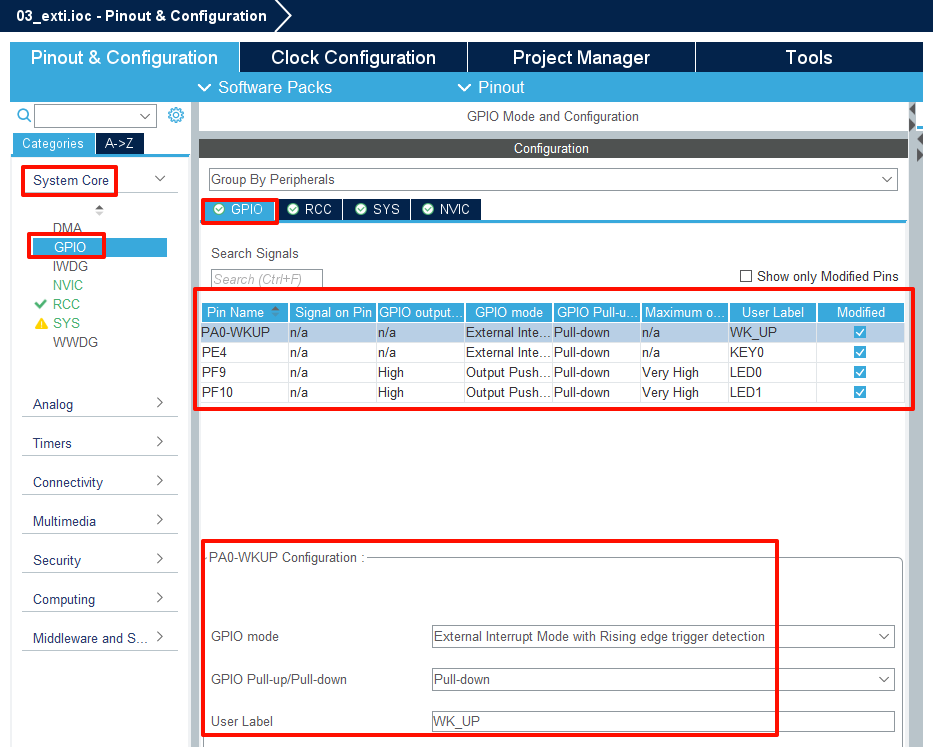

## Exti example<a name="brief"></a>

### 1 Brief
The main function of this code is to make the on-board KEY0 and WKUP control the status of the LED0 and LED1 by an external interrupt.
### 2 Hardware Hookup
The hardware resources used in this example are:
+ LED0 - PF9
+ LED1 - PF10
+ KEY - WKUP(PA0)
+ KEY - KEY0(PE4) 


The hardware is consistent with the *KEY example*, and will not be described in detail here.

### 3 STM32CubeIDE Configuration

Let's copy the project from the previous chapter and name both the project and the.ioc file **03_exti**. Next we start the EXTI configuration by double-clicking the **03_exti.ioc** file.

We need to reconfigure the IO mode of PA0 and PE4 pins in the previous chapter to ``GPIO_EXTI0`` and ``GPIO_EXTI4``, as shown in the following figure:


The following is the working mode of GPIO, and the specific configuration is shown in the figure below:



Then we configure the following in the **System > NVIC** option:


Click **File > Save**, and you will be asked to generate code.Click **Yes**.

##### code
Then we add this exti driver file *exti.c/exti.h* under the BSP folder, the detailed code of exti.h is not shown here, you can open our source code to see, here show the code of exti.c.
###### exti.c
```c#
void HAL_GPIO_EXTI_Callback(uint16_t GPIO_Pin)
{
    delay_ms(20);              /* delay 20ms to eliminate chattering */
    switch (GPIO_Pin)
    {
        case KEY0_Pin:
            if (KEY0 == 1)
            {
                LED1_TOGGLE(); /* LED1 state is flipped */
            }
            break;
        case WK_UP_Pin:
            if (WK_UP == 1)
            {
                LED0_TOGGLE(); /* LED0 state is flipped */
            }
            break;
    }
}
```
``HAL_GPIO_EXTI_Callback`` is a weak interface and we have rewritten this function to implement the true external interrupt control logic. Inside the function, by judging the IO pin to determine the interrupt is from which IO port, that is, which interrupt line, and then write the corresponding control logic.

First delay 20 milliseconds to eliminate the shake, and then judge the level of the key, if it is high, it means that one of the keys is pressed, and the LED state is flipped once.

###### main.c
Back in main.c, change the code to the following:
```c#
int main(void)
{
  /* USER CODE BEGIN 1 */

  /* USER CODE END 1 */

  /* MCU Configuration--------------------------------------------------------*/

  /* Reset of all peripherals, Initializes the Flash interface and the Systick. */
  HAL_Init();

  /* USER CODE BEGIN Init */

  /* USER CODE END Init */

  /* Configure the system clock */
  SystemClock_Config();

  /* USER CODE BEGIN SysInit */

  /* USER CODE END SysInit */

  /* Initialize all configured peripherals */
  MX_GPIO_Init();
  /* USER CODE BEGIN 2 */

  /* USER CODE END 2 */

  /* Infinite loop */
  /* USER CODE BEGIN WHILE */
  while (1)
  {
    HAL_Delay(10);           /* delay 10ms */
    /* USER CODE END WHILE */

    /* USER CODE BEGIN 3 */
  }
  /* USER CODE END 3 */
}
```

### 4 Running
#### 4.1 Compile & Download
After the compilation is complete, connect the DAP and the Mini Board, and then connect to the computer together to download the program to the Mini Board.
#### 4.2 Phenomenon
Press the **RESET** button to begin running the program on your Mini Board, and observe that the LED on the Mini Board is off. At this time, press the WKUP or KEY0 button, you can see the state of the LED flip.

[jump to title](#brief)


