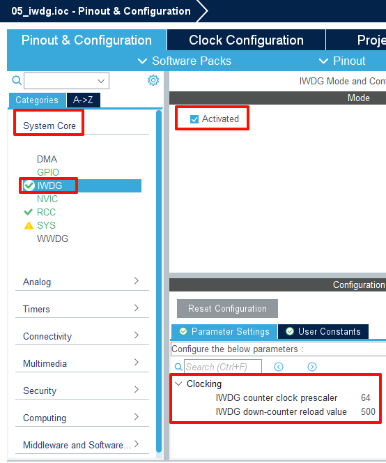

## Iwdg example<a name="brief"></a>

### 1 Brief
In this program, the Mini Board's on-board LED0 flashes due to continuous reset. If the WKUP button is pressed to feed the dog, the reset will not be triggered and the LED0 will remain on.If the WKUP key is not pressed to feed the dog beyond the watchdog's overflow time (1000 ms), a reset is triggered and the LED0 is extinguished once.
### 2 Hardware Hookup
The hardware resources used in this example are:
+ LED0 - PB5
+ LED1 - PE5
+ KEY - WKUP(PA0)
+ IWDG

The independent watchdog used in this example is the on-chip resource of STM32F103, so there is no corresponding connection schematic diagram.

### 3 STM32CubeIDE Configuration

Let's copy the project from **04_uart** and name both the project and the.ioc file **05_iwdg**. Next we start the IWDG configuration by double-clicking the **05_iwdg.ioc** file.

First, click **System Core->IWDG**, and the configuration is as follows:



Click **File > Save**, and you will be asked to generate code.Click **Yes**.

##### code
In the initialization code generated in this example, we modify the two files *iwdg.c and iwdg.h*. iwdg.h is just a function declaration that will not be shown here, let's look at the iwdg.c file.
###### iwdg.c
```c#
void iwdg_feed(void)
{
  HAL_IWDG_Refresh(&hiwdg);   /* Reload the counter */
}
```
In this file, we add the iwdg feed function to feed the dog, inside which we simply call the HAL library function ``HAL_IWDG_Refresh``.

###### main.c
Change main.c to the following:
```c#
int main(void)
{
  /* USER CODE BEGIN 1 */

  /* USER CODE END 1 */

  /* MCU Configuration--------------------------------------------------------*/

  /* Reset of all peripherals, Initializes the Flash interface and the Systick. */
  HAL_Init();

  /* USER CODE BEGIN Init */

  /* USER CODE END Init */

  /* Configure the system clock */
  SystemClock_Config();

  /* USER CODE BEGIN SysInit */

  /* USER CODE END SysInit */

  /* Initialize all configured peripherals */
  MX_GPIO_Init();
  MX_IWDG_Init();
  MX_USART1_UART_Init();
  /* USER CODE BEGIN 2 */
  HAL_Delay(100);             /* delay 100ms */
  LED0(0);                    /* turn on LED0 */
  /* USER CODE END 2 */

  /* Infinite loop */
  /* USER CODE BEGIN WHILE */
  while (1)
  {
    if (key_scan(0) == WKUP_PRES)      /* If WK_UP is pressed, the dog is fed. */
    {
      iwdg_feed();                     /* feed the dog */
    }

    HAL_Delay(10);                     /* delay 10ms */
    /* USER CODE END WHILE */

    /* USER CODE BEGIN 3 */
  }
  /* USER CODE END 3 */
}
```
In the while loop, determine whether the WKUP button is pressed, if it is, feed the dog, if it is not, delay 10 milliseconds, and continue the above operation.When the key is not detected after 1 second, the IWDG will generate a reset signal, and the system will reset. You can see that the LED0 will be extinguished once due to the system reset, and then on again.On the contrary, when the button WKUP is pressed, and WKUP is pressed again within 1 second, the dog will be fed in time, the system will not reset, and the LED0 will not flash.


### 4 Running
#### 4.1 Compile & Download
After the compilation is complete, connect the DAP and the Mini Board, and then connect to the computer together to download the program to the Mini board.
#### 4.2 Phenomenon
Press the **RESET** button to begin running the program on your Mini Board, observe that the LED0 on the Mini board is constantly flashing, proving that the system is constantly reset. At this time, we try to press the WKUP button repeatedly, and you can see that the LED0 will be on.

[jump to title](#brief)