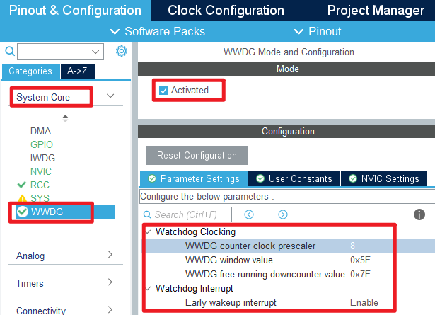
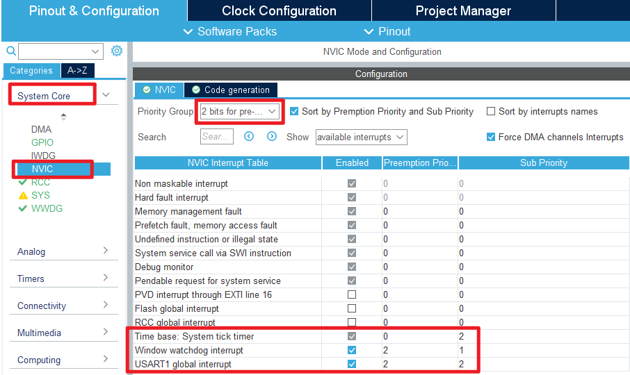

## Wwdg example<a name="brief"></a>

### 1 Brief
The function of this program is to turn on LED0 for 300 milliseconds, then turn it off, and then enter a dead loop, waiting for the WWDG interrupt. In the WWDG interrupt service function, the watchdog is fed, and LED1 keeps flashing.
### 2 Hardware Hookup
The hardware resources used in this example are:
+ LED0 - PB5
+ LED1 - PE5
+ USART1 - PA9\PA10
+ WWDG

The WWDG used in this example is the on-chip resource of STM32F103, so there is no corresponding connection schematic diagram.

### 3 STM32CubeIDE Configuration

We copy the project from **04_uart** and name both the project and the.ioc file **06_wwdg**. Next we start the WWDG configuration by double-clicking the **06_wwdg.ioc** file.

First, click **System Core > WWDG**, and the configuration is as follows:



The configuration of the NVIC is shown below:



Click **File > Save**, and you will be asked to generate code.Click **Yes**.

##### code
###### wwdg.c
We added an interrupt callback function to the initialization code, as follows:
```c#
void HAL_WWDG_EarlyWakeupCallback(WWDG_HandleTypeDef *hwwdg)
{
    HAL_WWDG_Refresh(hwwdg);      /* Update the window watchdog value. */
    LED1_TOGGLE();                /* Feeding the dog successfully. */
}
```
From the code above, in the interrupt service function, we feed the watchdog and make LED1 continuously flash to indicate that feeding the watchdog is successful.

###### main.c
Change main.c to the following:
```c#
int main(void)
{
  /* USER CODE BEGIN 1 */

  /* USER CODE END 1 */

  /* MCU Configuration--------------------------------------------------------*/

  /* Reset of all peripherals, Initializes the Flash interface and the Systick. */
  HAL_Init();

  /* USER CODE BEGIN Init */

  /* USER CODE END Init */

  /* Configure the system clock */
  SystemClock_Config();

  /* USER CODE BEGIN SysInit */

  /* USER CODE END SysInit */

  /* Initialize all configured peripherals */
  MX_GPIO_Init();
  MX_USART1_UART_Init();
  MX_WWDG_Init();
  /* USER CODE BEGIN 2 */
  LED0(0);
  HAL_Delay(300);
  /* USER CODE END 2 */

  /* Infinite loop */
  /* USER CODE BEGIN WHILE */
  while (1)
  {
    LED0(1);                 /* turn off LED */
    /* USER CODE END WHILE */

    /* USER CODE BEGIN 3 */
  }
  /* USER CODE END 3 */
}
```


### 4 Running
#### 4.1 Compile & Download
After the compilation is complete, connect the DAP and the Mini Board, and then connect to the computer together to download the program to the Mini Board.
#### 4.2 Phenomenon
Press the **RESET** button to begin running the program on your Mini Board. Observe that the LED0 on the Mini Board will light up and turn off once, and LED1 keeps flashing, indicating that the WWDG feeding dog has been normally executed.


[jump to title](#brief)

