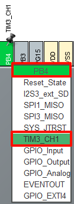
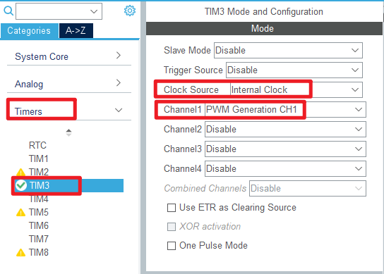
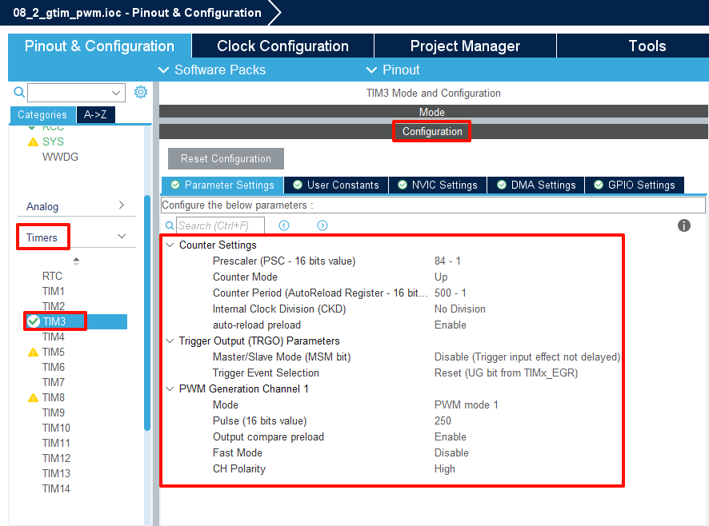
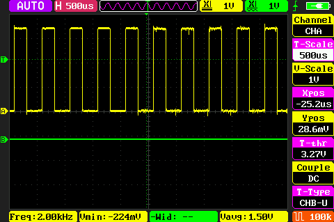

## General-purpose timer PWM output example<a name="brief"></a>

### 1 Brief
The function of this program is to use the  general-purpose timer 3 channel 1 multiplexing pin PB4 output PWM, you can use an oscilloscope connected to the PB4 pin to observe the continuously changing PWM duty cycle.
### 2 Hardware Hookup
The hardware resources used in this example are:
+ LED0 - PB5
+ LED1 - PE5
+ USART1 - PA9\PA10
+ TIM3 - channel1(PB4)

The TIM3 used in this example is the on-chip resource of STM32F103, so there is no corresponding connection schematic diagram.

### 3 STM32CubeIDE Configuration


We copy the project from **04_uart** and name both the project and the.ioc file **08_2_gtim_pwm**. Next we start the GTIM configuration by double-clicking the **08_2_gtim_pwm.ioc** file.

First, we multiplexed the PB4 pin into TIM3_CH1, as shown below.



Click **Timers->TIM3** and configure as shown in the following figure.



The red box above indicates that the internal clock is selected and the PWM waveform is generated by channel 1. The other options are left at the default Settings.

The **Parameter Settings** are as follows.



Click **File > Save**, and you will be asked to generate code.Click **Yes**.

##### code
We add some code to the tim.c file's initialization function ``MX_TIM3_Init``, as follows:
###### tim.c
```c#
  /* USER CODE BEGIN TIM3_Init 2 */
  HAL_TIM_PWM_Start(&htim3, TIM_CHANNEL_1);  /* Open the corresponding PWM channel */
  /* USER CODE END TIM3_Init 2 */
```
The above function ``HAL_TIM_PWM_Start`` is used to enable TIM3 and enable the TIM3_CH1 output of the PWM channel.

###### main.c
The comparison value of TIM3_CH1 is constantly changed in the while loop of the main function, the specific code is as follows.
```c#
int main(void)
{
  /* USER CODE BEGIN 1 */
  uint16_t compare = 0;
  uint8_t counter = 0;
  /* USER CODE END 1 */

  /* MCU Configuration--------------------------------------------------------*/

  /* Reset of all peripherals, Initializes the Flash interface and the Systick. */
  HAL_Init();

  /* USER CODE BEGIN Init */

  /* USER CODE END Init */

  /* Configure the system clock */
  SystemClock_Config();

  /* USER CODE BEGIN SysInit */

  /* USER CODE END SysInit */

  /* Initialize all configured peripherals */
  MX_GPIO_Init();
  MX_USART1_UART_Init();
  MX_TIM3_Init();
  /* USER CODE BEGIN 2 */

  /* USER CODE END 2 */

  /* Infinite loop */
  /* USER CODE BEGIN WHILE */
  while (1)
  {
     HAL_Delay(10);     /* delay 10ms */

     if (compare++ >= 300)
     {
         compare = 100;
     }
      __HAL_TIM_SET_COMPARE(&htim3, TIM_CHANNEL_1, compare);
      /* Modify the comparison value to control the duty cycle */

     if (counter++ == 20)
     {
        counter = 0;
        LED0_TOGGLE();
     }

    /* USER CODE END WHILE */

    /* USER CODE BEGIN 3 */
  } 
  /* USER CODE END 3 */
}
```
The above program changes the comparison value of TIM3_CH1 in the loop to achieve the purpose of changing the PWM duty cycle. 


### 4 Running
#### 4.1 Compile & Download
After the compilation is complete, connect the DAP and the Mini Board, and then connect to the computer together to download the program to the Mini Board.
#### 4.2 Phenomenon
Press the **RESET** button to begin running the program on your Mini Board.Through the oscilloscope connected to the PB4 pin to observe the continuously changing PWM duty cycle.



[jump to title](#brief)

