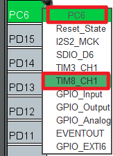
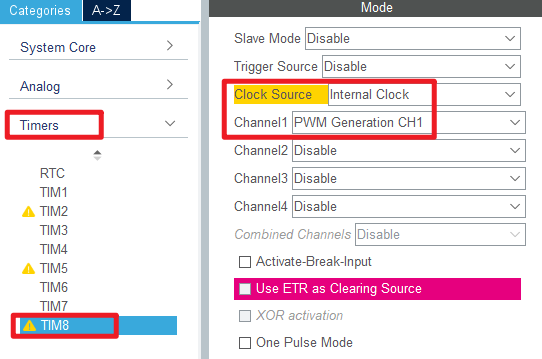

## Advanced timer output a specified number of PWM example<a name="brief"></a>

### 1 Brief
The function of this code is to press the KEY0 button to control TIM8 to output 5 PWM pulses through the PC6 pin.
### 2 Hardware Hookup
The hardware resources used in this example are:
+ LED0 - PB5
+ LED1 - PE5
+ KEY - KEY0(PE5)
+ USART1 - PA9\PA10
+ TIM8 - channel1(PC6)
+ ALIENTEK DS100 oscilloscope

The TIM8 used in this example is the on-chip resource of STM32F103, so there is no corresponding connection schematic diagram.

### 3 STM32CubeIDE Configuration

Let's copy the project from **04_uart** and name both the project and the.ioc file **09_1_atim_npwm**. Next we start the ATIM configuration by double-clicking the **09_1_atim_npwm.ioc** file.

First we multiplex the PA11 pin into TIM8_CH1 as shown below.



Click **Timers > TIM8** and configure as shown in the following figure.



Click **Timers > TIM8 > Parameter Settings** .


The timer update interrupt is used in this example, so the NVIC configuration is as follows:


Click **File > Save**, and you will be asked to generate code.Click **Yes**.

##### code
We add some code to the tim.c file's initialization function ``MX_TIM8_Init``, as follows:
###### tim.c
```c#
  /* USER CODE BEGIN TIM8_Init 2 */
  HAL_TIM_PWM_Start(&htim8, TIM_CHANNEL_1);   /* Open the corresponding PWM channel. */
  /* USER CODE END TIM8_Init 2 */
```
The above function ``HAL_TIM_PWM_Start`` is used to start the PWM output of TIM8_channel 1.

We also add some functions, like this:
```c#
/**
 * @brief   The advanced timer TIMX NPWM sets the number of PWMS
 * @param   npwm:The number of PWMS, 1~2^32
 * @retval  None.
 */
void atim_timx_npwm_chy_set(uint32_t npwm)
{
    if (npwm == 0) return;

    g_npwm_remain = npwm;                                  /* Save the number of pulses */
    __HAL_TIM_ENABLE_IT(&htim8, TIM_IT_UPDATE);            /* When the data is modified, the update is allowed to interrupt. */
    HAL_TIM_GenerateEvent(&htim8, TIM_EVENTSOURCE_UPDATE); /* An update event is generated and the pulse output is processed inside the interrupt. */
    __HAL_TIM_ENABLE(&htim8);                              /* Enable TIMX */
}

/**
  * @brief  Period elapsed callback in non-blocking mode
  * @param  htim TIM handle
  * @retval None
  */
void HAL_TIM_PeriodElapsedCallback(TIM_HandleTypeDef *htim)
{
  uint16_t npwm = 0;
  if (g_npwm_remain >= 256)           /* There are also more than 256 pulses to be sent. */
  {
    g_npwm_remain = g_npwm_remain - 256;
    npwm = 256;
  }
  else if (g_npwm_remain % 256)       /* There are still bits (less than 256) of pulses to send. */
  {
    npwm = g_npwm_remain % 256;
    g_npwm_remain = 0;                /* There's no pulse. */
  }

  if (npwm)                           /* There's a pulse to send */
  {
    TIM8->RCR = npwm - 1;             /* The value of the repeat count register is set to npwm-1, which means npwm pulses */
    HAL_TIM_GenerateEvent(&htim8, TIM_EVENTSOURCE_UPDATE); /* An update event is generated and the pulse output is processed inside the interrupt */
    __HAL_TIM_ENABLE(&htim8);                              /* Enable TIMX */
  }
  else
  {
    TIM8->CR1 &= ~(1 << 0);           /* close TIM8 */
  }
}
```
The function ``atim_timx_npwm_chy_set`` is used to set the number of PWM waves to send.

The function ``HAL_TIM_PeriodElapsedCallback`` is the update interrupt callback function. Since the double count register of advanced timers is only valid for the lower octs, special handling is needed in cases where more than 255 PWMS need to be generated. Subsequently, the number of PWMS that need to be generated is decremented by 1 and written to the double-count register of TIM8. Since a new value written to the double-count register takes effect only when the next update event occurs, an update event needs to be generated manually. Finally, enable TIM8 to continuously output PWM. An update interrupt is triggered when the value of the double count register reaches 0. In the update interrupt service function, the advanced timer is turned off if the specified number of PWMS has been output.

###### main.c
Your finished main() function should look like the following:
```c
int main(void)
{
  /* USER CODE BEGIN 1 */
  uint8_t key = 0;
  uint8_t t = 0;
  /* USER CODE END 1 */

  /* MCU Configuration--------------------------------------------------------*/

  /* Reset of all peripherals, Initializes the Flash interface and the Systick. */
  HAL_Init();

  /* USER CODE BEGIN Init */

  /* USER CODE END Init */

  /* Configure the system clock */
  SystemClock_Config();

  /* USER CODE BEGIN SysInit */

  /* USER CODE END SysInit */

  /* Initialize all configured peripherals */
  MX_GPIO_Init();
  MX_USART1_UART_Init();
  MX_TIM8_Init();
  /* USER CODE BEGIN 2 */
  stm32f103ve_show_mesg();
  atim_timx_npwm_chy_set(5);       /* Five PWM waves are output. */
  /* USER CODE END 2 */

  /* Infinite loop */
  /* USER CODE BEGIN WHILE */
  while (1)
  {
    key = key_scan(0);             /* scan key */

    if (key == KEY0_PRES)          /* KEY0 is pressed */
    {
       atim_timx_npwm_chy_set(5);  /* Control TIM8_CH1 output 5 PWM pulses. */
    }

    if (t > 20)                    /* Enter once in 200ms. */
    {
       t = 0;
       LED0_TOGGLE();              /* LED0 blinks to prompt the program to run */
    }
    t++;
    HAL_Delay(10);                 /* delay 10ms */
    /* USER CODE END WHILE */

    /* USER CODE BEGIN 3 */
  }
  /* USER CODE END 3 */
}
```
For the previous configuration, we have set the PWM frequency to 2Hz. After initializing TIM8, it outputs 5 PWM waves, and scans the key repeatedly. If KEY0 is pressed, it outputs 5 PWM waves.


### 4 Running
#### 4.1 Compile & Download
After the compilation is complete, connect the DAP and the Mini Board, and then connect to the computer together to download the program to the Mini Board.
#### 4.2 Phenomenon
Press the **RESET** button to begin running the program on your Mini Board, observe the LED0 flashing on the Mini Board, indicating that the code download is successful. At this time, it can be observed that the PC6 pin outputs five PWM signals with a frequency of 2Hz and a duty cycle of 50% by means of an oscilloscope or an external LED.


[jump to title](#brief)

