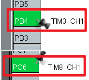

## Advanced timer PWM input example<a name="brief"></a>
### 1 Brief
The function of this program is to capture the PWM output of TIM3_channel_1(PB4) with TIM8 channel_1(PC6), and the result is output through the serial port code.
### 2 Hardware Hookup
The hardware resources used in this example are:
+ TIM8 - channel1(PC6)
+ TIM3 - channel1(PB4)
+ USART1 - PA9\PA10

The TIM8 used in this example is the on-chip resource of STM32F103, so there is no corresponding connection schematic diagram.

### 3 STM32CubeIDE Configuration


We copy the project from  **04_uart** and name both the project and the.ioc file **09_4_atim_pwm_in**. Next we start the ATIM configuration by double-clicking the **09_4_atim_pwm_in.ioc** file.

First, we will configure the pin as shown below:



Click **Timers > TIM3** and configure as shown in the following figure.


Click **Timers > TIM8** and configure as shown in the following figure.


Click **Timers > TIM8 > Parameter Settings** .


The update interrupt and input capture interrupt are used in this experiment. The configuration of NVIC is shown in the following figure:


Click **File > Save**, and you will be asked to generate code.Click **Yes**.

##### code
We add some code to the tim.c file's initialization function ``MX_TIM8_Init``, as follows:
###### tim.c
```c#
  /* USER CODE BEGIN TIM8_Init 2 */
  __HAL_TIM_ENABLE_IT(&htim8, TIM_IT_UPDATE);
  HAL_TIM_IC_Start_IT(&htim8, TIM_CHANNEL_1);
  HAL_TIM_IC_Start_IT(&htim8, TIM_CHANNEL_2);
  /* USER CODE END TIM8_Init 2 */
```
The above code is used to enable the update interrupt and turn on the input capture of TIM8 channels 1 and 2 as well as the capture interrupt.

Next is ``MX_TIM3_Init``, the initializer for TIM3, with the following code:
```c#
  /* USER CODE BEGIN TIM3_Init 2 */
  HAL_TIM_PWM_Start(&htim3, TIM_CHANNEL_1);  /* Open the corresponding PWM channel */
  /* USER CODE END TIM3_Init 2 */
```
The above code is used to enable the output of the PWM.

Then we added two separate functions as follows.
```c#
/* USER CODE BEGIN 1 */

/*
 * @brief  Timer TIMX PWM input mode restarts capture.
 * @param  None.
 * @retval None.
 */
void atim_timx_pwmin_chy_restart(void)
{
  __ASM volatile("cpsid i");                      /* Turn off interrupt */

  g_timxchy_pwmin_sta = 0;                        /* Reset the state and start the detection again. */
  g_timxchy_pwmin_psc = 0;                        /* The frequency division coefficient is cleared to zero. */

  __HAL_TIM_SET_PRESCALER(&htim8, 0);             /* It is collected at the maximum counting frequency to get the best accuracy. */
  __HAL_TIM_SET_COUNTER(&htim8, 0);               /* Clear counter */

  __HAL_TIM_ENABLE_IT(&htim8, TIM_IT_CC1);        /* Enable channel 1 to capture the interrupt */
  __HAL_TIM_ENABLE_IT(&htim8, TIM_IT_UPDATE);     /* Enable overflow interrupts */
  __HAL_TIM_ENABLE(&htim8);                       /* Enable TIMX */

  TIM8->SR = 0;                                   /* Clear all interrupt flags. */

  __ASM volatile("cpsie i");                      /* Open interrupts */
}

/*
 * @brief  Timer TIMX channel Y PWM input mode interrupt handler function
 * @param  None.
 * @retval None.
 */
void atim_timx_pwmin_chy_process(void)
{
  static uint8_t sflag = 0;                   /* Start PWMIN input detection flag. */

  if (g_timxchy_pwmin_sta)
  {
    g_timxchy_pwmin_psc = 0;
    TIM8->SR = 0;                             /* Clear all interrupt flags. */
    __HAL_TIM_SET_COUNTER(&htim8, 0);         /* Clear counter */
    return ;
  }

  if (__HAL_TIM_GET_FLAG(&htim8, TIM_FLAG_UPDATE))        /* An overflow interrupt has occurred. */
  {
    __HAL_TIM_CLEAR_FLAG(&htim8, TIM_FLAG_UPDATE);        /* Clear the overflow interrupt mark. */

    if (__HAL_TIM_GET_FLAG(&htim8, TIM_FLAG_CC1) == 0)    /* No cycle capture interruption occurred and the capture was not completed */
    {
      sflag = 0;
      if (g_timxchy_pwmin_psc == 0)
      {
        g_timxchy_pwmin_psc ++;
      }
      else
      {
        if (g_timxchy_pwmin_psc == 65535)                 /* It's already Max. It's probably a no-input state */
        {
          g_timxchy_pwmin_psc = 0;                        /* Restore the frequency */
        }
        else if (g_timxchy_pwmin_psc > 32767)             /* It's at its maximum. */
        {
          g_timxchy_pwmin_psc = 65535;                    /* It is directly equal to the maximum frequency division coefficient. */
        }
        else
        {
          g_timxchy_pwmin_psc += g_timxchy_pwmin_psc;     /* double */
        }
      }

      __HAL_TIM_SET_PRESCALER(&htim8, g_timxchy_pwmin_psc); /* Set the timer predivision coefficient */
      __HAL_TIM_SET_COUNTER(&htim8, 0);                     /* Clear counter */
      TIM8->SR = 0;                                         /* Clear all interrupt flags */
      return ;
    }
  }

  if (sflag == 0)                 /* First acquisition to capture interrupt */
  {
    if (__HAL_TIM_GET_FLAG(&htim8, TIM_FLAG_CC1))           /* The first cycle capture interruption was detected */
    {
      sflag = 1;                  /* Mark that the first cycle has been captured and the second cycle capture can begin */
    }

    TIM8->SR = 0;                 /* Clear all interrupt flags */
    return ;                      /* Complete the operation */
  }

  if (g_timxchy_pwmin_sta == 0)   /* No capture yet */
  {
    if (__HAL_TIM_GET_FLAG(&htim8, TIM_FLAG_CC1))         /* A cycle capture interrupt has been detected */
    {
      g_timxchy_pwmin_hval = HAL_TIM_ReadCapturedValue(&htim8, TIM_CHANNEL_2) + 1; /* High level pulse width capture value */
      g_timxchy_pwmin_cval = HAL_TIM_ReadCapturedValue(&htim8, TIM_CHANNEL_1) + 1; /* Periodic capture value */

      if (g_timxchy_pwmin_hval < g_timxchy_pwmin_cval)    /* The high level pulse width must be smaller than the cycle length */
      {
        g_timxchy_pwmin_sta = 1;                          /* Mark capture successful */

        g_timxchy_pwmin_psc = TIM8->PSC;                  /* Obtain the PWM input frequency division coefficients */

        if (g_timxchy_pwmin_psc == 0)                     /* When the divider coefficient is 0, correct the read data */
        {
          g_timxchy_pwmin_hval++;                         /* The correction factor is 1, plus 1 */
          g_timxchy_pwmin_cval++;                         /* The correction factor is 1, plus 1 */
        }

        sflag = 0;
        /* After each capture PWM input is successful,
         * the capture is stopped to avoid frequent interrupts
         * affecting the normal code operation of the system */
        TIM8->CR1  &= ~(1 << 0);                      /* Turn off TIMX */
        __HAL_TIM_DISABLE_IT(&htim8, TIM_IT_CC1);     /* Turn off channel 1 to capture the interrupt */
        __HAL_TIM_DISABLE_IT(&htim8, TIM_IT_CC2);     /* Turn off channel 2 to capture the interrupt */
        __HAL_TIM_DISABLE_IT(&htim8, TIM_IT_UPDATE);  /* Turn off overflow interrupts. */

         TIM8->SR = 0;                                /* Clear all interrupt flags. */
      }
      else
      {
        atim_timx_pwmin_chy_restart();
      }
    }
  }

  TIM8->SR = 0;                                       /* Clear all interrupt flags. */
}
/* USER CODE END 1 */

```
The ``atim_timx_pwmin_chy_restart`` function first turns off all interrupts, then sets some status flags to zero, enabling related interrupts and clearing them.

The ``atim_timx_pwmin_chy_process`` function contains the interrupt capture and update process. If it is the first time to capture the rising edge, we set the sflag to position 1, then clear all the interrupt bits, and wait for the next capture interrupt to occur. if the capture interrupt happens again, it will take you to the ``if (g_timxchy_pwmin_sta == 0)`` code. The CCR1 and CCR2 register values are captured by the ``HAL_TIM_ReadCapturedValue`` function. This obtained register value +1 is the corresponding counter number.

###### stm32f1xx_it.c
In this interrupt file, we modify the ``TIM8_UP_IRQHandler`` and ``TIM8_CC_IRQHandler`` functions as follows:
```c#
void TIM8_UP_IRQHandler(void)
{
  /* USER CODE BEGIN TIM8_UP_IRQn 0 */
  atim_timx_pwmin_chy_process();
  /* USER CODE END TIM8_UP_IRQn 0 */
  HAL_TIM_IRQHandler(&htim8);
  /* USER CODE BEGIN TIM8_UP_IRQn 1 */

  /* USER CODE END TIM8_UP_IRQn 1 */
}

/**
  * @brief This function handles TIM8 capture compare interrupt.
  */
void TIM8_CC_IRQHandler(void)
{
  /* USER CODE BEGIN TIM8_CC_IRQn 0 */
  atim_timx_pwmin_chy_process();
  /* USER CODE END TIM8_CC_IRQn 0 */
  HAL_TIM_IRQHandler(&htim8);
  /* USER CODE BEGIN TIM8_CC_IRQn 1 */

  /* USER CODE END TIM8_CC_IRQn 1 */
}
```

##### main.c
To output the PWM signal information in the while loop of the main function, the code is as follows:
```c#
int main(void)
{
  /* USER CODE BEGIN 1 */
  uint8_t t = 0;
  float ht, ct, f, tpsc;
  /* USER CODE END 1 */

  /* MCU Configuration--------------------------------------------------------*/

  /* Reset of all peripherals, Initializes the Flash interface and the Systick. */
  HAL_Init();

  /* USER CODE BEGIN Init */

  /* USER CODE END Init */

  /* Configure the system clock */
  SystemClock_Config();

  /* USER CODE BEGIN SysInit */

  /* USER CODE END SysInit */

  /* Initialize all configured peripherals */
  MX_GPIO_Init();
  MX_USART1_UART_Init();
  MX_TIM3_Init();
  MX_TIM8_Init();
  /* USER CODE BEGIN 2 */

  /* USER CODE END 2 */

  /* Infinite loop */
  /* USER CODE BEGIN WHILE */
  while (1)
  {
      t++;
      HAL_Delay(10);  /* delay 10ms */

      if (t >= 20)    /* The results are output every 200ms, and the LED0 is blinked to prompt the program to run. */
      {
          if (g_timxchy_pwmin_sta)    /* The data is captured once */
          {
              printf("\r\n");                                     /* The output is blank, and another line begins */
              printf("PWM PSC  :%u\r\n", g_timxchy_pwmin_psc);    /* Print the frequency division coefficients */
              printf("PWM Hight:%lu\r\n", g_timxchy_pwmin_hval);  /* Print high level pulse width */
              printf("PWM Cycle:%lu\r\n", g_timxchy_pwmin_cval);  /* Print cycle */

              tpsc = ((double)g_timxchy_pwmin_psc + 1) / 72;      /* The PWM sampling clock cycle time is obtained */
              ht = g_timxchy_pwmin_hval * tpsc;                   /* Calculate the high level time */
              ct = g_timxchy_pwmin_cval * tpsc;                   /* Calculating cycle length */
              f = (1 / ct) * 1000000;                             /* Calculated rate */

              printf("PWM Hight time:%.3fus\r\n", ht);            /* Print high level pulse width length */
              printf("PWM Cycle time:%.3fus\r\n", ct);            /* Print cycle time length */
              printf("PWM Frequency :%.3fHz\r\n", f);             /* Print frequency */

              atim_timx_pwmin_chy_restart();                      /* Restart PWM input detection */
          }

          LED0_TOGGLE();                                          /* LED0 blinks to indicate that the program is running */
          t = 0;
      }
    /* USER CODE END WHILE */

    /* USER CODE BEGIN 3 */
  }
  /* USER CODE END 3 */
}
```
In the preceding code, when the initialization is complete, it waits for the capture success flag in the advanced timer interrupt function to be true.After the capture is successful, the serial debugging assistant outputs the high level time, PWM cycle length, and frequency of the PWM input signal.


### 4 Running
#### 4.1 Compile & Download
After the compilation is complete, connect the DAP and the Mini Board, and then connect to the computer together to download the program to the Mini Board.
#### 4.2 Phenomenon
Press the **RESET** button to begin running the program on your Mini Board, open the serial port debugging assistant will print the example information, indicating that the program has been downloaded successfully.We need to connect **PC6** and **PB4** pins with a dupont wire. The example phenomenon is shown as follows:


[jump to title](#brief)
