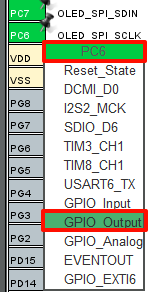

## OLED example<a name="brief"></a>

### 1 Brief
In this code we will use the OLED interface on the Mini Board's baseboard to illuminate the OLED and implement functions such as displaying ASCII characters and colors.
### 2 Hardware Hookup
The hardware resources used in this example are:
+ LED0 - PF9
+ ALIENTEK 0.96 inch OLED module

The connection of this interface to the onboard MCU is shown in the schematic diagram below:


### 3 STM32CubeIDE Configuration

We copy the project from  **04_uart** and name both the project and the.ioc file **10_oled**. Next we start the OLED configuration by double-clicking the **10_oled.ioc** file.

At the **Pinout & Configuration** section, start configuring the required IO for the OLED, as shown in the following figure:



Click **System Core->GPIO**, and since we have already explained in detail the steps for configuring the IO ports and clock settings earlier, we will not repeat the previous steps here. Let's directly look at the results of the IO configuration:


Next, enable the pins used by the OLED to correspond one by one with the schematic diagram, that is, check them all.


Click **File > Save**, and you will be asked to generate code.Click **Yes**.

##### code
Create a new folder named OLED, then create four files within the OLED folder: oled.c, oled.h, and oledfont.h.

###### oled.h
```c#
#define OLED_RST(x)                 do { (x) ?                                                                      \
                                        HAL_GPIO_WritePin(OLED_SPI_RST_PORT, OLED_SPI_RST_PIN, GPIO_PIN_SET):       \
                                        HAL_GPIO_WritePin(OLED_SPI_RST_PORT, OLED_SPI_RST_PIN, GPIO_PIN_RESET);     \
                                    } while (0)

#define OLED_CS(x)                  do { (x) ?                                                                      \
                                        HAL_GPIO_WritePin(OLED_SPI_CS_PORT, OLED_SPI_CS_PIN, GPIO_PIN_SET):         \
                                        HAL_GPIO_WritePin(OLED_SPI_CS_PORT, OLED_SPI_CS_PIN, GPIO_PIN_RESET);       \
                                    } while (0)

#define OLED_RS(x)                  do { (x) ?                                                                      \
                                        HAL_GPIO_WritePin(OLED_SPI_RS_PORT, OLED_SPI_RS_PIN, GPIO_PIN_SET):         \
                                        HAL_GPIO_WritePin(OLED_SPI_RS_PORT, OLED_SPI_RS_PIN, GPIO_PIN_RESET);       \
                                    } while (0)

#define OLED_SCLK(x)                do { (x) ?                                                                      \
                                        HAL_GPIO_WritePin(OLED_SPI_SCLK_PORT, OLED_SPI_SCLK_PIN, GPIO_PIN_SET):     \
                                        HAL_GPIO_WritePin(OLED_SPI_SCLK_PORT, OLED_SPI_SCLK_PIN, GPIO_PIN_RESET);   \
                                    } while (0)

#define OLED_SDIN(x)                do { (x) ?                                                                      \
                                        HAL_GPIO_WritePin(OLED_SPI_SDIN_PORT, OLED_SPI_SDIN_PIN, GPIO_PIN_SET):     \
                                        HAL_GPIO_WritePin(OLED_SPI_SDIN_PORT, OLED_SPI_SDIN_PIN, GPIO_PIN_RESET);   \
                                    } while (0)

/* OLED 8080 parallel port mode pin operation definition */
#define OLED_WR(x)                  do { (x) ?                                                                      \
                                        HAL_GPIO_WritePin(GPIOA, GPIO_PIN_4, GPIO_PIN_SET):                         \
                                        HAL_GPIO_WritePin(GPIOA, GPIO_PIN_4, GPIO_PIN_RESET);                       \
                                    } while (0)

#define OLED_RD(x)                  do { (x) ?                                                                      \
                                        HAL_GPIO_WritePin(GPIOB, GPIO_PIN_11, GPIO_PIN_SET):                        \
                                        HAL_GPIO_WritePin(GPIOB, GPIO_PIN_11, GPIO_PIN_RESET);                      \
                                    } while (0)

/* Command/data definition */
#define OLED_CMD    0   /* write command */
#define OLED_DATA   1   /* write data */
```
The above are some IO operation functions, as well as macro definitions for writing commands and data for the OLED. The purpose of these will not be repeated here, so please read the code to understand them.

###### oled.c

First is the OLED initialization function, and we deployed its related IO configuration in the gpio.c file. Therefore, this initialization function mainly implements some initialization sequences, which we can do according to the information provided by the manufacturer. It is worth noting that because OLED is without backlight, after initialization, we cleared all the display memory. Therefore, we cannot see any content on the screen, just like it is not powered on. Do not think that this is an initialization failure. The data module needs to be written in order to display the content.

```c#

void oled_init(void)
{
	OLED_CS(1);
	OLED_RS(1);
	
	OLED_RST(0);
	delay_ms(100);
	OLED_RST(1);
	
	oled_wr_byte(0xAE, OLED_CMD);    /* Turn off display */
	oled_wr_byte(0xD5, OLED_CMD);    /* Set clock division factor and oscillator frequency */
	oled_wr_byte(0x50, OLED_CMD);    /* [3:0]: Division factor; [7:4]: Oscillator frequency */
	oled_wr_byte(0xA8, OLED_CMD);    /* Set multiplex ratio */
	oled_wr_byte(0x3F, OLED_CMD);    /* Default 0x3F (1/64) */
	oled_wr_byte(0xD3, OLED_CMD);    /* Set display offset */
	oled_wr_byte(0x00, OLED_CMD);    /* Default to 0 */
	oled_wr_byte(0x40, OLED_CMD);    /* Set display start line, [5:0]: Line number */
	oled_wr_byte(0x8D, OLED_CMD);    /* Set charge pump */
	oled_wr_byte(0x14, OLED_CMD);    /* bit2: On/Off */
	oled_wr_byte(0x20, OLED_CMD);    /* Set memory addressing mode */
	oled_wr_byte(0x02, OLED_CMD);    /* [1:0]: 00: Column addressing mode; 01: Row addressing mode; 10: Page addressing mode, default 10 */
	oled_wr_byte(0xA1, OLED_CMD);    /* Set segment re-map, bit0: 0: 0->0; 1: 0->127 */
	oled_wr_byte(0xC8, OLED_CMD);    /* Set COM scan direction, bit3: 0: Normal mode; 1: Remapped mode COM[N-1]->COM0, N: Multiplex ratio */
	oled_wr_byte(0xDA, OLED_CMD);    /* Set COM hardware pin configuration */
	oled_wr_byte(0x12, OLED_CMD);    /* [5:4]: Configuration */
	oled_wr_byte(0x81, OLED_CMD);    /* Set contrast control */
	oled_wr_byte(0xEF, OLED_CMD);    /* 1~255, default 0x7F (brightness setting, larger value for brighter) */
	oled_wr_byte(0xD9, OLED_CMD);    /* Set pre-charge period */
	oled_wr_byte(0xF1, OLED_CMD);    /* [3:0]: PHASE 1; [7:4]: PHASE 2; */
	oled_wr_byte(0xDB, OLED_CMD);    /* Set VCOMH voltage multiplier */
	oled_wr_byte(0x30, OLED_CMD);    /* [6:4]: 000: 0.65*vcc; 001: 0.77*vcc; 011: 0.83*vcc */
	oled_wr_byte(0xA4, OLED_CMD);    /* Enable global display, bit0: 1: On; 0: Off (White screen/Black screen) */
	oled_wr_byte(0xA6, OLED_CMD);    /* Set display mode, bit0: 1: Reverse display; 0: Normal display */
	oled_wr_byte(0xAF, OLED_CMD);    /* Turn on display */
	oled_clear();                    /* Clear screen */
}

#endif
```

Next, what we need to introduce is the **oled_refresh_gram** function that updates the display memory to the OLED. The function's purpose is to refresh the values of the two-dimensional array **g_oled_gram** defined in our program to the display memory (GRAM) of the OLED at once. At the beginning of the oled.c file, we have defined the following two-dimensional array:

```c#

/* 
 * OLED video memory
 * Each byte represents 8 pixels, 128 means there are 128 columns, 8 means there are 64 rows, and the high bit means the high number of rows.
 * For example: g_oled_gram[0][0], which contains the first column, rows 1 through 8, and g_oled_gram[0][0].0, which represents the coordinate (0,0).
 * Similarly: g_oled_gram[1][0].1 for the coordinate (1,1), and g_oled_gram[10][1].2 for the coordinate (10,10).
 * 
 * The format is as follows (high bits indicate high rows)
 * [0]0 1 2 3 ... 127
 * [1]0 1 2 3 ... 127
 * [2]0 1 2 3 ... 127
 * [3]0 1 2 3 ... 127
 * [4]0 1 2 3 ... 127
 * [5]0 1 2 3 ... 127
 * [6]0 1 2 3 ... 127
 * [7]0 1 2 3 ... 127
 */
static uint8_t g_oled_gram[128][8];

#endif
```
The values of this array correspond one-to-one with the OLED display memory (GRAM) values. During operation, we only need to modify the value of this array first, and then use the **oled_refresh_gram** function to refresh the entire array's values to the OLED's GRAM at once. The function **oled_refresh_gram** is defined as follows:

```c#

/**
 * @brief  updates video memory to OLED
 * @param  None
 * @retval None
 */
void oled_refresh_gram(void)
{
    uint8_t i;
    uint8_t n;
    
    for (i=0; i<8; i++)
    {
        oled_wr_byte(0xB0 + i, OLED_CMD);   /* Set page address (0-7) */
        oled_wr_byte(0x00, OLED_CMD);       /* Set display location - column low address */
        oled_wr_byte(0x10, OLED_CMD);       /* Set display location - column high address */
        for (n=0; n<128; n++)
        {
            oled_wr_byte(g_oled_gram[n][i], OLED_DATA);
        }
    }
}

#endif
```

The **oled_refresh_gram** function first sets the page address, then writes the column address (i.e., the vertical coordinate), and proceeds to write 128 bytes starting from 0 to fill the page. Finally, it loops through writing the content of 8 pages, achieving the complete copy from STM32 memory to OLED memory.

The following is the function for writing commands:

```c#

#if (OLED_MODE == 1)    /* OLED uses 8080 parallel port mode */

/**
 * @brief   outputs an 8-bit data to the OLED using a patchwork method
 * @param   data : The data to output
 * @retval  None
 */
static void oled_data_out(uint8_t data)
{
    GPIOC->ODR &= ~(0xF << 6);                          /* GPIOC[9:6] Reset */
    GPIOC->ODR |= ((uint16_t)data & 0xF) << 6;          /* data[3:0] --> GPIOC[9:6] */
    
    GPIOC->ODR &= ~(0x1 << 11);                         /* GPIOC[11] Reset */
    GPIOC->ODR |= ((uint16_t)(data >> 4) & 0x1) << 11;  /* data[4] --> GPIOC[11] */
    
    GPIOB->ODR &= ~(0x1 << 6);                          /* GPIOB[6] Reset */
    GPIOB->ODR |= ((uint16_t)(data >> 5) & 0x1) << 6;   /* data[5] --> GPIOB[6] */
    
    GPIOB->ODR &= ~(0x3 << 8);                          /* GPIOB[9:8] Reset */
    GPIOB->ODR |= ((uint16_t)(data >> 6) & 0x3) << 8;   /* data[7:6] --> GPIOB[9:8] */
}

/**
 * @brief   writes a byte to the OLED
 * @param   data : The data to output
 * @param   cmd  : command/data flag
 * @arg     OLED_CMD: command
 * @arg     OLED_DATA: Data
 * @retval  None
 */
static void oled_wr_byte(uint8_t data, uint8_t cmd)
{
    oled_data_out(data);
    OLED_RS(cmd);
    OLED_CS(0);
    OLED_WR(0);
    OLED_WR(1);
    OLED_CS(1);
    OLED_RS(1);
}

#else   /* The OLED uses a 4-wire SPI mode */

/**
 * @brief   writes a byte to the OLED
 * @param   data : The data to output
 * @param   cmd  : command/data flag
 * @arg     OLED_CMD: command
 * @arg     OLED_DATA: Data
 * @retval  none
 */
static void oled_wr_byte(uint8_t data, uint8_t cmd)
{
    uint8_t i;
    
    OLED_RS(cmd);
    OLED_CS(0);
    
    for (i=0; i<8; i++)
    {
        OLED_SCLK(0);
        if ((data & 0x80) != 0)
        {
            OLED_SDIN(1);
        }
        else
        {
            OLED_SDIN(0);
        }
        OLED_SCLK(1);
        data <<= 1;
    }
    
    OLED_CS(1);
    OLED_RS(1);
}

#endif

#endif
```
It is worth noting that we use conditional compilation here because our module supports both 8080 parallel mode and four-wire SPI mode. In order to accommodate both modes, we utilize conditional compilation to handle the different configurations.

###### main.c
Your finished main() function should look like the following:
```c#
int main(void)
{
  /* USER CODE BEGIN 1 */
    uint8_t t = ' ';
  /* USER CODE END 1 */

  /* MCU Configuration--------------------------------------------------------*/

  /* Reset of all peripherals, Initializes the Flash interface and the Systick. */
  HAL_Init();

  /* USER CODE BEGIN Init */

  /* USER CODE END Init */

  /* Configure the system clock */
  SystemClock_Config();

  /* USER CODE BEGIN SysInit */
  delay_init(168);
  /* USER CODE END SysInit */

  /* Initialize all configured peripherals */
  MX_GPIO_Init();
  MX_USART1_UART_Init();
  /* USER CODE BEGIN 2 */

  oled_init();                        				/* Initialize OLED */

  oled_show_string(0, 0, "ALIENTEK", 24);
  oled_show_string(0, 24, "0.96' OLED TEST", 16);
  oled_show_string(0, 40, "ATOM 2024/04/10", 12);
  oled_show_string(0, 52, "ASCII:", 12);
  oled_show_string(64, 52, "CODE:", 12);
  oled_refresh_gram();                            /* Update video memory to OLED */

  /* USER CODE END 2 */

  /* Infinite loop */
  /* USER CODE BEGIN WHILE */
  while (1)
  {
    /* USER CODE END WHILE */

      oled_show_char(36, 52, t, 12, 1);           /* Display ASCII characters */
      oled_show_num(94, 52, t, 3, 12);            /* Displays the code value of an ASCII character */
      oled_refresh_gram();                        /* Update video memory to OLED */

      if (++t > '~')
      {
          t = ' ';
      }

      LED0_TOGGLE();
      HAL_Delay(500);  								/* delay 500ms */

    /* USER CODE BEGIN 3 */
  }
  /* USER CODE END 3 */
}
```

### 4 Running
#### 4.1 Compile & Download
After the compilation is complete, connect the DAP and the Mini Board, and then connect to the computer together to download the program to the Mini Board.
#### 4.2 Phenomenon
Press the **RESET** button to begin running the program on your Mini Board, observe the LED0 flashing on the Mini Board, indicating that the code download is successful. Connecting the OLED module and the Mini Board, the phenomenon is shown as follows. 


[jump to title](#brief)