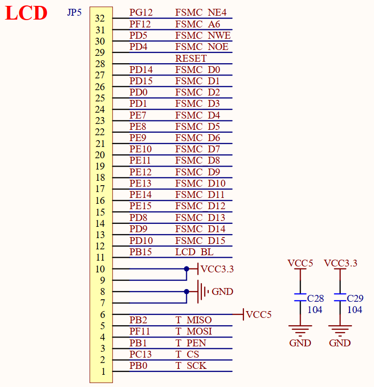
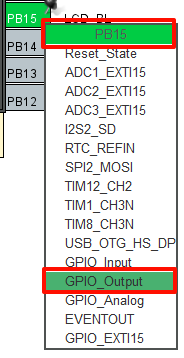
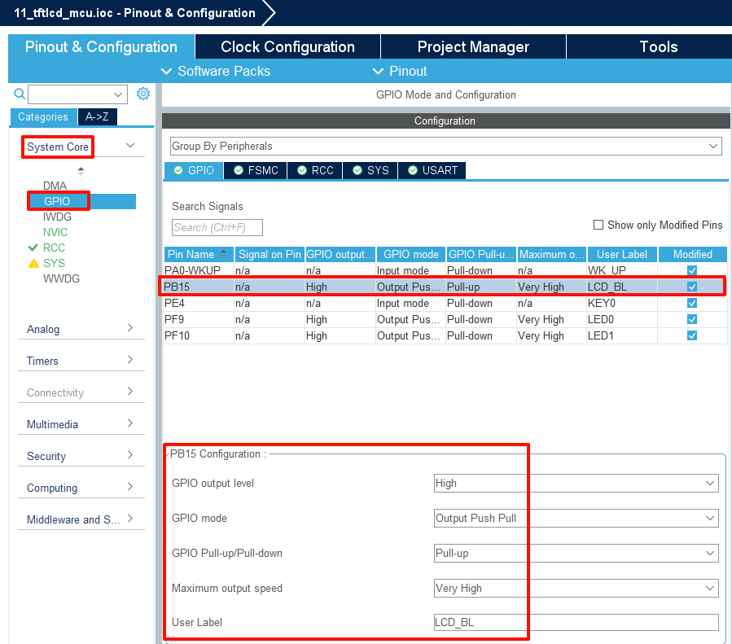
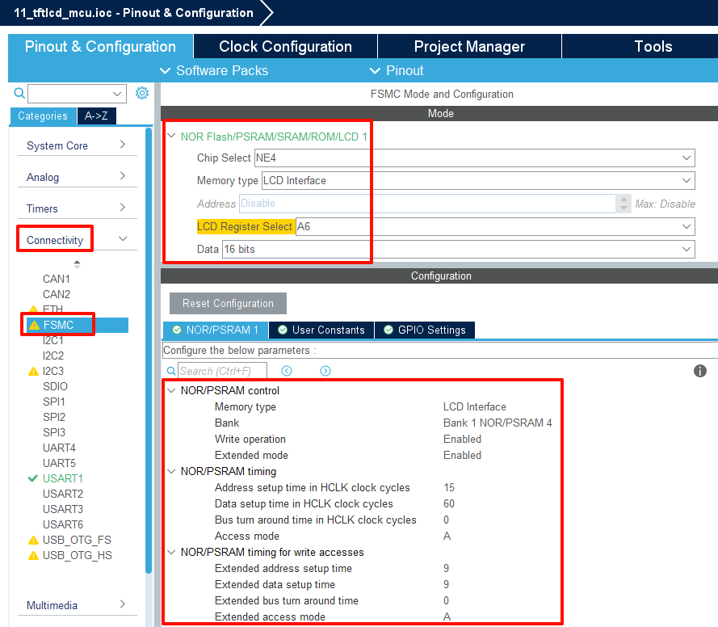
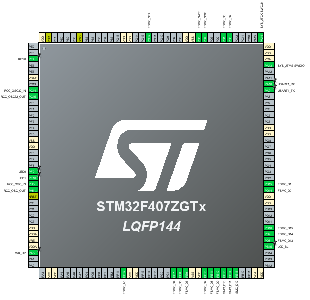

## TFTLCD example<a name="brief"></a>

### 1 Brief
In this code we will use the TFTLCD interface on the Mini Board's baseboard to illuminate the TFTLCD and implement functions such as displaying ASCII characters and colors.
### 2 Hardware Hookup
The hardware resources used in this example are:
+ LED0 - PF9
+ ALIENTEK  2.8/3.5/4.3/7 inch TFTLCD module

The connection of this interface to the onboard MCU is shown in the schematic diagram below:



### 3 STM32CubeIDE Configuration

We copy the project from  **04_uart** and name both the project and the.ioc file **11_tftlcd_mcu**. Next we start the TFTLCD_MCU configuration by double-clicking the **11_tftlcd_mcu.ioc** file.

At the **Pinout & Configuration** section, configure the backlight pin **PB15** for the LCD, as shown in the following figure:



Click **System Core->GPIO**, and config the PB0.



Next, configure the parameters of the FSMC in **Connectivity->FSMC**.



Next, enable the pins used by the LCD to correspond one by one with the schematic diagram, that is, check them all.



Click **File > Save**, and you will be asked to generate code.Click **Yes**.

##### code
Create a new folder named LCD, then create four files within the LCD folder: lcd.c, lcd.h, lcd_ex.c, and lcdfont.h.

###### lcd.h
```c#
#define LCD_FSMC_NEX         4              /* When FSMC_NE4 is connected to LCD_CS, the value range can only be: 1~4 */
#define LCD_FSMC_AX          10             /* Use FSMC_A10 connected to LCD_RS, the value range is: 0 ~ 25 */

/* LCD important parameter set */
typedef struct
{
    uint16_t width;     /* LCD width */
    uint16_t height;    /* LCD height */
    uint16_t id;        /* LCD ID */
    uint8_t dir;        /* Landscape or portrait control: 0, portrait; 1. Landscape. */
    uint16_t wramcmd;   /* Start writing gram instructions */
    uint16_t setxcmd;   /* Set the x-coordinate command */
    uint16_t setycmd;   /* Set the y-coordinate command */
} _lcd_dev;
```
The above is a structure ``_lcd_dev`` in lcd.h, which is used to store some important parameter information of the LCD. There are also some variable declarations and details can be viewed by opening the code.

###### lcd.c
We focus on the following LCD functions, as follows:
```c#
/**
 * @brief   Initialize LCD
 * @note    This initialization function can initialize various types of LCD
 * @param   None.
 * @retval  None.
 */
void lcd_init(void)
{
    HAL_Delay(50);
    
    /* Try a read of 9341 ID */
    lcd_wr_regno(0xD3);
    lcddev.id = lcd_rd_data();                                                              /* dummy read */
    lcddev.id = lcd_rd_data();                                                              /* Read to 0X00 */
    lcddev.id = lcd_rd_data() << 8;                                                         /* Read 0X93 */
    lcddev.id |= lcd_rd_data();																/* Read 0X41 */
    if (lcddev.id != 0x9341)																/* Not 9341, try to see if it's ST7789 */
    {
        lcd_wr_regno(0x04);
        lcddev.id = lcd_rd_data();                                                          /* dummy read */
        lcddev.id = lcd_rd_data();                                                          /* Read to 0X85 */
        lcddev.id = lcd_rd_data() << 8;                                                     /* Read 0X85 */
        lcddev.id |= lcd_rd_data();                                                         /* Read 0X52 */
        if (lcddev.id == 0x8552)                                                            /* Convert the ID of 8552 to 7789 */
        {
            lcddev.id = 0x7789;
        }
        if (lcddev.id != 0x7789)                                                            /* Also not ST7789, try not NT35310 */
        {
            lcd_wr_regno(0xD4);
            lcddev.id = lcd_rd_data();                                                      /* dummy read */
            lcddev.id = lcd_rd_data();                                                      /* Read back 0x01 */
            lcddev.id = lcd_rd_data() << 8;                                                 /* Read back 0x53 */
            lcddev.id |= lcd_rd_data();                                                     /* Read back 0x10 */
            if (lcddev.id != 0x5310)                                                        /* Also not NT35310, try to see if it is ST7796 */
            {
            	 /* Send key (provided by manufacturer) */
                lcd_write_reg(0xF000, 0x0055);
                lcd_write_reg(0xF001, 0x00AA);
                lcd_write_reg(0xF002, 0x0052);
                lcd_write_reg(0xF003, 0x0008);
                lcd_write_reg(0xF004, 0x0001);
                
                lcd_wr_regno(0xC500);
                lcddev.id = lcd_rd_data() << 8;                                             /* Read the lower eight bits of the ID */
                lcd_wr_regno(0xC501);
                lcddev.id |= lcd_rd_data();                                                 /* Read back 0x55 */
                HAL_Delay(5);
                if (lcddev.id != 0x5510)                                                   	/* Read the high eight bits of the ID */
                {
                    lcd_wr_regno(0xA1);
                    lcddev.id = lcd_rd_data();
                    lcddev.id = lcd_rd_data() << 8;                                         /* Read back 0x57 */
                    lcddev.id |= lcd_rd_data();                                             /* Read back 0x61 */
                    if (lcddev.id == 0x5761)                                                /* The ID read back by SSD1963 is 5761H, which we force to be 1963 for convenience */
                    {
                        lcddev.id = 0x1963;
                    }
                }
            }
        }
    }
    
    if (lcddev.id == 0x7789)
    {
        lcd_ex_st7789_reginit();                                                            /* Perform ST7789 initialization */
    }
    else if (lcddev.id == 0x9341)
    {
        lcd_ex_ili9341_reginit();                                                           /* Perform ILI9341 initialization */
    }
    else if (lcddev.id == 0x5310)
    {
        lcd_ex_nt35310_reginit();                                                           /* Perform NT35310 initialization */
    }
    else if (lcddev.id == 0x5510)
    {
        lcd_ex_nt35510_reginit();                                                           /* Perform ST7796 initialization */
    }
    else if (lcddev.id == 0x1963)
    {
        lcd_ex_ssd1963_reginit();                                                           /* Perform SSD1963 initialization */
        lcd_ssd_backlight_set(100);                                                         /* The backlight is set to its brightest */
    }
    
    if ((lcddev.id == 0x9341) || (lcddev.id == 0x1963) || (lcddev.id == 0x7789))            /* 9341/1963/7789 */
    {
    	ExtTiming.AddressSetupTime = 3;
    	ExtTiming.DataSetupTime = 3;
        FSMC_NORSRAM_Extended_Timing_Init(hsram1.Extended, &ExtTiming, hsram1.Init.NSBank, hsram1.Init.ExtendedMode);
    }
    else if ((lcddev.id == 0x5310) || (lcddev.id == 0x5510))                                /* 5310/5510 */
    {
    	ExtTiming.AddressSetupTime = 2;
    	ExtTiming.DataSetupTime = 2;
        FSMC_NORSRAM_Extended_Timing_Init(hsram1.Extended, &ExtTiming, hsram1.Init.NSBank, hsram1.Init.ExtendedMode);
    }
    
    lcd_display_dir(0); /* Portrait is the default */
    LCD_BL(1);          /* Light up the backlight */
    lcd_clear(WHITE);
}

/**
 * @brief   LCD write data
 * @param   data: data to be written
 * @retval  None
 */
void lcd_wr_data(volatile uint16_t data)
{
    data = data;
    LCD->LCD_RAM = data;
}

/**
 * @brief   LCD write register number/address function
 * @param   regno: register number/address
 * @retval  None
 */
void lcd_wr_regno(volatile uint16_t regno)
{
    regno = regno;
    LCD->LCD_REG = regno;   /* Writes the register sequence number to be written */
}

/**
 * @brief   LCD write register function
 * @param   regno: register number/address
 * @param   data: data to be written
 * @retval  None
 */
void lcd_write_reg(uint16_t regno, uint16_t data)
{
    LCD->LCD_REG = regno;   /* Writes the register sequence number to be written */
    LCD->LCD_RAM = data;    /* Write in data */
}

/**
 * @brief   LCD delay function
 * @param   i: The value of the delay.
 * @retval  None
 */
static void lcd_opt_delay(uint32_t i)
{
    while (i--);
}

/**
 * @brief   LCD read register function
 * @param   None.
 * @retval  The data read
 */
static uint16_t lcd_rd_data(void)
{
    volatile uint16_t ram;
    ram = LCD->LCD_RAM;
    return ram;
}

/**
 * @brief   LCD ready to write GRAM
 * @param   None.
 * @retval  None.
 */
void lcd_write_ram_prepare(void)
{
    LCD->LCD_REG = lcddev.wramcmd;
}
```
First is the LCD initialization function, which executes different code based on the model of the control IC, thus improving the overall versatility of the program. Following are some read and write functions for the LCD.

###### main.c
Your finished main() function should look like the following:
```c#
int main(void)
{
  /* USER CODE BEGIN 1 */
  uint8_t x = 0;
  uint8_t lcd_id[12];
  /* USER CODE END 1 */

  /* MCU Configuration--------------------------------------------------------*/

  /* Reset of all peripherals, Initializes the Flash interface and the Systick. */
  HAL_Init();

  /* USER CODE BEGIN Init */

  /* USER CODE END Init */

  /* Configure the system clock */
  SystemClock_Config();

  /* USER CODE BEGIN SysInit */

  /* USER CODE END SysInit */

  /* Initialize all configured peripherals */
  MX_GPIO_Init();
  MX_USART1_UART_Init();
  MX_FSMC_Init();
  /* USER CODE BEGIN 2 */

  lcd_init();                                         /* Initialize LCD */
  sprintf((char *)lcd_id, "LCD ID:%04X", lcddev.id);  /* Print the LCD ID to the lcd id array */
  /* USER CODE END 2 */

  /* Infinite loop */
  /* USER CODE BEGIN WHILE */
  while (1)
  {
    switch (x)
    {
      case 0:lcd_clear(WHITE);break;
      case 1:lcd_clear(BLACK);break;
      case 2:lcd_clear(BLUE);break;
      case 3:lcd_clear(RED);break;
      case 4:lcd_clear(MAGENTA);break;
      case 5:lcd_clear(GREEN);break;
      case 6:lcd_clear(CYAN);break;
      case 7:lcd_clear(YELLOW);break;
      case 8:lcd_clear(BRRED);break;
      case 9:lcd_clear(GRAY);break;
      case 10:lcd_clear(LGRAY);break;
      case 11:lcd_clear(BROWN);break;
    }

    lcd_show_string(10, 40, 240, 32, 32, "STM32", RED);
    lcd_show_string(10, 80, 240, 24, 24, "TFTLCD TEST", RED);
    lcd_show_string(10, 110, 240, 16, 16, "ATOM@ALIENTEK", RED);
    lcd_show_string(10, 130, 240, 16, 16, (char *)lcd_id, RED); /* Display LCD ID */
    x++;

    if (x == 12)
    {
       x = 0;
    }

    LED0_TOGGLE();          /* flashing LED0 indicates that the system is running */
    HAL_Delay(1000);        /* delay 1000ms */
    /* USER CODE END WHILE */

    /* USER CODE BEGIN 3 */
  }
  /* USER CODE END 3 */
}
```

### 4 Running
#### 4.1 Compile & Download
After the compilation is complete, connect the DAP and the Mini Board, and then connect to the computer together to download the program to the Mini Board.
#### 4.2 Phenomenon
After completing the compilation and burning operations, first disconnect the power supply to the development board. Then, connect the TFTLCD module to the development board through the LCD adapter board. Finally, power up the development board. Please note that it is necessary to disconnect the power when plugging or unplugging connectors and modules on the development board to avoid hardware damage. After running the program, you will see relevant information of this experiment displayed on the LCD. Additionally, the background color on the LCD will switch every 1000 milliseconds.

[jump to title](#brief)