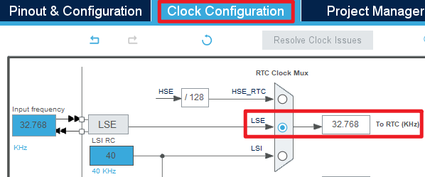
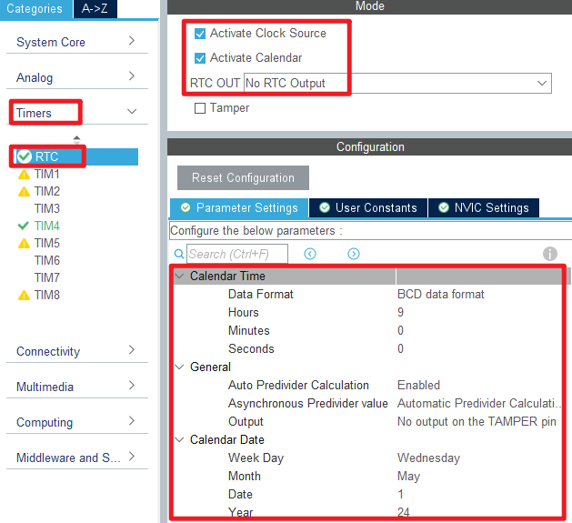
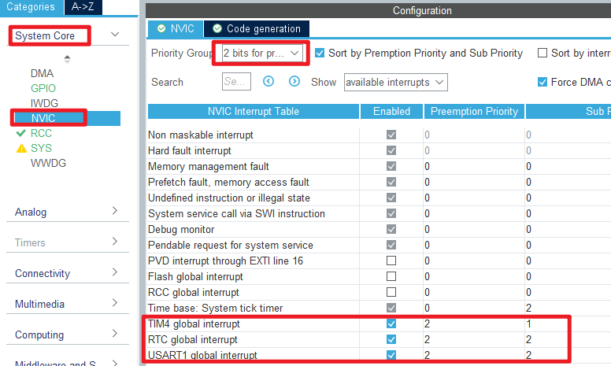

## RTC example<a name="brief"></a>

### 1 Brief
The function of this code is to generate an RTC wake-up interrupt every second.
### 2 Hardware Hookup
The hardware resources used in this example are:
+ LED0 - PF9
+ LED1 - PF10
+ USART1 - PA9/PA10
+ RTC
+ ALIENTEK  2.8/3.5/4.3/7 inch TFTLCD module

The RTC used in this example is the on-chip resource of STM32F407, so there is no corresponding connection schematic.

### 3 STM32CubeIDE Configuration


Let's copy the project from  **12_usmart** and name both the project and the.ioc file **13_rtc**. Next we start the RTC configuration by double-clicking the **13_rtc.ioc** file.

First click **Clock Configuration** and set it as shown below.



Open **Timers > RTC** as shown below.



Open **NVIC** configuration as shown below.



Click **File > Save**, and you will be asked to generate code.Click **Yes**.

##### code
###### rtc.c
We added a lot of code to rtc.c, so you can open the source code to have a look, but here are the important ones:
```c#
/**
 * @brief   Set RTC time information
 * @param   hour: Hour
 * @param   minute: Minute
 * @param   second: Second
 * @param   ampm: AM/PM
 *            - 0: AM
 *            - 1: PM
 * @retval  Setting result
 *            - 0: Success
 *            - 1: Failure
 */
uint8_t rtc_set_time(uint8_t hour, uint8_t minute, uint8_t second, uint8_t ampm)
{
    RTC_TimeTypeDef rtc_time_struct = {0};

    rtc_time_struct.Hours = hour;
    rtc_time_struct.Minutes = minute;
    rtc_time_struct.Seconds = second;
    rtc_time_struct.TimeFormat = ampm;
    rtc_time_struct.DayLightSaving = RTC_DAYLIGHTSAVING_NONE;
    rtc_time_struct.StoreOperation = RTC_STOREOPERATION_RESET;
    if (HAL_RTC_SetTime(&hrtc, &rtc_time_struct, RTC_FORMAT_BIN) != HAL_OK)
    {
        return 1;
    }

    return 0;
}
```
The preceding function is used to set a time.We input a time that will be used as a baseline for subsequent calculations.

```c#
/**
 * @brief   Get RTC time information
 * @param   hour: Hour
 * @param   minute: Minute
 * @param   second: Second
 * @param   ampm: AM/PM
 *            - 0: AM
 *            - 1: PM
 * @retval  None
 */
void rtc_get_time(uint8_t *hour, uint8_t *minute, uint8_t *second, uint8_t *ampm)
{
    RTC_TimeTypeDef rtc_time_struct = {0};

    HAL_RTC_GetTime(&hrtc, &rtc_time_struct, RTC_FORMAT_BIN);

    *hour = rtc_time_struct.Hours;
    *minute = rtc_time_struct.Minutes;
    *second = rtc_time_struct.Seconds;
    *ampm = rtc_time_struct.TimeFormat;
}
```
The above functions are used to obtain the time and are simple encapsulations of the RTC driver in the HAL library.

###### main.c
Add some codes between the /* USER CODE */ guards as follow:
```c#
int main(void)
{
  /* USER CODE BEGIN 1 */

    uint8_t t = 0;
    char tbuf[40];
    uint8_t hour, minute, second, ampm;
    uint8_t year, month, date, week;

  /* USER CODE END 1 */

  /* MCU Configuration--------------------------------------------------------*/

  /* Reset of all peripherals, Initializes the Flash interface and the Systick. */
  HAL_Init();

  /* USER CODE BEGIN Init */

  /* USER CODE END Init */

  /* Configure the system clock */
  SystemClock_Config();

  /* USER CODE BEGIN SysInit */
  delay_init(168);
  /* USER CODE END SysInit */

  /* Initialize all configured peripherals */
  MX_GPIO_Init();
  MX_USART1_UART_Init();
  MX_FSMC_Init();
  MX_TIM4_Init();
  MX_RTC_Init();
  /* USER CODE BEGIN 2 */

  lcd_init();

  lcd_show_string(30, 50, 200, 16, 16, "STM32", RED);
  lcd_show_string(30, 70, 200, 16, 16, "RTC TEST", RED);
  lcd_show_string(30, 90, 200, 16, 16, "ATOM@ALIENTEK", RED);

  /* USER CODE END 2 */

  /* Infinite loop */
  /* USER CODE BEGIN WHILE */
  while (1)
  {
    /* USER CODE END WHILE */
      if ((t % 10) == 0)
      {
          /* Get RTC time information */
          rtc_get_time(&hour, &minute, &second, &ampm);
          sprintf(tbuf, "Time:%02d:%02d:%02d", hour, minute, second);
          lcd_show_string(30, 120, 210, 16, 16, tbuf, RED);

          /* Get RTC date information */
          rtc_get_date(&year, &month, &date, &week);
          sprintf(tbuf, "Date:20%02d-%02d-%02d", year, month, date);
          lcd_show_string(30, 140, 210, 16, 16, tbuf, RED);
          sprintf(tbuf, "Week:%d", week);
          lcd_show_string(30, 160, 210, 16, 16, tbuf, RED);
      }

      if (++t == 20)
      {
          t = 0;
          LED0_TOGGLE();
      }

	  HAL_Delay(10);
    /* USER CODE BEGIN 3 */
  }
  /* USER CODE END 3 */
}
```

###### usmart_port.c
In order to facilitate the call verification of RTC-related functions, **usmart_nametab** is modified in this file as follows:
```c#
struct _m_usmart_nametab usmart_nametab[] =
{
#if USMART_USE_WRFUNS == 1      /* If read and write operations are enabled */
    (void *)read_addr, "uint32_t read_addr(uint32_t addr)",
    (void *)write_addr, "void write_addr(uint32_t addr,uint32_t val)",
#endif

    (void *)rtc_set_time, "uint8_t rtc_set_time(uint16_t year, uint8_t month, uint8_t date, uint8_t hour, uint8_t minute, uint8_t second)",
    (void *)rtc_set_alarm, "void rtc_set_alarm(uint8_t week, uint8_t hour, uint8_t minute, uint8_t second)",
};
```
The related functions of RTC are added to USMART, so that RTC time and alarm clock can be set directly through the serial port.

### 4 Running

#### 4.1 Compile & Download

After the compilation is complete, connect the DAP and the Mini Board, and then connect to the computer together to download the program to the Mini Board.

#### 4.2 Phenomenon

Press the **RESET** button to begin running the program on your Mini Board, observe the LED0 flashing on the Mini Board, open the serial port and the host computer **ATK-XCOM** can see the prompt information of the example, indicating that the code download is successful. 
After the compilation and burning operations are completed, the real-time RTC time will be displayed on the LCD. Additionally, LED1 will blink at a frequency of 0.5Hz under the periodic wake-up of the RTC driver. At this point, you can utilize the serial debugging assistant to call the "rtc_set_alarma()" function of the USMART debugging component to set the alarm for the RTC. When observing the RTC time reaching the set alarm time on the LCD, you will see the string "ALARM A!\r\n" printed as a prompt in the serial debugging assistant.

[jump to title](#brief)