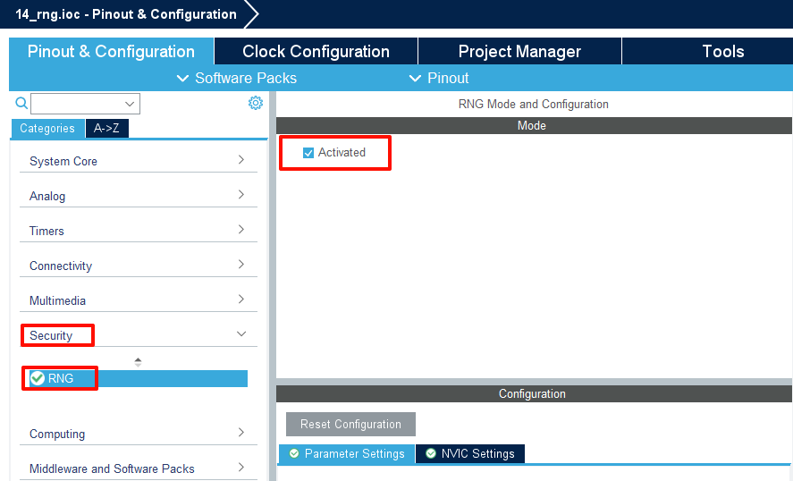
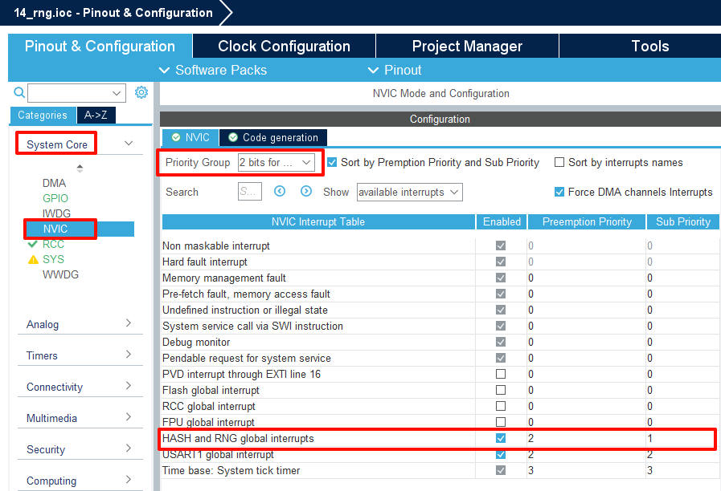
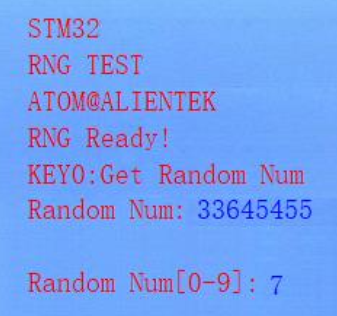

## RNG example<a name="brief"></a>

### 1 Brief
The function generates a 32-bit random number using the RNG (Random Number Generator).
### 2 Hardware Hookup
The hardware resources used in this example are:
+ LED0 - PF9
+ LED1 - PF10
+ RNG
+ ALIENTEK  2.8/3.5/4.3/7 inch TFTLCD module

The RTC used in this example is the on-chip resource of STM32F407, so there is no corresponding connection schematic.

### 3 STM32CubeIDE Configuration


Let's copy the project from  **12_usmart** and name both the project and the.ioc file **14_rng**. Next we start the RNG configuration by double-clicking the **14_rng.ioc** file.

First click **Security** and set it as shown below.




Open **NVIC** configuration as shown below.



Click **File > Save**, and you will be asked to generate code.Click **Yes**.

##### code
###### rtc.c
We added a lot of code to rng.c, so you can open the source code to have a look, but here are the important ones:
```c#
/**
 * @brief   Get random number
 * @param   None
 * @retval  Random number
 */
uint32_t rng_get_random(void)
{
    uint32_t random;

    if (HAL_RNG_GenerateRandomNumber(&hrng, &random) != HAL_OK)
    {
        return 0;
    }

    return random;
}

/**
 * @brief   Get a random number within the specified range
 * @param   min: Minimum value of the specified range
 * @param   max: Maximum value of the specified range
 * @retval  Random number
 */
int32_t rng_get_random_range(int32_t min, int32_t max)
{
    uint32_t random;

    if (HAL_RNG_GenerateRandomNumber(&hrng, &random) != HAL_OK)
    {
        return 0;
    }

    return ((int32_t)random % (max - min + 1) + min);
}
```
The RNG driver provides two functions for obtaining random numbers. One function directly retrieves the 32-bit random number generated by the RNG, while the other function processes the 32-bit random number generated by the RNG to obtain a random number within a specified range.

###### main.c
Add some codes between the /* USER CODE */ guards as follow:
```c#
int main(void)
{
  /* USER CODE BEGIN 1 */
    uint8_t t = 0;
    uint8_t key;
    uint32_t random;
    int32_t random_range;
  /* USER CODE END 1 */

  /* MCU Configuration--------------------------------------------------------*/

  /* Reset of all peripherals, Initializes the Flash interface and the Systick. */
  HAL_Init();

  /* USER CODE BEGIN Init */

  /* USER CODE END Init */

  /* Configure the system clock */
  SystemClock_Config();

  /* USER CODE BEGIN SysInit */
  delay_init(168);
  /* USER CODE END SysInit */

  /* Initialize all configured peripherals */
  MX_GPIO_Init();
  MX_USART1_UART_Init();
  MX_FSMC_Init();
  MX_RNG_Init();
  /* USER CODE BEGIN 2 */

  lcd_init();
  lcd_show_string(30, 50, 200, 16, 16, "STM32", RED);
  lcd_show_string(30, 70, 200, 16, 16, "RNG TEST", RED);
  lcd_show_string(30, 90, 200, 16, 16, "ATOM@ALIENTEK", RED);

  lcd_show_string(30, 130, 200, 16, 16, "KEY0:Get Random Num", RED);
  lcd_show_string(30, 150, 200, 16, 16, "Random Num:", RED);
  lcd_show_string(30, 170, 200, 16, 16, "Random Num[0-9]:", RED);

  /* USER CODE END 2 */

  /* Infinite loop */
  /* USER CODE BEGIN WHILE */
  while (1)
  {
    /* USER CODE END WHILE */

      key = key_scan(0);
      if (key == KEY0_PRES)
      {
          /* Get random number */
          random = rng_get_random();
          lcd_show_num(30 + 8 * 11, 150, random, 10, 16, BLUE);
      }

      if (++t == 20)
      {
          t = 0;
          LED0_TOGGLE();

          /* Get a random number within the specified range */
          random_range = rng_get_random_range(0, 9);
          lcd_show_num(30 + 8 * 16, 170, random_range, 1, 16, BLUE);
      }

      HAL_Delay(10);

    /* USER CODE BEGIN 3 */
  }
  /* USER CODE END 3 */
}
```

From the above code, it can be seen that after the relevant initialization, a random number from 0 to 9 will continue to be displayed on the LCD screen. If the KEY0 button is pressed, the 32-bit random number generated by the RNG will be displayed on the LCD screen.

### 4 Running

#### 4.1 Compile & Download

After the compilation is complete, connect the DAP and the Mini Board, and then connect to the computer together to download the program to the Mini Board.

#### 4.2 Phenomenon

Press the **RESET** button to begin running the program on your Mini Board, observe the LED0 flashing on the Mini Board,and the LCD continuously refreshes to display a random number between 0 and 9. When the KEY0 button is pressed, the LCD screen refreshes to display a 32-bit random number.



[jump to title](#brief)