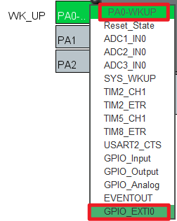
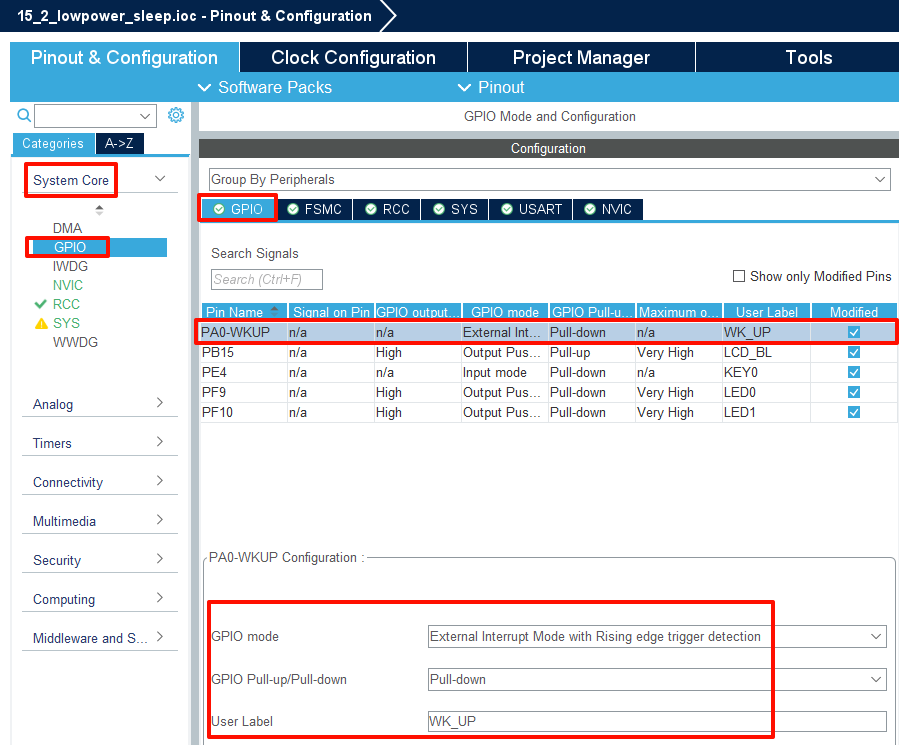
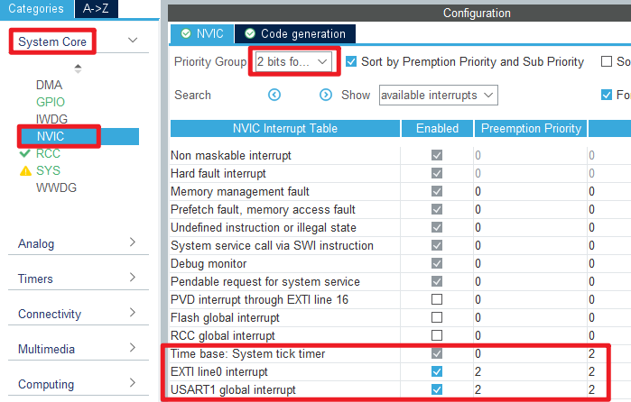

## LowPower_Sleep example<a name="brief"></a>

### 1 Brief
The function of this program is that when the KEY0 is pressed, it enters the Sleep Mode, and the LCD screen will display **Enter Sleep Mode...**. When WKUP is pressed to Exit Sleep Mode, the LCD screen will display **Exit Sleep Mode...**. 
### 2 Hardware Description
The hardware resources used in this example are:
+ LED0 - PF9
+ LED1 - PF10
+ USART1 - PA9/PA10
+ KEY - WKUP(PA0)
+ KEY - KEY0(PE4) 
+ ALIENTEK  2.8/3.5/4.3/7 inch TFTLCD module

This example introduces the sleep mode in the low power mode and does not involve the connection schematic.

### 3 STM32CubeIDE Configuration

Let's copy the project from  **15_1_lowpower_pvd** and name both the project and the.ioc file **15_2_lowpower_sleep**. Next we start the configuration by double-clicking the **15_2_lowpower_sleep.ioc** file.

First, click **Pinout&Configuration**, modify the PA0 pin to the external interrupt wakeup mode as shown below:



The specific parameter configuration of PA0 is shown in the following figure.



In this example, the sleep mode is awakened by external interrupt, so the NVIC should be configured, as shown below:



Click **File > Save**, and you will be asked to generate code.Click **Yes**.In addition, we also need to add the PWR driver file ``pwr.c/pwr.h``. The pwr file in this example is different from the one in the previous chapter.

##### code
###### pwr.c
The code for this file is as follows.
```c#
void pwr_enter_sleep(void)
{
  HAL_SuspendTick();  /* Pause the tick clock to prevent wakeup from being interrupted by the tick clock */
  HAL_PWR_EnterSLEEPMode(PWR_MAINREGULATOR_ON, PWR_SLEEPENTRY_WFI); /* Execute the WFI command and enter the sleep mode */
}

/**
 * @brief    External interrupt callback function
 * @param    GPIO Pin : Interrupt pin
 * @note     This function is called by PWR WKUP INT IRQHandler()
 * @retval   None
 */
void HAL_GPIO_EXTI_Callback(uint16_t GPIO_Pin)
{
  if (GPIO_Pin == WK_UP_Pin)
  {
      /* The HAL_GPIO_EXTI_IRQHandler() function has cleared the interrupt flag for us,
       *  so we can call the callback without doing anything */
      SysTick->CTRL  |= SysTick_CTRL_TICKINT_Msk;
  }
}
```
The ``HAL_PWR_EnterSLEEPMode`` function is called directly from within the ``pwr_enter_sleep`` function to use the WFI command to enter sleep mode.
The latter function is a callback function, we just wake up the sleep mode, we don't have to write another logic program.

###### main.c
Here's the main function.
```c#
int main(void)
{
  /* USER CODE BEGIN 1 */
  uint8_t t = 0;
  uint8_t key = 0;
  /* USER CODE END 1 */

  /* MCU Configuration--------------------------------------------------------*/

  /* Reset of all peripherals, Initializes the Flash interface and the Systick. */
  HAL_Init();

  /* USER CODE BEGIN Init */

  /* USER CODE END Init */

  /* Configure the system clock */
  SystemClock_Config();

  /* USER CODE BEGIN SysInit */

  /* USER CODE END SysInit */

  /* Initialize all configured peripherals */
  MX_GPIO_Init();
  MX_USART1_UART_Init();
  MX_FSMC_Init();
  /* USER CODE BEGIN 2 */
  lcd_init();                                         /* Initialize LCD */
  stm32f103ve_show_mesg();
  lcd_show_string(30, 50, 200, 16, 16, "STM32", RED);
  lcd_show_string(30, 70, 200, 16, 16, "SLEEP TEST", RED);
  lcd_show_string(30, 90, 200, 16, 16, "ATOM@ALIENTEK", RED);

  lcd_show_string(30, 110, 200, 16, 16, "KEY0:Enter SLEEP MODE", RED);
  lcd_show_string(30, 130, 200, 16, 16, "WK_UP:Exit SLEEP MODE", RED);
  /* USER CODE END 2 */

  /* Infinite loop */
  /* USER CODE BEGIN WHILE */
  while (1)
  {
    key = key_scan(0);

    if (key == KEY0_PRES)
    {
      lcd_show_string(30, 150, 200, 16, 16, "Enter Sleep Mode...", BLUE);
      /* Press the KEY0 button to turn on LED1 and enter the sleep mode */
      LED1(0);
      pwr_enter_sleep();    /* Enter sleep mode */
      lcd_show_string(30, 150, 200, 16, 16, "Exit  Sleep Mode...", BLUE);
      LED1(1);
    }
    if ((t % 20) == 0)
    {
      LED0_TOGGLE();   /* flashing LED0 indicates that the system is running */
    }

    t++;
    HAL_Delay(10);   	 /* delay 10ms */
    /* USER CODE END WHILE */

    /* USER CODE BEGIN 3 */
  }
  /* USER CODE END 3 */
}
```

### 4 Running
#### 4.1 Compile & Download
After the compilation is complete, connect the DAP and the Mini Board, and then connect to the computer together to download the program to the Mini Board.
#### 4.2 Phenomenon
Press the **RESET** button to begin running the program on your Mini Board, observe the LED0 flashing on the Mini Board, indicating that the code download is successful. If you press the KEY0 button, the LCD screen will display **Enter Sleep Mode...** and LED1 will light up. If you press the WKUP button, the LCD screen will display **Exit Sleep Mode...** and LED1 will turn off.

[jump to title](#brief)