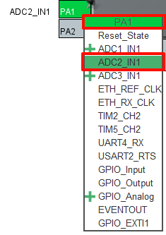
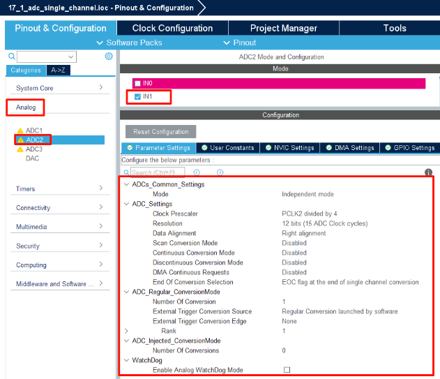
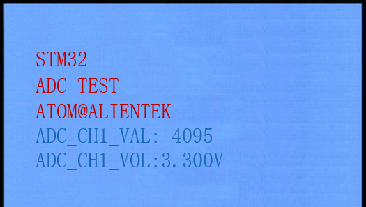

## ADC_Single_Channel example<a name="brief"></a>

### 1 Brief
The function of this code is that the ADC collects the voltage on channel 1, and displays the digital amount of the voltage converted by the ADC and the analog amount converted on the LCD mudule screen.
### 2 Hardware Hookup
The hardware resources used in this example are:
+ LED0 - PF9
+ USART1 - PA9/PA10
+ ADC2 - Channel1(PA1)
+ ALIENTEK  2.8/3.5/4.3/7 inch TFTLCD module

The ADC used in this example is an on-chip resource of STM32F407, so there is no corresponding connection schematic.

### 3 STM32CubeIDE Configuration

We copy the **11_tftlcd_mcu** project and name both the project and the.ioc file **17_1_adc_single_channel**.Next we start the ADC configuration by double-clicking the **17_1_adc_single_channel.ioc** file.

In **Pinout&Configuration**, select PA1, set it as shown below.



Click **Analog > ADC2** to set mode.



Click **File > Save**, and you will be asked to generate code.Click **Yes**.

##### code
###### adc.c
Two separate functions have also been added, as follows.
```c#
uint32_t adc_get_result(void)
{
    HAL_ADC_Start(&hadc2);                      /* Turn on the ADC */
    HAL_ADC_PollForConversion(&hadc2, 10);      /* Round robin transformation */
    return (uint16_t)HAL_ADC_GetValue(&hadc2);  /* Returns the result of the last ADC2 rule group transformation */
}

/**
 * @brief   Takes the transformation value of the channel ch, takes it times, and averages it
 * @param   times : Get the number of times
 * @retval  channel ch the average of times conversion results
 */
uint32_t adc_get_result_average(uint8_t times)
{
    uint32_t temp_val = 0;
    uint8_t t;

    for (t = 0; t < times; t++)     /* Get The times data */
    {
        temp_val += adc_get_result();
        HAL_Delay(5);               /* delay 5ms */
    }

    return temp_val / times;        /* Returning the average */
}
```
The first function, ``adc_get_result``, gets the ADC conversion result by first calling ``HAL_ADC_Start`` and then ``HAL_ADC_PollForConversion``. Finally, the ``HAL_ADC_GetValue`` function is called to get the result of the conversion.

The second function, ``adc_get_result_average``, is used to get the average of the results of multiple ADC conversions to improve accuracy.

###### main.c
Add some codes between the /* USER CODE */ guards as follow:
```c#
int main(void)
{
  /* USER CODE BEGIN 1 */
    uint16_t adc_result;
    uint16_t voltage;
  /* USER CODE END 1 */

  /* MCU Configuration--------------------------------------------------------*/

  /* Reset of all peripherals, Initializes the Flash interface and the Systick. */
  HAL_Init();

  /* USER CODE BEGIN Init */

  /* USER CODE END Init */

  /* Configure the system clock */
  SystemClock_Config();

  /* USER CODE BEGIN SysInit */
  delay_init(168);
  /* USER CODE END SysInit */

  /* Initialize all configured peripherals */
  MX_GPIO_Init();
  MX_USART1_UART_Init();
  MX_FSMC_Init();
  MX_ADC2_Init();
  /* USER CODE BEGIN 2 */

  lcd_init();
  lcd_show_string(30, 50, 200, 16, 16, "STM32", RED);
  lcd_show_string(30, 70, 200, 16, 16, "ADC TEST", RED);
  lcd_show_string(30, 90, 200, 16, 16, "ATOM@ALIENTEK", RED);

  lcd_show_string(30, 110, 200, 16, 16, "ADC1_CH1_VAL:0", BLUE);
  lcd_show_string(30, 130, 200, 16, 16, "ADC1_CH1_VOL:0.000V", BLUE);

  /* USER CODE END 2 */

  /* Infinite loop */
  /* USER CODE BEGIN WHILE */
  while (1)
  {
    /* USER CODE END WHILE */

      adc_result = adc_get_result_average(ADC_CHANNEL_1, 10);      /* The result of ADC channel 10 conversion and mean filtering is obtained */
      lcd_show_xnum(134, 110, adc_result, 5, 16, 0, BLUE);

      voltage = (adc_result * 3300) / 4095;                       /* Calculate the actual voltage value (1000x enlargement) */
      lcd_show_xnum(134, 130, voltage / 1000, 1, 16, 0, BLUE);
      lcd_show_xnum(150, 130, voltage % 1000, 3, 16, 0x80, BLUE);

      LED0_TOGGLE();
      HAL_Delay(100);

    /* USER CODE BEGIN 3 */
  }
  /* USER CODE END 3 */
}
```

### 4 Running
#### 4.1 Compile & Download
After the compilation is complete, connect the DAP and the Mini Board, and then connect to the computer together to download the program to the Mini Board.
#### 4.2 Phenomenon
Press the **RESET** button to begin running the program on your Mini Board, observe the LED0 flashing on the Mini Board, open the serial port and the host computer **ATK-XCOM** can see the prompt information of the example, indicating that the code download is successful. When a dupont wire is used to connect the PA1 pin with different voltage values, the digital and analog voltage of the LCD screen will also change. **It should be noted that the input voltage cannot exceed the 3.3V threshold of the Mini Board**, otherwise it may damage the Mini Board. The phenomenon is illustrated in the following figure.



[jump to title](#brief)