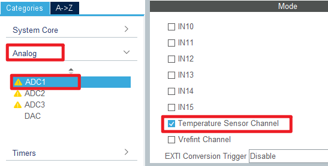
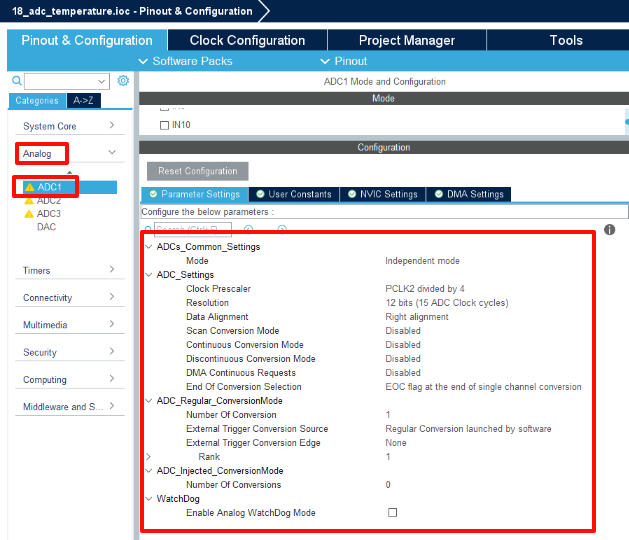

## ADC_Temperature example<a name="brief"></a>

### 1 Brief
The function of this program is that ADC collects the voltage on channel 16, converts the voltage value into the temperature value through the algorithm, and displays the converted temperature value on the lcd module screen.
### 2 Hardware Hookup
The hardware resources used in this example are:
+ LED0 - PF9
+ USART1 - PA9/PA10
+ ADC1 - Temperature Sensor Channel
+ ALIENTEK  2.8/3.5/4.3/7 inch TFTLCD module

The ADC used in this example is an on-chip resource of STM32F407, so there is no corresponding connection schematic.

### 3 STM32CubeIDE Configuration


We copy the **11_tftlcd** project and name both the project and the.ioc file **18_adc_temperature**.Next we start the ADC configuration by double-clicking the **18_adc_temperature.ioc** file.

The Temperature Sensor Channel used in this example is set as shown below.





Click **File > Save**, and you will be asked to generate code.Click **Yes**.

##### code
We add some code to adc.c, starting with ADC1's initialization function ``MX_ADC1_Init``, as follows.
###### adc.c
We also added four separate functions as follows.
```c#
/**
 * @brief   Set up ADC channel
 * @param   adc_handle: ADC handle
 * @param   channel: ADC channel
 * @param   rank: Rank of regular conversion
 * @param   sampling_time: Sampling time
 * @retval  None
 */
void adc_channel_set(ADC_HandleTypeDef *adc_handle, uint32_t channel, uint32_t rank, uint32_t sampling_time)
{
    ADC_ChannelConfTypeDef adc_channel_conf_struct = {0};

    /* Configure ADC channel */
    adc_channel_conf_struct.Channel = channel;
    adc_channel_conf_struct.Rank = rank;
    adc_channel_conf_struct.SamplingTime = sampling_time;
    adc_channel_conf_struct.Offset = 0;
    HAL_ADC_ConfigChannel(adc_handle, &adc_channel_conf_struct);
}


/**
 * @brief   Get ADC result
 * @param   channel: ADC channel
 * @retval  ADC result
 */
uint16_t adc_get_result(uint32_t channel)
{
    uint16_t result;

    adc_channel_set(&hadc1, channel, 1, ADC_SAMPLETIME_480CYCLES);   /* Set up ADC channel */
    HAL_ADC_Start(&hadc1);                                           /* Start ADC */
    HAL_ADC_PollForConversion(&hadc1, HAL_MAX_DELAY);                /* Poll for ADC conversion */
    result = HAL_ADC_GetValue(&hadc1);                               /* Get ADC value */

    return result;
}

/**
 * @brief   Get ADC result using moving average filtering
 * @param   channel: ADC channel
 * @param   times: Number of raw data for moving average filtering
 * @retval  ADC result
 */
uint16_t adc_get_result_average(uint32_t channel, uint8_t times)
{
    uint32_t sum_result = 0;
    uint8_t index;
    uint16_t result;

    for (index = 0; index < times; index++)
    {
        sum_result += adc_get_result(channel);
    }

    result = sum_result / times;

    return result;
}

/**
 * @brief   Get internal temperature sensor result
 * @param   None
 * @retval  Internal temperature sensor result (multiplied by 100)
 */
int16_t adc_get_temperature(void)
{
    uint16_t result;
    double voltage;
    double temperature;
    int16_t temperature_x100;

    result = adc_get_result_average(ADC_CHANNEL_TEMPSENSOR, 10);
    voltage = ((double)result * 3.3) / 4095;
    temperature = (voltage - 0.76) * 400 + 25;
    temperature_x100 = (int16_t)(temperature * 100);

    return temperature_x100;
}
```
After obtaining the output voltage of the temperature sensor, the above code converts the voltage value to the actual temperature value through the temperature conversion formula.

###### main.c
Here's the main function.
```c#
int main(void)
{
  /* USER CODE BEGIN 1 */
	int16_t temperature;
  /* USER CODE END 1 */

  /* MCU Configuration--------------------------------------------------------*/

  /* Reset of all peripherals, Initializes the Flash interface and the Systick. */
  HAL_Init();

  /* USER CODE BEGIN Init */

  /* USER CODE END Init */

  /* Configure the system clock */
  SystemClock_Config();

  /* USER CODE BEGIN SysInit */
  delay_init(168);
  /* USER CODE END SysInit */

  /* Initialize all configured peripherals */
  MX_GPIO_Init();
  MX_USART1_UART_Init();
  MX_FSMC_Init();
  MX_ADC1_Init();
  /* USER CODE BEGIN 2 */

  lcd_init();
  lcd_show_string(30, 50, 200, 16, 16, "STM32", RED);
  lcd_show_string(30, 70, 200, 16, 16, "Temperature TEST", RED);
  lcd_show_string(30, 90, 200, 16, 16, "ATOM@ALIENTEK", RED);

  lcd_show_string(30, 110, 200, 16, 16, "TEMPERATE: 00.00C", BLUE);

  /* USER CODE END 2 */

  /* Infinite loop */
  /* USER CODE BEGIN WHILE */
  while (1)
  {
    /* USER CODE END WHILE */

      temperature = adc_get_temperature();    /* Get internal temperature sensor results */

      /* Display temperature */
      if (temperature < 0)
      {
          temperature = -temperature;
          lcd_show_string(30 + 10 * 8, 110, 16, 16, 16, "-", BLUE);
      }
      else
      {
          lcd_show_string(30 + 10 * 8, 110, 16, 16, 16, " ", BLUE);
      }
      lcd_show_xnum(30 + 11 * 8, 110, temperature / 100, 2, 16, 0, BLUE);
      lcd_show_xnum(30 + 14 * 8, 110, temperature % 100, 2, 16, 0x80, BLUE);

      LED0_TOGGLE();
      HAL_Delay(100);

    /* USER CODE BEGIN 3 */
  }
  /* USER CODE END 3 */
}
```
This code is relatively simple, constantly calling the ``adc_get_temperature`` function to obtain the temperature value collected by the internal temperature sensor, and the temperature value is displayed in real time through the lcd module screen.


### 4 Running
#### 4.1 Compile & Download
After the compilation is complete, connect the DAP and the Mini Board, and then connect to the computer together to download the program to the Mini Board.
#### 4.2 Phenomenon
Press the **RESET** button to begin running the program on your Mini Board, observe the LED0 flashing on the Mini Board, indicating that the code download is successful. The temperature value of the internal temperature sensor on the Mini Board will be displayed on the lcd screen, as shown in the following figure.


[jump to title](#brief)