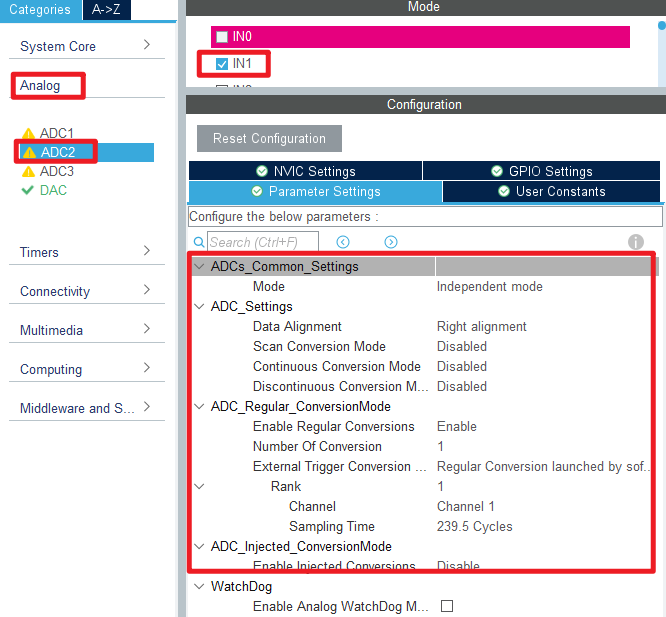

## DAC_Output example<a name="brief"></a>

### 1 Brief
The function of this code is the serial port host computer constantly refresh display PA4 pin output voltage of the digital amount, analog amount and PA1 pin input voltage analog amount. Press the WKUP button to increase the voltage output of the PA4 pin, and press the KEY0 button to reduce the voltage output of the PA4 pin.
### 2 Hardware Hookup
The hardware resources used in this example are:
+ LED0 - PF9
+ USART1 - PA9/PA10
+ ADC2 - Channel1(PA1)
+ DAC1 - Channel1(PA4)
+ ALIENTEK  2.8/3.5/4.3/7 inch TFTLCD module

The DAC used in this example is an on-chip resource of STM32F407, so there is no corresponding connection schematic.

### 3 STM32CubeIDE Configuration

We copy the **11_tftlcd** project and name both the project and the.ioc file **19_1_dac_output**.Next we start the DAC configuration by double-clicking the **19_1_dac_output.ioc** file.

In **Pinout&Configuration**, click **PA1** and **PA4** pin to set mode.


Configure the following figure in **Analog->ADC2**.



Then open **Analog->DAC1** to configure.


Click **File > Save**, and you will be asked to generate code.Click **Yes**.
The code for the ADC part was described in section ``17_1_ADC_Single_Channel``, but the DAC part is introduced here.

##### code
We add some code to dac.c, starting with DAC1's initialization function ``MX_DAC1_Init``, as follows.
###### dac.c
```c#
  /* USER CODE BEGIN DAC1_Init 2 */
  HAL_DAC_Start(&hdac, DAC_CHANNEL_1);  /* Enables DAC */
  /* USER CODE END DAC1_Init 2 */
```
This line is added to the initialization function to open DAC channel 1.
A separate function has also been added as follows.
```c#
void dac_set_voltage(uint16_t vol)
{
    uint16_t value;

    value = (vol * 4095) / 3300;
    value &= 0xFFF;

    HAL_DAC_SetValue(&hdac, DAC_CHANNEL_1, DAC_ALIGN_12B_R, value); /* The 12-bit right-aligned data format sets the DAC value */
}
```
This function converts voltage values to DAC input values and is set from 0 to 3300, representing **0 to 3.3V**.

###### main.c
Here's the main function.
```c#
int main(void)
{
  /* USER CODE BEGIN 1 */
    uint8_t t = 0;
    uint8_t key;
    uint16_t dac_value;
    uint16_t dac_voltage = 100;
    uint16_t adc_value;
    uint16_t adc_voltage;
  /* USER CODE END 1 */

  /* MCU Configuration--------------------------------------------------------*/

  /* Reset of all peripherals, Initializes the Flash interface and the Systick. */
  HAL_Init();

  /* USER CODE BEGIN Init */

  /* USER CODE END Init */

  /* Configure the system clock */
  SystemClock_Config();

  /* USER CODE BEGIN SysInit */
  delay_init(168);
  /* USER CODE END SysInit */

  /* Initialize all configured peripherals */
  MX_GPIO_Init();
  MX_USART1_UART_Init();
  MX_FSMC_Init();
  MX_ADC2_Init();
  MX_DAC_Init();
  /* USER CODE BEGIN 2 */

  lcd_init();

  lcd_show_string(30, 50, 200, 16, 16, "STM32", RED);
  lcd_show_string(30, 70, 200, 16, 16, "DAC TEST", RED);
  lcd_show_string(30, 90, 200, 16, 16, "ATOM@ALIENTEK", RED);

  lcd_show_string(30, 110, 200, 16, 16, "WK_UP:+ KEY0:-", RED);

  lcd_show_string(30, 130, 200, 16, 16, "DAC_CH1 VAL:", BLUE);
  lcd_show_string(30, 150, 200, 16, 16, "DAC_CH1_VOL:0.000V", BLUE);
  lcd_show_string(30, 170, 200, 16, 16, "ADC2_CH1_VOL:0.000V", BLUE);

  dac_set_voltage(dac_voltage);       /* Output increased by 100 */

  /* USER CODE END 2 */

  /* Infinite loop */
  /* USER CODE BEGIN WHILE */
  while (1)
  {
    /* USER CODE END WHILE */

      key = key_scan(0);
      if (key == WKUP_PRES)
      {
          if (dac_voltage < 3300)
          {
              dac_voltage += 100;
              dac_set_voltage(dac_voltage);
          }
      }
      else if (key == KEY0_PRES)
      {
          if (dac_voltage > 100)
          {
              dac_voltage -= 100;
              dac_set_voltage(dac_voltage);
          }
      }

      if (++t == 20)
      {
          t = 0;

          /* Display the DAC output in digital quantity. */
          dac_value = HAL_DAC_GetValue(&hdac, DAC_CHANNEL_1);
          lcd_show_xnum(126, 130, dac_value, 4, 16, 0, BLUE);

          /* Display the DAC output in analog quantity. */
          lcd_show_xnum(126, 150, dac_voltage / 1000, 1, 16, 0, BLUE);
          lcd_show_xnum(142, 150, dac_voltage % 1000, 3, 16, 0x80, BLUE);

          /* Display the analog quantity acquired by the ADC. */
          adc_value = adc_get_result_average(ADC_CHANNEL_1, 10);
          adc_voltage = (adc_value * 3300) / 4095;
          lcd_show_xnum(134, 170, adc_voltage / 1000, 1, 16, 0, BLUE);
          lcd_show_xnum(150, 170, adc_voltage % 1000, 3, 16, 0x80, BLUE);

          LED0_TOGGLE();
      }

      HAL_Delay(10);

    /* USER CODE BEGIN 3 */
  }
  /* USER CODE END 3 */
}
```
In this part of the code, we control the voltage value of DAC output by WKUP and KEY0 keys.


### 4 Running
#### 4.1 Compile & Download
After the compilation is complete, connect the DAP and the Mini Board, and then connect to the computer together to download the program to the Mini Board.
#### 4.2 Phenomenon
Press the **RESET** button to begin running the program on your Mini Board, observe the LED0 flashing on the Mini Board, indicating that the code download is successful. Connect **PA1** and **PA4** pins with a dupont line, and press the KEY0 or WKUP button to adjust the output voltage of DAC channel 1. You can see that the analog and digital amount of DAC output voltage displayed by the lcd module screen and the analog amount of voltage collected by the ADC also change. The phenomenon is illustrated in the following figure:


[jump to title](#brief)
