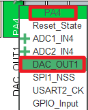
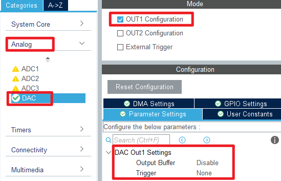
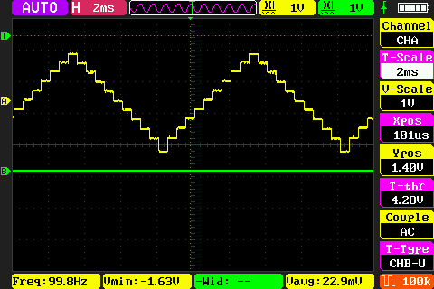
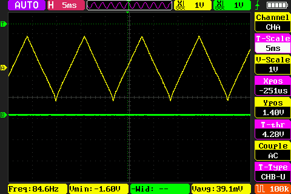

## DAC_Triangular_Wave example<a name="brief"></a>

### 1 Brief
The function of this code is to press the KEY0 button and the PA4 pin outputs 100 triangle wave 1. Press the WKUP button, and the PA4 pin outputs 100 triangle wave 2.
### 2 Hardware Hookup
The hardware resources used in this example are:
+ LED0 - PF9
+ USART1 - PA9/PA10
+ DAC1 - Channel1(PA4)
+ ALIENTEK DS100 oscilloscope
+ ALIENTEK  2.8/3.5/4.3/7 inch TFTLCD module

The DAC used in this example is an on-chip resource of STM32F407, so there is no corresponding connection schematic.

### 3 STM32CubeIDE Configuration

We copy the **11_tftlcd** project and name both the project and the.ioc file **19_2_dac_triangular_wave**.Next we start the DAC configuration by double-clicking the **19_2_dac_triangular_wave.ioc** file.

In **Pinout&Configuration**, click **PA4** pin to set mode.



Then open **Analog->DAC1** to configure.



Click **File > Save**, and you will be asked to generate code.Click **Yes**.

##### code
We add some code to dac.c, starting with DAC1's initialization function ``MX_DAC1_Init``, as follows.
###### dac.c
```c#
  /* USER CODE BEGIN DAC1_Init 2 */
  HAL_DAC_Start(&hdac, DAC_CHANNEL_1);  /* Open DAC channel 1 */
  /* USER CODE END DAC1_Init 2 */
```
This line is added to the initialization function to open DAC channel 1.
A separate function has also been added as follows.
```c#
void dac_triangular_wave(uint16_t maxval, uint16_t dt, uint16_t samples, uint16_t n)
{
    uint16_t i, j;
    float incval;                           /* incremental change */
    float curval;                           /* current value */

    if ((maxval + 1) <= samples)
    {
        return ;                            /* Data is not valid */
    }

    incval = (maxval + 1) / (samples / 2);  /* Calculate the increment */

    for (j = 0; j < n; j++)
    {
        curval = 0;
        HAL_DAC_SetValue(&hdac, DAC_CHANNEL_1, DAC_ALIGN_12B_R, curval);      /* I'm going to print 0 first. */
        for (i = 0; i < (samples / 2); i++)                                   /* Output rising edge */
        {
            curval +=  incval;                                                /* New output value */
            HAL_DAC_SetValue(&hdac, DAC_CHANNEL_1, DAC_ALIGN_12B_R, curval);
            delay_us(dt);                                                     /* delay 5ms */
        }
        for (i = 0; i < (samples / 2); i++)                                   /* Output falling edge */
        {
            curval -=  incval;                                                /* New output value */
            HAL_DAC_SetValue(&hdac, DAC_CHANNEL_1, DAC_ALIGN_12B_R, curval);
            delay_us(dt);                                                     /* delay 5ms */
        }
    }
}
```
This function is used to set the DAC channel 1 output to a specified triangular wave.

###### main.c
Here's the main function.
```c#
int main(void)
{
  /* USER CODE BEGIN 1 */
    uint8_t t = 0;
    uint8_t key;
  /* USER CODE END 1 */

  /* MCU Configuration--------------------------------------------------------*/

  /* Reset of all peripherals, Initializes the Flash interface and the Systick. */
  HAL_Init();

  /* USER CODE BEGIN Init */

  /* USER CODE END Init */

  /* Configure the system clock */
  SystemClock_Config();

  /* USER CODE BEGIN SysInit */
  delay_init(168);
  /* USER CODE END SysInit */

  /* Initialize all configured peripherals */
  MX_GPIO_Init();
  MX_USART1_UART_Init();
  MX_FSMC_Init();
  MX_DAC_Init();
  /* USER CODE BEGIN 2 */

  lcd_init();

  lcd_show_string(30, 50, 200, 16, 16, "STM32", RED);
  lcd_show_string(30, 70, 200, 16, 16, "DAC Triangular Wave TEST", RED);
  lcd_show_string(30, 90, 200, 16, 16, "ATOM@ALIENTEK", RED);

  lcd_show_string(30, 110, 200, 16, 16, "WK_UP:Wave1 KEY0:Wave2", RED);

  /* USER CODE END 2 */

  /* Infinite loop */
  /* USER CODE BEGIN WHILE */
  while (1)
  {
    /* USER CODE END WHILE */

      key = key_scan(0);
      if (key == WKUP_PRES)
      {
         /* DAC output triangular wave 1, with an amplitude of 3.3V, a frequency of 100Hz, and 2000 sampling points. */
          lcd_show_string(30, 130, 200, 16, 16, "DAC Wave1", BLUE);
          dac_triangular_wave(4095, 5, 2000, 100);
          lcd_show_string(30, 130, 200, 16, 16, "DAC None", BLUE);
      }
      else if (key == KEY0_PRES)
      {
          /* DAC output triangular wave 2, with an amplitude of 3.3V, a frequency of 100Hz, and 20 sampling points. */
          lcd_show_string(30, 130, 200, 16, 16, "DAC Wave2", BLUE);
          dac_triangular_wave(4095, 500, 20, 100);
          lcd_show_string(30, 130, 200, 16, 16, "DAC None", BLUE);
      }

      if (++t == 20)
      {
          t = 0;
          LED0_TOGGLE();
      }

      delay_ms(10);

    /* USER CODE BEGIN 3 */
  }
  /* USER CODE END 3 */
}
```
After the initialization of this part of the code, the key is scanned continuously, and according to the scanned key, the DAC channel 1 is controlled to output the triangle wave with the specified amplitude, frequency, and number.


### 4 Running
#### 4.1 Compile & Download
After the compilation is complete, connect the DAP and the Mini Board, and then connect to the computer together to download the program to the Mini Board.
#### 4.2 Phenomenon
Press the **RESET** button to begin running the program on your Mini Board, observe the LED0 flashing on the Mini Board, indicating that the code download is successful. Connect the **PA4** pin with a **ALIENTEK DS100 oscilloscope** and press the KEY0 and WKUP keys respectively. You can see two different types of triangle waves, as shown in the following figure:





[jump to title](#brief)
