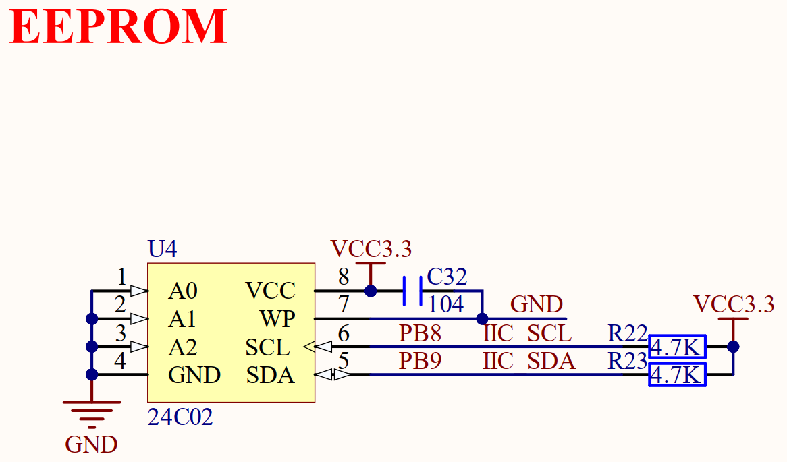
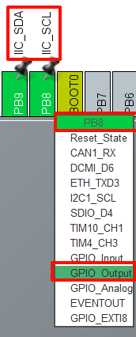
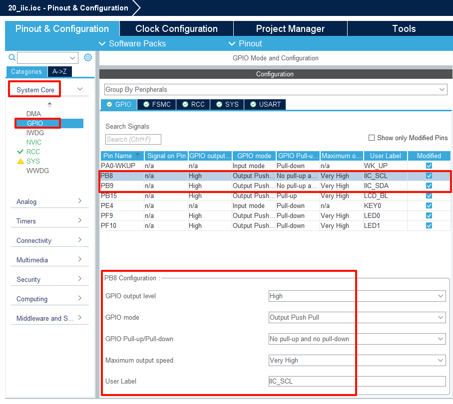
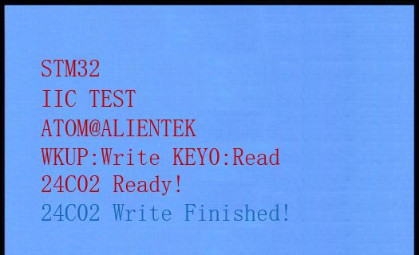
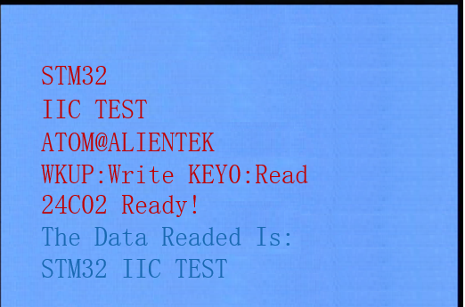

## RNG example<a name="brief"></a>


### 1 Brief
The function of this example is to write data to the 24C02 via the IIC bus every time WKUP is pressed, and to control the 24C02 to read data by pressing KEY0. Relevant information is also displayed on the LCD simultaneously.
### 2 Hardware Hookup
The hardware resources used in this example are:
+ LED0 - PF9
+ USART1 - PA9/PA10
+ KEY - WKUP(PA0)
+ KEY - KEY0(PE4)
+ ALIENTEK  2.8/3.5/4.3/7 inch TFTLCD module

The connection between the 24C02 and the Mini Board is shown in the following diagram.



### 3 STM32CubeIDE Configuration


We copy the **11_tftlcd_mcu** project and name both the project and the.ioc file **20_iic**.Next we start the DAC configuration by double-clicking the **20_iic.ioc** file.

In **Pinout&Configuration**, click **PB6 and PB7** pin to set mode.



The detailed configuration of pins is as follows.



Click **File > Save**, and you will be asked to generate code.Click **Yes**.

##### code

We will add the IIC-driver file ``myiic.c/myiic.h`` and ``24cxx.c/24cxx.h``.

###### myiic.c
```c#
void iic_init(void)
{
    iic_stop();     /* Stop all devices on the bus */
}

void iic_start(void)
{
    IIC_SDA(1);
    IIC_SCL(1);
    iic_delay();
    IIC_SDA(0);
    iic_delay();
    IIC_SCL(0);
    iic_delay();
}

void iic_stop(void)
{
    IIC_SDA(0);
    iic_delay();
    IIC_SCL(1);
    iic_delay();
    IIC_SDA(1);
    iic_delay();
}
```
In the IIC driver are various operations on the IIC, such as generating the IIC start signal, generating the IIC stop signal, etc.

###### 24cxx.c
The 24C02 driver contains various operation functions for EEPROM, such as read and write functions.

```c#
uint8_t at24cxx_read_one_byte(uint16_t addr)
{
    uint8_t temp = 0;
    iic_start();                 /* Send start signal */

    if (EE_TYPE > AT24C16)       /* For models above 24C16, the address is sent in 2 bytes */
    {
        iic_send_byte(0XA0);     /* The write command is sent, and the IIC stipulates that the least significant bit is 0, indicating writing */
        iic_wait_ack();          /* Every time a byte is sent, it waits for an ACK */
        iic_send_byte(addr >> 8);/* Send high-byte addresses */
    }
    else
    {
        iic_send_byte(0XA0 + ((addr >> 8) << 1));   /* Send device 0XA0 + high bit a8/a9/a10 address, write data */
    }

    iic_wait_ack();             /* Every time a byte is sent, it waits for an ACK */
    iic_send_byte(addr % 256);  /* Send low address */
    iic_wait_ack();             /* Wait for the ACK, at which point the address is sent */

    iic_start();                /* Retransmit the start signal */
    iic_send_byte(0XA1);        /* Enter receive mode, the IIC specifies that the least bit is 0, indicating read */
    iic_wait_ack();             /* Every time a byte is sent, it waits for an ACK */
    temp = iic_read_byte(0);    /* Receives one byte of data */
    iic_stop();                 /* Produces a stopping condition */
    return temp;
}

/**
 * @brief    writes a data at the address specified by AT24CXX
 * @param    addr: The destination to write the data to
 * @param    data: The data to be written
 * @retval   None
 */
void at24cxx_write_one_byte(uint16_t addr, uint8_t data)
{
    iic_start();                /* Send start signal */

    if (EE_TYPE > AT24C16)      /* For models above 24C16, the address is sent in 2 bytes */
    {
        iic_send_byte(0XA0);    /* The write command is sent, and the IIC stipulates that the least significant bit is 0, indicating writing */
        iic_wait_ack();         /* Every time a byte is sent, it waits for an ACK */
        iic_send_byte(addr >> 8);/* Send high-byte addresses */
    }
    else
    {
        iic_send_byte(0XA0 + ((addr >> 8) << 1));   /* Send device 0XA0 + high bit a8/a9/a10 address, write data */
    }

    iic_wait_ack();             /* Every time a byte is sent, it waits for an ACK */
    iic_send_byte(addr % 256);  /* Send low address */
    iic_wait_ack();             /* Wait for the ACK, at which point the address is sent */

    /* There is no need to re-send the start signal because we no longer need to enter receive mode when writing data */
    iic_send_byte(data);        /* Send 1 byte */
    iic_wait_ack();             /* Waiting for ACK */
    iic_stop();                 /* Produces a stopping condition */
    HAL_Delay(10);              /* Note: EEPROM writes are slow and must wait until 10ms before writing a word */
}
```

###### main.c
```c#
int main(void)
{
  /* USER CODE BEGIN 1 */
    uint8_t t = 0;
    uint8_t key;
    uint8_t data[TEXT_SIZE];
  /* USER CODE END 1 */

  /* MCU Configuration--------------------------------------------------------*/

  /* Reset of all peripherals, Initializes the Flash interface and the Systick. */
  HAL_Init();

  /* USER CODE BEGIN Init */

  /* USER CODE END Init */

  /* Configure the system clock */
  SystemClock_Config();

  /* USER CODE BEGIN SysInit */
  delay_init(168);
  /* USER CODE END SysInit */

  /* Initialize all configured peripherals */
  MX_GPIO_Init();
  MX_USART1_UART_Init();
  MX_FSMC_Init();
  /* USER CODE BEGIN 2 */

  lcd_init();
  at24cxx_init();

  lcd_show_string(30, 50, 200, 16, 16, "STM32", RED);
  lcd_show_string(30, 70, 200, 16, 16, "IIC TEST", RED);
  lcd_show_string(30, 90, 200, 16, 16, "ATOM@ALIENTEK", RED);

  lcd_show_string(30, 110, 200, 16, 16, "WK_UP:Write KEY0:Read", RED);

  /* Check whether AT24CXX is normal */
  while (at24cxx_check() != 0)
  {
      lcd_show_string(30, 130, 200, 16, 16, "24C02 Check Failed!", RED);
      delay_ms(500);
      lcd_show_string(30, 130, 200, 16, 16, "Please Check!      ", RED);
      delay_ms(500);
      LED0_TOGGLE();
  }
  lcd_show_string(30, 130, 200, 16, 16, "24C02 Ready!       ", RED);

  /* USER CODE END 2 */

  /* Infinite loop */
  /* USER CODE BEGIN WHILE */
  while (1)
  {
    /* USER CODE END WHILE */

      key = key_scan(0);
      if (key == WKUP_PRES)
      {
    	  /* Write data to AT24CXX */
          lcd_fill(0, 150, 239, 319, WHITE);
          lcd_show_string(30, 150, 200, 16, 16, "Start Write 24C02....", BLUE);
          at24cxx_write(0, (uint8_t *)g_text_buf, TEXT_SIZE);
          lcd_show_string(30, 150, 200, 16, 16, "24C02 Write Finished!", BLUE);
      }
      else if (key == KEY0_PRES)
      {
    	  /* Read data from AT24CXX */
          lcd_show_string(30, 150, 200, 16, 16, "Start Read 24C02.... ", BLUE);
          at24cxx_read(0, data, TEXT_SIZE);
          lcd_show_string(30, 150, 200, 16, 16, "The Data Readed Is:  ", BLUE);
          lcd_show_string(30, 170, 200, 16, 16, (char *)data, BLUE);
      }

      if (++t == 20)
      {
          t = 0;
          LED0_TOGGLE();
      }

      HAL_Delay(10);

    /* USER CODE BEGIN 3 */
  }
  /* USER CODE END 3 */
}
```


### 4 Running
#### 4.1 Compile & Download
After the compilation is complete, connect the DAP and the Mini Board, and then connect to the computer together to download the program to the Mini Board.
#### 4.2 Phenomenon
Press the **RESET** button to begin running the program on your Mini Board, observe the LED0 flashing on the Mini Board, indicating that the code download is successful. 

Press WKUP to write data, and then press KEY0 to read data, and finally the contents of the LCD display as shown in the following figure:





[jump to title](#brief)