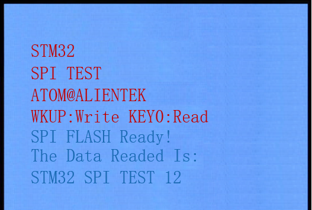

## RNG example<a name="brief"></a>


### 1 Brief
The function of this example is to control the writing of norflash by the WKUP key, and to control the reading of norflash by the KEY0 key, and to display relevant information on the LCD module.
### 2 Hardware Hookup
The hardware resources used in this example are:
+ LED0 - PF9
+ USART1 - PA9/PA10
+ KEY - WKUP(PA0)
+ KEY - KEY0(PE4)
+ ALIENTEK  2.8/3.5/4.3/7 inch TFTLCD module

The connection between the norflash and the Mini Board is shown in the following diagram.


### 3 STM32CubeIDE Configuration


We copy the **11_tftlcd_mcu** project and name both the project and the.ioc file **21_spi**.Next we start the DAC configuration by double-clicking the **21_spi.ioc** file.

Click **Connectivity -> SPI1**, config as below:


In **Pinout&Configuration**, select the slice selection pin. Click **PB12** pin to set mode.


The detailed configuration of pins is as follows.


Click **File > Save**, and you will be asked to generate code.Click **Yes**.

##### code

We will add the NORFLASH-driver file ``norflash.c/norflash.h``.

###### spi.c
In the SPI file, we add the speed setting function, which is realized by means of registers. In addition, the built-in functions of HAL library are called to receive and send operations.
```c#
void spi1_set_speed(uint32_t speed)
{
    __HAL_SPI_DISABLE(&hspi1);
    hspi1.Instance->CR1 &= ~SPI_CR1_BR_Msk;
    hspi1.Instance->CR1 |= speed;
    __HAL_SPI_ENABLE(&hspi1);
}

uint8_t spi1_read_write_byte(uint8_t txdata)
{
    uint8_t rxdata;

    if (HAL_SPI_TransmitReceive(&hspi1, &txdata, &rxdata, 1, 1000) != HAL_OK)
    {
        return 0;
    }

    return rxdata;
}
```

###### norflash.c
In the norflash driver is a variety of norflash operations, including reading, writing and erasing.

```c#
void norflash_init(void)
{
    uint8_t temp;

    NORFLASH_CS(1);                     /* Deselect the chip */

    MX_SPI1_Init();                   	/* Initialize spi1 */
    spi1_set_speed(SPI_BAUDRATEPRESCALER_4);/* Switch spi1 to high-speed mode 18MHz */
    
    g_norflash_type = norflash_read_id();   /* Read FLASH ID */
    printf("ID:%x\r\n", g_norflash_type);
    if (g_norflash_type == W25Q256)     /* If SPI FLASH is W25Q256, 4-byte address mode must be enabled */
    {
        temp = norflash_read_sr(3);     /* Read status register 3 to determine address mode */

        if ((temp & 0X01) == 0)         /* If not in 4-byte address mode, switch to 4-byte address mode */
        {
            norflash_write_enable();    /* Enable write */
            temp |= 1 << 1;             /* ADP=1, enable 4-byte address mode */
            norflash_write_sr(3, temp); /* Write to SR3 */
            
            NORFLASH_CS(0);
            spi1_read_write_byte(FLASH_Enable4ByteAddr);    /* Enable 4-byte address instruction */
            NORFLASH_CS(1);
        }
    }
}
```

###### main.c
```c#
int main(void)
{
  /* USER CODE BEGIN 1 */
    uint8_t t = 0;
    uint8_t key;
    uint8_t data[TEXT_SIZE];
    uint16_t id;
    uint32_t flashsize;
  /* USER CODE END 1 */

  /* MCU Configuration--------------------------------------------------------*/

  /* Reset of all peripherals, Initializes the Flash interface and the Systick. */
  HAL_Init();

  /* USER CODE BEGIN Init */

  /* USER CODE END Init */

  /* Configure the system clock */
  SystemClock_Config();

  /* USER CODE BEGIN SysInit */
  delay_init(168);
  /* USER CODE END SysInit */

  /* Initialize all configured peripherals */
  MX_GPIO_Init();
  MX_USART1_UART_Init();
  MX_FSMC_Init();
  MX_SPI1_Init();
  /* USER CODE BEGIN 2 */

  lcd_init();
  norflash_init();                    /* Initializes NOR Flash */

  lcd_show_string(30, 50, 200, 16, 16, "STM32", RED);
  lcd_show_string(30, 70, 200, 16, 16, "SPI TEST", RED);
  lcd_show_string(30, 90, 200, 16, 16, "ATOM@ALIENTEK", RED);

  lcd_show_string(30, 110, 200, 16, 16, "WK_UP:Write KEY0:Read", RED);

  id = norflash_read_id();
  while ((id == 0) || (id == 0xFFFF))
  {
      lcd_show_string(30, 130, 200, 16, 16, "NOR Flash Check Failed!", RED);
      delay_ms(500);
      lcd_show_string(30, 130, 200, 16, 16, "Please Check!          ", RED);
      delay_ms(500);
      LED0_TOGGLE();
  }
  lcd_show_string(30, 130, 200, 16, 16, "NOR Flash Ready!", RED);
  flashsize = 16 * 1024 * 1024;

  /* USER CODE END 2 */

  /* Infinite loop */
  /* USER CODE BEGIN WHILE */
  while (1)
  {
    /* USER CODE END WHILE */

      key = key_scan(0);
      if (key == WKUP_PRES)
      {
    	  /* Write data to NOR Flash */
          lcd_fill(0, 150, 239, 319, WHITE);
          lcd_show_string(30, 150, 200, 16, 16, "Start Write Flash....", BLUE);
          norflash_write((uint8_t *)g_text_buf, flashsize - TEXT_SIZE, TEXT_SIZE);
          lcd_show_string(30, 150, 200, 16, 16, "Flash Write Finished!", BLUE);
      }
      else if (key == KEY0_PRES)
      {
    	  /* Read data from NOR Flash */
          lcd_show_string(30, 150, 200, 16, 16, "Start Read Flash.... ", BLUE);
          norflash_read(data, flashsize - TEXT_SIZE, TEXT_SIZE);
          lcd_show_string(30, 150, 200, 16, 16, "The Data Readed Is:  ", BLUE);
          lcd_show_string(30, 170, 200, 16, 16, (char *)data, BLUE);
      }

      if (++t == 20)
      {
          t = 0;
          LED0_TOGGLE();
      }

      HAL_Delay(10);

    /* USER CODE BEGIN 3 */
  }
  /* USER CODE END 3 */
}
```

### 4 Running
#### 4.1 Compile & Download
After the compilation is complete, connect the DAP and the Mini Board, and then connect to the computer together to download the program to the Mini Board.
#### 4.2 Phenomenon
Press the **RESET** button to begin running the program on your Mini Board, observe the LED0 flashing on the Mini Board, indicating that the code download is successful. 

Press WKUP to write data, and then press KEY0 to read data, and finally the contents of the LCD display as shown in the following figure:




[jump to title](#brief)