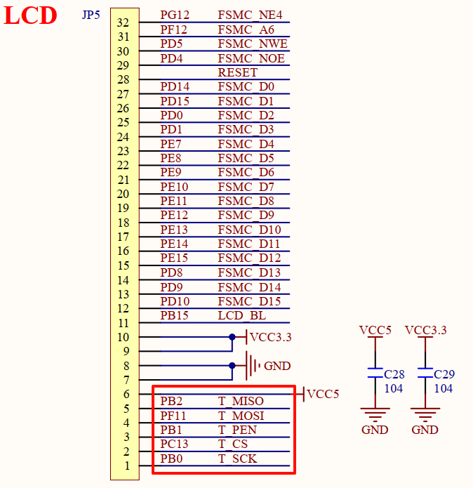
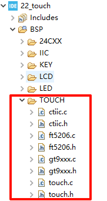

## Touch example<a name="brief"></a>


### 1 Brief
The function of this example is to control the ALIENTEK TFTLCD module to achieve the function of a tablet.
### 2 Hardware Hookup
The hardware resources used in this example are:
+ LED0 - PF9
+ USART1 - PA9/PA10
+ KEY - KEY0(PE4)
+ ALIENTEK  2.8/3.5/4.3/7 inch TFTLCD module

The connection ports of the TFTLCD module and the Mini Board are as follows.The touch screen (resistive touch screen) of the TFTLCD module has a total of 5 wires connected to the STM32F4.



### 3 STM32CubeIDE Configuration

We copy the project from  **20_iic** and name both the project and the.ioc file **22_touch**. The **.ioc** file does not need to be modified for this example. But we will add the TOUCH-driver file as below.



##### code

For the touch screen driver, we'll focus on the initializer function in touch.c.

###### touch.c
In the initialization, the ID number of the TFTLCD module will be read, and different types of touch screens will be initialized according to the ID number of the LCD.
```c#
uint8_t tp_init(void)
{
    GPIO_InitTypeDef gpio_init_struct = {0};
    
    tp_dev.touchtype = 0;                                                               /* Default Settings (resistor, portrait) */
    tp_dev.touchtype |= lcddev.dir & 0x01;                                              /* Determine whether the screen is landscape or portrait based on the LCD */
    
    if ((lcddev.id == 0x5510) ||                                                        /* Capacitive touch screen, 4.3 "/10.1" screen */
        (lcddev.id == 0x9806) ||
        (lcddev.id == 0x7796) ||
        (lcddev.id == 0x4342) ||
        (lcddev.id == 0x4384) ||
        (lcddev.id == 0x1018))
    {
        gt9xxx_init();
        tp_dev.scan = gt9xxx_scan;                                                      /* Set the touch screen scan function */
        tp_dev.touchtype |= 0x80;                                                       /* capacitive touch screen */
        return 0;
    }
    else if ((lcddev.id == 0x1963) || (lcddev.id == 0x7084) || (lcddev.id == 0x7016))   /* SSD1963 7 inch screen or 7 inch 800*480/1024*600 RGB screen */
    {
        if (ft5206_init() == 0)
        {
            tp_dev.scan = ft5206_scan;                                                  /* Set the touch screen scan function */
        }
        else
        {
            gt9xxx_init();
            tp_dev.scan = gt9xxx_scan;                                                  /* Set the touch screen scan function */
        }
        tp_dev.touchtype |= 0x80;                                                       /* capacitive touch screen */
        return 0;
    }
    else                                                                                /* resistive touch screen */
    {
        T_PEN_GPIO_CLK_ENABLE();
        T_CS_GPIO_CLK_ENABLE();
        T_MISO_GPIO_CLK_ENABLE();
        T_MOSI_GPIO_CLK_ENABLE();
        T_CLK_GPIO_CLK_ENABLE();
        
        gpio_init_struct.Pin = T_PEN_GPIO_PIN;
        gpio_init_struct.Mode = GPIO_MODE_INPUT;
        gpio_init_struct.Pull = GPIO_PULLUP;
        gpio_init_struct.Speed = GPIO_SPEED_FREQ_HIGH;
        HAL_GPIO_Init(T_PEN_GPIO_PORT, &gpio_init_struct);
        
        gpio_init_struct.Pin = T_CS_GPIO_PIN;
        gpio_init_struct.Mode = GPIO_MODE_OUTPUT_PP;
        gpio_init_struct.Pull = GPIO_PULLUP;
        gpio_init_struct.Speed = GPIO_SPEED_FREQ_HIGH;
        HAL_GPIO_Init(T_CS_GPIO_PORT, &gpio_init_struct);
        
        gpio_init_struct.Pin = T_MISO_GPIO_PIN;
        gpio_init_struct.Mode = GPIO_MODE_INPUT;
        gpio_init_struct.Pull = GPIO_PULLUP;
        gpio_init_struct.Speed = GPIO_SPEED_FREQ_HIGH;
        HAL_GPIO_Init(T_MISO_GPIO_PORT, &gpio_init_struct);
        
        gpio_init_struct.Pin = T_MOSI_GPIO_PIN;
        gpio_init_struct.Mode = GPIO_MODE_OUTPUT_PP;
        gpio_init_struct.Pull = GPIO_PULLUP;
        gpio_init_struct.Speed = GPIO_SPEED_FREQ_HIGH;
        HAL_GPIO_Init(T_MOSI_GPIO_PORT, &gpio_init_struct);
        
        gpio_init_struct.Pin = T_CLK_GPIO_PIN;
        gpio_init_struct.Mode = GPIO_MODE_OUTPUT_PP;
        gpio_init_struct.Pull = GPIO_PULLUP;
        gpio_init_struct.Speed = GPIO_SPEED_FREQ_HIGH;
        HAL_GPIO_Init(T_CLK_GPIO_PORT, &gpio_init_struct);
        
        tp_read_xy(&tp_dev.x[0], &tp_dev.y[0]);                                         /* First read initialization */
        at24cxx_init();                                                                 /* Initialize AT24CXX */
        
        if (tp_get_adjust_data())                                                       /* Calibrated touch */
        {
            return 0;
        }
        else                                                                            /* Uncalibrated touch */
        {
            tp_adjust();                                                                /* Touch screen calibration */
            tp_save_adjust_data();                                                      /* Saving calibration parameters */
        }
        
        tp_get_adjust_data();                                                           /* Obtain the touch screen calibration parameters */
    }
    
    return 1;
}
```

###### main.c
```c#
int main(void)
{
  /* USER CODE BEGIN 1 */

  /* USER CODE END 1 */

  /* MCU Configuration--------------------------------------------------------*/

  /* Reset of all peripherals, Initializes the Flash interface and the Systick. */
  HAL_Init();

  /* USER CODE BEGIN Init */

  /* USER CODE END Init */

  /* Configure the system clock */
  SystemClock_Config();

  /* USER CODE BEGIN SysInit */
  delay_init(168);
  /* USER CODE END SysInit */

  /* Initialize all configured peripherals */
  MX_GPIO_Init();
  MX_USART1_UART_Init();
  MX_FSMC_Init();
  /* USER CODE BEGIN 2 */

  lcd_init();
  tp_dev.init();                      /* Initialize the touch screen */

  lcd_show_string(30, 50, 200, 16, 16, "STM32", RED);
  lcd_show_string(30, 70, 200, 16, 16, "TOUCH TEST", RED);
  lcd_show_string(30, 90, 200, 16, 16, "ATOM@ALIENTEK", RED);

  /* Resistive screen displays touch calibration prompt */
  if ((tp_dev.touchtype & 0x80) == 0)
  {
      lcd_show_string(30, 110, 200, 16, 16, "Press KEY0 to Adjust", RED);
  }
  HAL_Delay(1500);
  load_draw_dialog();

  if (tp_dev.touchtype & 0x80)
  {
	  /* Capacitive screen test */
      ctp_test();
  }
  else
  {
	  /* Resistive screen test */
      rtp_test();
  }

  /* USER CODE END 2 */

  /* Infinite loop */
  /* USER CODE BEGIN WHILE */
  while (1)
  {
    /* USER CODE END WHILE */
	  HAL_Delay(10);
    /* USER CODE BEGIN 3 */
  }
  /* USER CODE END 3 */
}
```
After the touch screen is initialized, different test functions are called according to different types, because the capacitive screen supports multi-touch, while the resistive screen does not.

The capacitor screen test function is as follows:
```c#
void ctp_test(void)
{
    uint8_t t = 0;
    uint8_t i = 0;
    uint16_t lastpos[10][2];        /* The last data */
    uint8_t maxp = 5;

    if (lcddev.id == 0X1018)maxp = 10;

    while (1)
    {
        tp_dev.scan(0);

        for (t = 0; t < maxp; t++)
        {
            if ((tp_dev.sta) & (1 << t))
            {
                if (tp_dev.x[t] < lcddev.width && tp_dev.y[t] < lcddev.height)  /* The coordinates are in screen range */
                {
                    if (lastpos[t][0] == 0XFFFF)
                    {
                        lastpos[t][0] = tp_dev.x[t];
                        lastpos[t][1] = tp_dev.y[t];
                    }

                    lcd_draw_bline(lastpos[t][0], lastpos[t][1], tp_dev.x[t], tp_dev.y[t], 2, POINT_COLOR_TBL[t]); /* draw line */
                    lastpos[t][0] = tp_dev.x[t];
                    lastpos[t][1] = tp_dev.y[t];

                    if (tp_dev.x[t] > (lcddev.width - 24) && tp_dev.y[t] < 20)
                    {
                        load_draw_dialog();   /* clear */
                    }
                }
            }
            else
            {
                lastpos[t][0] = 0XFFFF;
            }
        }

        HAL_Delay(5);
        i++;

        if (i % 20 == 0)LED0_TOGGLE();
    }
}
```

### 4 Running
#### 4.1 Compile & Download
After the compilation is complete, connect the DAP and the Mini Board, and then connect to the computer together to download the program to the Mini Board.
#### 4.2 Phenomenon
Press the **RESET** button to begin running the program on your Mini Board, observe the LED0 flashing on the Mini Board, indicating that the code download is successful. 

The information is displayed on the LCD, and then the whiteboard interface is entered, at which time any pattern can be drawn on the LCD. If the capacitive screen, but also support multi-touch, if the resistive screen to press the KEY0 button to calibrate the resistive touch screen.


[jump to title](#brief)