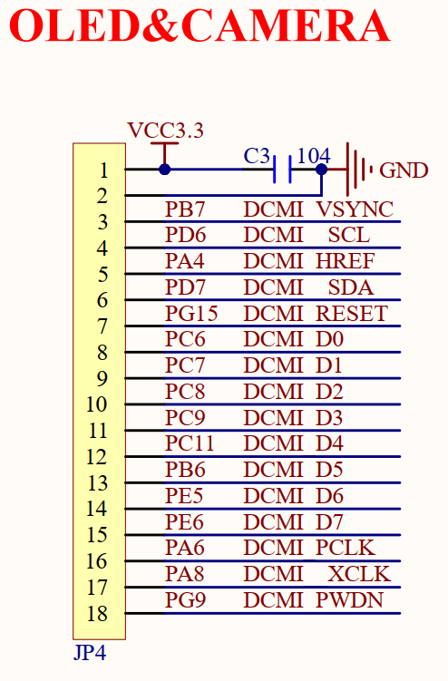
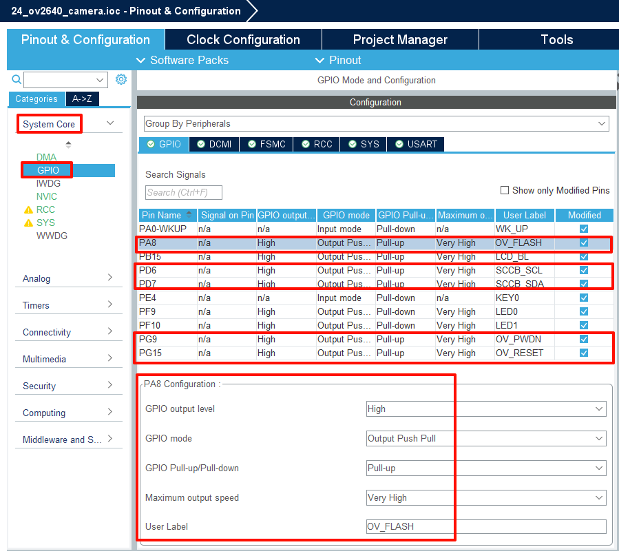
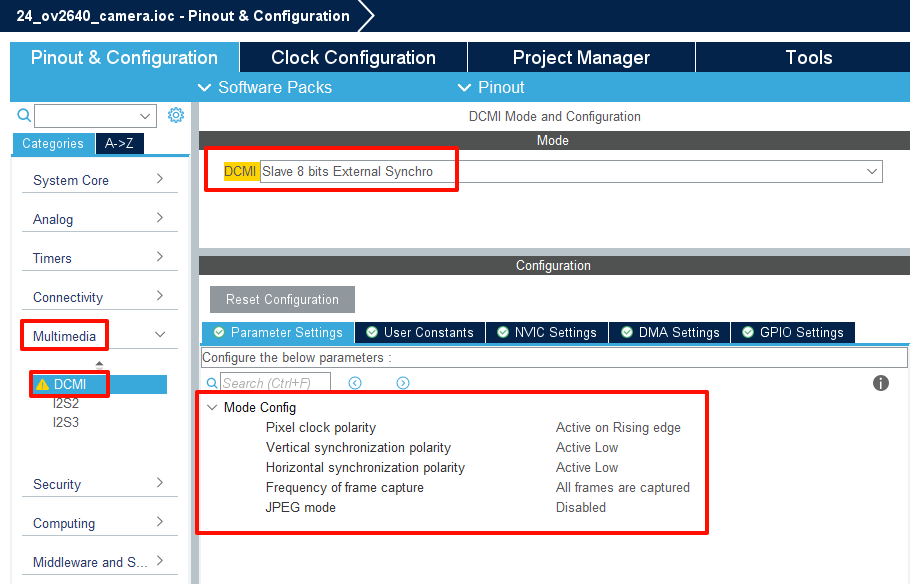
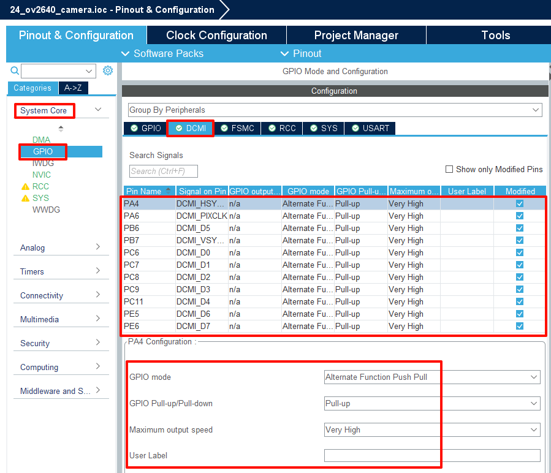
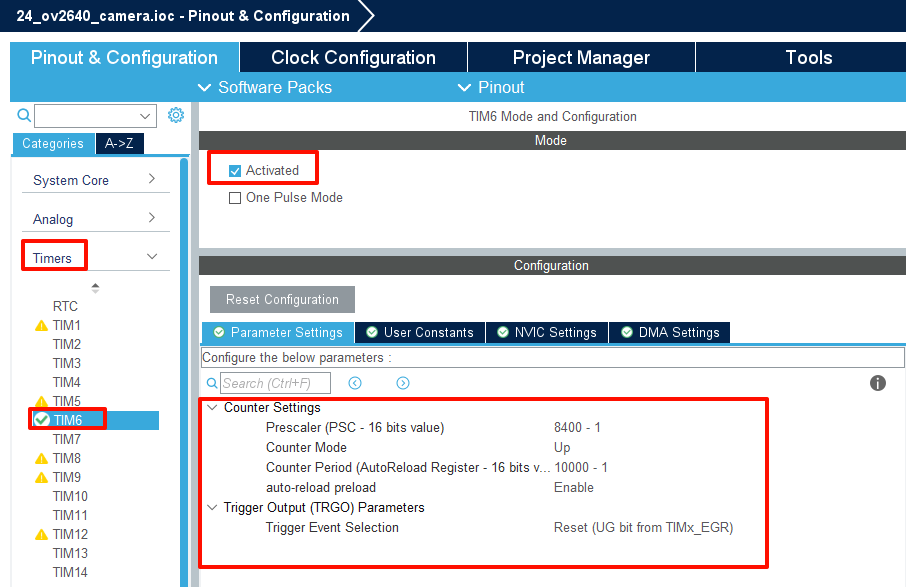
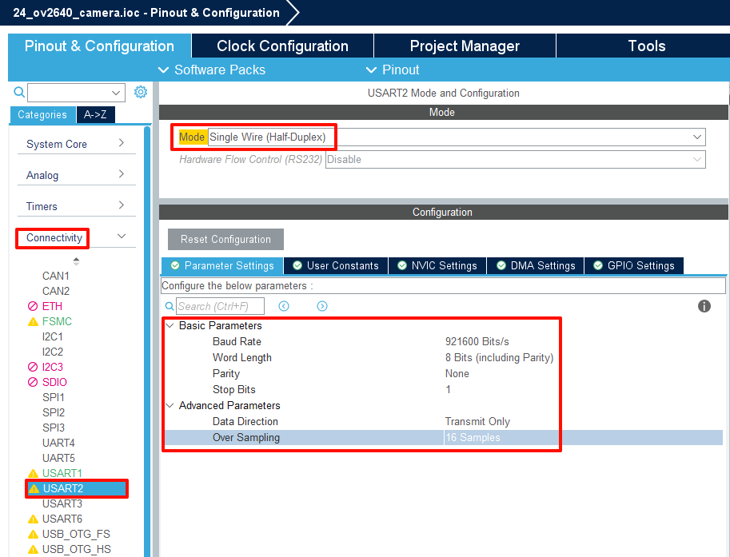
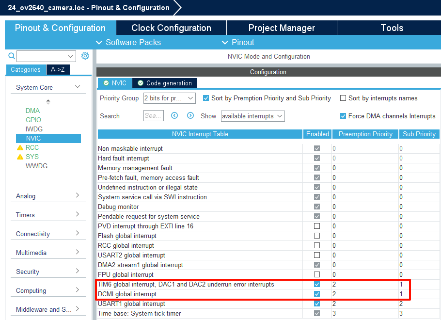
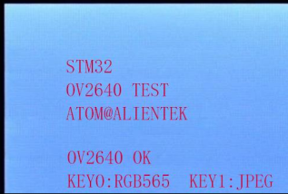
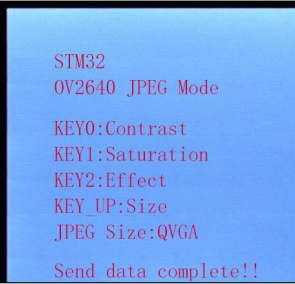

## OV2640 Camera example<a name="brief"></a>

### 1 Brief
This chapter will introduce the use of STM32F407 to drive the OV2640 camera, so as to obtain the image data output by the camera, and display it on the LCD, or send it through the serial port software.
### 2 Hardware Hookup
The hardware resources used in this example are:
+ LED0 - PF9
+ LED1 - PF10
+ USART1 - PA9/PA10
+ KEY - WKUP(PA0)
+ KEY - KEY0(PE4)
+ ALIENTEK  2.8/3.5/4.3/7 inch TFTLCD module
+ USART2 - PA2 
+ TIM6
+ ATK-MC2640 Camera Module：
+ OV_D0~D7 - PC6/PC7/PC8/PC9/PC11/PB6/PE5/PE6
+ OV_SCL - PD6
+ OV_SDA - PD7
+ OV_VSYNC - PB7
+ OV_HREF - PA4
+ OV_PCLK - PA6
+ OV_PWDN - PG9
+ OV_RESET - PG15
+ OV_XCLK - PA8

This experiment utilizes a ALIENTEK OV2640 camera module (ATK-MC2640), which requires connection to the on-board CAMERA interface via a camera module extension cable. This interface is also compatible with OLED modules. The schematic diagram for the connection between this interface and the on-board MCU is shown below:



And this is OV2640 camera module schematic：


### 3 STM32CubeIDE Configuration

We copy the project from  **11_tftlcd_mcu** and name both the project and the.ioc file **24_ov2640_camera**. Next we start the OV2640 Camera configuration by double-clicking the **24_ov2640_camera.ioc** file.

At the **Pinout & Configuration** section, click **System Core->GPIO** configure the OV2640 pin, as shown in the following figure:



Next configure the DCMI at **Multimedia->DCMI**,as shown in the following figure:



The **DCMI** pins after the configuration are as follows:



Next we configure the parameters of TIM6 at **Timers->TIM6**, with the following settings:



Next we configure the parameters of USART2 at **Connectivity->USART2**, with the following settings:



TIM6 should generate an interrupt upon overflow every 1 second. The external interrupt line is used to detect the frame signal, so we need to enable the corresponding interrupt and configure the interrupt priority. As shown in the following diagram:



Finally we click **File > Save**, and you will be asked to generate code.Click **Yes**.

##### code
Create a new folder named OV2640, then create five files within the OV2640 folder: ov2640.c, ov2640.h, ov2640cfg.h, sccb.c, and sccb.h.

###### ov2640.h
```c#
/* OV2640 MID, PID, and SCCB Address Definitions */
#define OV2640_MID                  0x7FA2
#define OV2640_PID                  0x2642
#define OV2640_ADDR                 0x60

/* OV2640 DSP Register address Definitions */
#define OV2640_DSP_R_BYPASS         0x05
#define OV2640_DSP_Qs               0x44
#define OV2640_DSP_CTRL             0x50
#define OV2640_DSP_HSIZE1           0x51
#define OV2640_DSP_VSIZE1           0x52
#define OV2640_DSP_XOFFL            0x53
#define OV2640_DSP_YOFFL            0x54
#define OV2640_DSP_VHYX             0x55
#define OV2640_DSP_DPRP             0x56
#define OV2640_DSP_TEST             0x57
#define OV2640_DSP_ZMOW             0x5A
#define OV2640_DSP_ZMOH             0x5B
#define OV2640_DSP_ZMHH             0x5C
#define OV2640_DSP_BPADDR           0x7C
#define OV2640_DSP_BPDATA           0x7D
#define OV2640_DSP_CTRL2            0x86
#define OV2640_DSP_CTRL3            0x87
#define OV2640_DSP_SIZEL            0x8C
#define OV2640_DSP_HSIZE2           0xC0
#define OV2640_DSP_VSIZE2           0xC1
#define OV2640_DSP_CTRL0            0xC2
#define OV2640_DSP_CTRL1            0xC3
#define OV2640_DSP_R_DVP_SP         0xD3
#define OV2640_DSP_IMAGE_MODE       0xDA
#define OV2640_DSP_RESET            0xE0
#define OV2640_DSP_MS_SP            0xF0
#define OV2640_DSP_SS_ID            0x7F
#define OV2640_DSP_SS_CTRL          0xF8
#define OV2640_DSP_MC_BIST          0xF9
#define OV2640_DSP_MC_AL            0xFA
#define OV2640_DSP_MC_AH            0xFB
#define OV2640_DSP_MC_D             0xFC
#define OV2640_DSP_P_STATUS         0xFE
#define OV2640_DSP_RA_DLMT          0xFF

/* OV2640 Sensor Register address Definition */
#define OV2640_SENSOR_GAIN          0x00
#define OV2640_SENSOR_COM1          0x03
#define OV2640_SENSOR_REG04         0x04
#define OV2640_SENSOR_REG08         0x08
#define OV2640_SENSOR_COM2          0x09
#define OV2640_SENSOR_PIDH          0x0A
#define OV2640_SENSOR_PIDL          0x0B
#define OV2640_SENSOR_COM3          0x0C
#define OV2640_SENSOR_COM4          0x0D
#define OV2640_SENSOR_AEC           0x10
#define OV2640_SENSOR_CLKRC         0x11
#define OV2640_SENSOR_COM7          0x12
#define OV2640_SENSOR_COM8          0x13
#define OV2640_SENSOR_COM9          0x14
#define OV2640_SENSOR_COM10         0x15
#define OV2640_SENSOR_HREFST        0x17
#define OV2640_SENSOR_HREFEND       0x18
#define OV2640_SENSOR_VSTART        0x19
#define OV2640_SENSOR_VEND          0x1A
#define OV2640_SENSOR_MIDH          0x1C
#define OV2640_SENSOR_MIDL          0x1D
#define OV2640_SENSOR_AEW           0x24
#define OV2640_SENSOR_AEB           0x25
#define OV2640_SENSOR_W             0x26
#define OV2640_SENSOR_REG2A         0x2A
#define OV2640_SENSOR_FRARL         0x2B
#define OV2640_SENSOR_ADDVSL        0x2D
#define OV2640_SENSOR_ADDVHS        0x2E
#define OV2640_SENSOR_YAVG          0x2F
#define OV2640_SENSOR_REG32         0x32
#define OV2640_SENSOR_ARCOM2        0x34
#define OV2640_SENSOR_REG45         0x45
#define OV2640_SENSOR_FLL           0x46
#define OV2640_SENSOR_FLH           0x47
#define OV2640_SENSOR_COM19         0x48
#define OV2640_SENSOR_ZOOMS         0x49
#define OV2640_SENSOR_COM22         0x4B
#define OV2640_SENSOR_COM25         0x4E
#define OV2640_SENSOR_BD50          0x4F
#define OV2640_SENSOR_BD60          0x50
#define OV2640_SENSOR_REG5D         0x5D
#define OV2640_SENSOR_REG5E         0x5E
#define OV2640_SENSOR_REG5F         0x5F
#define OV2640_SENSOR_REG60         0x60
#define OV2640_SENSOR_HISTO_LOW     0x61
#define OV2640_SENSOR_HISTO_HIGH    0x62
```
These are macro definitions for some register addresses related to OV2640. There are also some variable declarations and details can be viewed by opening the code.

###### dcmi.c
We added the following functions to the DCMI driver, and first of all, the data returned by the camera is transmitted through DMA, in DCMI driver, DMA initialization function is shown as follows:

```c#
void dcmi_dma_init(uint32_t mem0addr, uint32_t mem1addr, uint16_t memsize, uint32_t memblen, uint32_t meminc)
{
    /* DCMI DMA Init */
    /* DCMI Init */
    hdma_dcmi.Instance = DMA2_Stream1;
    hdma_dcmi.Init.Channel = DMA_CHANNEL_1;
    hdma_dcmi.Init.Direction = DMA_PERIPH_TO_MEMORY;
    hdma_dcmi.Init.PeriphInc = DMA_PINC_DISABLE;
    hdma_dcmi.Init.MemInc = meminc;
    hdma_dcmi.Init.PeriphDataAlignment = DMA_PDATAALIGN_WORD;
    hdma_dcmi.Init.MemDataAlignment = memblen;
    hdma_dcmi.Init.Mode = DMA_CIRCULAR;
    hdma_dcmi.Init.Priority = DMA_PRIORITY_VERY_HIGH;
    hdma_dcmi.Init.FIFOMode = DMA_FIFOMODE_ENABLE;
    hdma_dcmi.Init.FIFOThreshold = DMA_FIFO_THRESHOLD_HALFFULL;
    hdma_dcmi.Init.MemBurst = DMA_MBURST_SINGLE;
    hdma_dcmi.Init.PeriphBurst = DMA_PBURST_SINGLE;
    if (HAL_DMA_Init(&hdma_dcmi) != HAL_OK)
    {
      Error_Handler();
    }

    __HAL_LINKDMA(&g_dcmi_handle,DMA_Handle,hdma_dcmi);

    if (mem1addr == 0)
    {
        HAL_DMA_Start(&hdma_dcmi, (uint32_t)&DCMI->DR, mem0addr, memsize);
    }
    else
    {
        HAL_DMAEx_MultiBufferStart(&hdma_dcmi, (uint32_t)&DCMI->DR, mem0addr, mem1addr, memsize);
        __HAL_DMA_ENABLE_IT(&hdma_dcmi, DMA_IT_TC);
    }
}
```
You can see that this function configures the DMA to transfer data from the DCMI to the memory, and it can be configured for single-buffer or double-buffer operation.

In the DCMI driver, the functions to start and stop DCMI transmission are as follows:

```c#
/**
 * @brief   Start the DCMI transfer
 * @param   None
 * @retval  None
 */
void dcmi_start(void)
{
    lcd_set_cursor(0, 0);
    lcd_write_ram_prepare();
    __HAL_DMA_ENABLE(&hdma_dcmi);   		/* Enable DMA */
    DCMI->CR |= DCMI_CR_CAPTURE;            /* DCMI capture is enabled */
}

/**
 * @brief   Stop the DCMI transfer
 * @param   None
 * @retval  None
 */
void dcmi_stop(void)
{
    DCMI->CR &= ~(DCMI_CR_CAPTURE);         /* Disable DCMI capture */
    while (DCMI->CR & 0X01);                /* Wait for transfer to end */
    __HAL_DMA_DISABLE(&hdma_dcmi);          /* Disable DMA */
}
```
Because in RGB565 mode, the DMA directly transfers the data from the DCMI to the LCD for display, corresponding operations are performed on the LCD in the function for starting DCMI transmission, and the DMA and DCMI are enabled.

In the DCMI driver, the frame event callback function for the DCMI is as follows:

```c#
void HAL_DCMI_FrameEventCallback(DCMI_HandleTypeDef *hdcmi)
{
    __HAL_DCMI_CLEAR_FLAG(&g_dcmi_handle, DCMI_FLAG_FRAMERI);	/* Clears frame interrupt */
    jpeg_data_process();    /* jpeg data processing */
    LED1_TOGGLE();          /* LED1 blinking */
    g_ov_frame++;

    __HAL_DCMI_ENABLE_IT(&g_dcmi_handle, DCMI_IT_FRAME);
}
```

From the above code, we can see that this function mainly calls the JPEG data processing function and calculates the frame rate.

Finally,the DCMI driver is introduced with this much information. For more details about SCCB and OV2640 drivers, readers are advised to refer to the accompanying sample code for this experiment.


###### main.c
Your finished main() function should look like the following:
```c#
int main(void)
{
  /* USER CODE BEGIN 1 */

    uint8_t t = 0;
    uint8_t key;

  /* USER CODE END 1 */

  /* MCU Configuration--------------------------------------------------------*/

  /* Reset of all peripherals, Initializes the Flash interface and the Systick. */
  HAL_Init();

  /* USER CODE BEGIN Init */

  /* USER CODE END Init */

  /* Configure the system clock */
  SystemClock_Config();

  /* USER CODE BEGIN SysInit */
  delay_init(168);
  /* USER CODE END SysInit */

  /* Initialize all configured peripherals */
  MX_GPIO_Init();
  MX_DMA_Init();
  MX_USART1_UART_Init();
  MX_FSMC_Init();
  MX_TIM6_Init();
  MX_USART2_UART_Init();
  MX_DCMI_Init();
  /* USER CODE BEGIN 2 */

  lcd_init();
  lcd_show_string(30, 50, 200, 16, 16, "STM32", RED);
  lcd_show_string(30, 70, 200, 16, 16, "OV2640 TEST", RED);
  lcd_show_string(30, 90, 200, 16, 16, "ATOM@ALIENTEK", RED);

  while (ov2640_init() != 0)                                      /* Initializes the OV2640 */
  {
      lcd_show_string(30, 130, 200, 16, 16, "OV2640 ERROR ", RED);
      HAL_Delay(200);
      lcd_show_string(30, 130, 200, 16, 16, "Please Check! ", RED);
      HAL_Delay(500);
      LED0_TOGGLE();
  }
  lcd_show_string(30, 130, 200, 16, 16, "OV2640 OK     ", RED);
  ov2640_flash_intctrl();

  /* USER CODE END 2 */

  /* Infinite loop */
  /* USER CODE BEGIN WHILE */
  while (1)
  {
    /* USER CODE END WHILE */

      t++;
      key = key_scan(0);

      if (key == KEY0_PRES)                                       /* RGB565 Mode */
      {
          g_ov_mode = 0;
          break;
      }
      else if (key == WKUP_PRES)                                  /* JPEG Mode */
      {
          g_ov_mode = 1;
          break;
      }

      if (t == 100)
      {
          lcd_show_string(30, 150, 230, 16, 16, "KEY0:RGB565  KEY_UP:JPEG", RED);
      }

      else if (t == 200)
      {
          t = 0;
          lcd_fill(30, 150, 230, 150 + 16, WHITE);
          LED0_TOGGLE();
      }

      HAL_Delay(5);

    /* USER CODE BEGIN 3 */
  }

  if (g_ov_mode == 0)
  {
      rgb565_test();                                              /* RGB565 Mode test */
  }
  else
  {
      jpeg_test();                                                /* JPEG Mode test */
  }

  /* USER CODE END 3 */
}
```

### 4 Running
#### 4.1 Compile & Download
After the compilation is complete, connect the DAP and the Mini Board, and then connect to the computer together to download the program to the Mini Board.
#### 4.2 Phenomenon
After completing the compilation and programming operations, first power off the development board, then connect the camera module to the development board via the camera extension cable, connect the LCD mode and USART2 to the PC, and finally power on the development board (when plugging or unplugging the connectors and modules on the development board, it is required to power off, otherwise it may damage the hardware). After running the program, you can see the prompt on the LCD to press KEY0 to enter the RGB565 mode test, and press WKUP to enter the JPEG mode test. 

If you press the KEY0 button at this time, if the development board is connected to the LCD module, you can see the real-time image captured by the camera on the LCD screen. Pressing the KEY0 button can change the contrast of the image, and pressing the WKUP button can change the size of the image.

If you press the WKUP button at this time, if the USART2 of the development board is connected to the PC via USB to serial mode, and the upper computer on the PC side is configured, you can see the real-time image captured by the camera in the upper computer software. Pressing the KEY0 button can change the contrast of the image, and pressing the WKUP button can change the size of the image.After entering the RGB565 mode or JPEG mode test, you can view the real-time frame of the camera through the serial debugging assistant Rate.





[jump to title](#brief)
