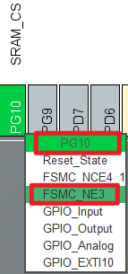

## SRAM example<a name="catalogue"></a>


### 1 Brief
This example drives SRAM to read and write data from SRAM. The capacity and data of SRAM can be tested by pressing KEY0 and WKUP keys, respectively.
### 2 Hardware Hookup
The hardware resources used in this example are:
+ LED0 - PF9
+ USART1 - PA9/PA10
+ KEY - WKUP(PA0)
+ KEY - KEY0(PE4)
+ ALIENTEK  2.8/3.5/4.3/7 inch TFTLCD module


### 3 STM32CubeIDE Configuration

We copy the project from **11_tftlcd_mcu** and rename both the project and the.ioc file **25_sram**. Next we start the SRAM configuration by double-clicking the **25_sram.ioc** file.

At the **Pinout & Configuration** section, configure the pin **PG10** for the SRAM, as shown in the following figure:



Click **System Core->GPIO**, and config the PG10.


Next, configure the parameters of the FSMC in **Connectivity->FSMC**.


The detailed parameter configuration is as follows:


Click **File > Save**, and you will be asked to generate code.Click **Yes**.

##### code

###### fsmc.c

```c#
void sram_write(uint8_t *pbuf, uint32_t addr, uint32_t datalen)
{
    for (; datalen != 0; datalen--)
    {
        *(volatile uint8_t *)(SRAM_BASE_ADDR + addr) = *pbuf;
        addr++;
        pbuf++;
    }
}

/**
 * @brief       Read specified length of data from a specified address in SRAM
 * @param       pbuf    : Pointer to the data storage area
 * @param       addr    : Starting address to read data (up to 32 bits)
 * @param       datalen : Number of bytes to read (up to 32 bits)
 * @retval      None
 */
void sram_read(uint8_t *pbuf, uint32_t addr, uint32_t datalen)
{
    for (; datalen != 0; datalen--)
    {
        *pbuf++ = *(volatile uint8_t *)(SRAM_BASE_ADDR + addr);
        addr++;
    }
}

/**
 * @brief       Test function to write one byte to a specified address in SRAM
 * @param       addr    : Starting address to write data (up to 32 bits)
 * @param       data    : Byte to write
 * @retval      None
 */
void sram_test_write(uint32_t addr, uint8_t data)
{
    sram_write(&data, addr, 1); /* Write one byte */
}

/**
 * @brief       Test function to read one byte from a specified address in SRAM
 * @param       addr    : Starting address to read data (up to 32 bits)
 * @retval      Data read (one byte)
 */
uint8_t sram_test_read(uint32_t addr)
{
    uint8_t data;
    sram_read(&data, addr, 1); /* Read one byte */
    return data;
}
```

###### main.c
We add some SRAM test code.

```c#
void fsmc_sram_test(uint16_t x, uint16_t y)
{
    uint32_t i = 0;
    uint8_t temp = 0;
    uint8_t sval = 0; /* Data read at address 0 */

    lcd_show_string(x, y, 239, y + 16, 16, "Ex Memory Test:   0KB", BLUE);

    /* Write one data every 4KB, a total of 256 data written, exactly 1MB */
    for (i = 0; i < 1024 * 1024; i += 4096)
    {
        sram_write(&temp, i, 1);
        temp++;
    }

    /* Read out the previously written data one by one and perform verification */
    for (i = 0; i < 1024 * 1024; i += 4096)
    {
        sram_read(&temp, i, 1);

        if (i == 0)
        {
            sval = temp;
        }
        else if (temp <= sval)
        {
            break; /* The data read later must be greater than the data read for the first time */
        }

        lcd_show_xnum(x + 15 * 8, y, (uint16_t)(temp - sval + 1) * 4, 4, 16, 0, BLUE); /* Display memory capacity */
    }
}

int main(void)
{
  /* USER CODE BEGIN 1 */
    uint8_t key;
    uint8_t i = 0;
    uint32_t ts = 0;
  /* USER CODE END 1 */

  /* MCU Configuration--------------------------------------------------------*/

  /* Reset of all peripherals, Initializes the Flash interface and the Systick. */
  HAL_Init();

  /* USER CODE BEGIN Init */

  /* USER CODE END Init */

  /* Configure the system clock */
  SystemClock_Config();

  /* USER CODE BEGIN SysInit */

  /* USER CODE END SysInit */

  /* Initialize all configured peripherals */
  MX_GPIO_Init();
  MX_USART1_UART_Init();
  MX_FSMC_Init();
  /* USER CODE BEGIN 2 */

  lcd_init();
  lcd_show_string(30,  50, 200, 16, 16, "STM32", RED);
  lcd_show_string(30,  70, 200, 16, 16, "SRAM TEST", RED);
  lcd_show_string(30,  90, 200, 16, 16, "ATOM@ALIENTEK", RED);
  lcd_show_string(30, 110, 200, 16, 16, "KEY0:Test Sram", RED);
  lcd_show_string(30, 130, 200, 16, 16, "KEY_UP:TEST Data", RED);

  for (ts = 0; ts < 250000; ts++)
  {
      g_test_buffer[ts] = ts;         /* Pre-store test data */
  }

  /* USER CODE END 2 */

  /* Infinite loop */
  /* USER CODE BEGIN WHILE */
  while (1)
  {
    /* USER CODE END WHILE */
      key = key_scan(0);              /* Continuous pressing is not supported */

      if (key == KEY0_PRES)
      {
          fsmc_sram_test(30, 150);    /* Test SRAM capacity */
      }
      else if (key == WKUP_PRES)      /* Print pre-stored test data */
      {
          for (ts = 0; ts < 250000; ts++)
          {
              lcd_show_xnum(30, 170, g_test_buffer[ts], 6, 16, 0, BLUE);
          }
      }
      else
      {
    	  HAL_Delay(10);        /* delay 10ms */
      }

      i++;

      if (i == 20)
      {
          i = 0;
          LED0_TOGGLE();
      }
    /* USER CODE END WHILE */

    /* USER CODE BEGIN 3 */
  }
  /* USER CODE END 3 */
}
```
The above function is to write data to the SRAM, and then read out the validation, once for the SRAM read and write test.

### 4 Running
#### 4.1 Compile & Download
After the compilation is complete, connect the DAP and the Mini Board, and then connect to the computer together to download the program to the Mini Board.
#### 4.2 Phenomenon
Press the **RESET** button to begin running the program on your Mini Board. Press the KEY0 button to read and write the SRAM, and you can see the results of testing external SRAM capacity on the LCD. If everything is normal, it will show "Ex Memory Test:1024KB", where 1024KB is the actual capacity of SRAM on the Mini Board (1MB). Press WKUP to read the SRAM test, also can see that the LCD constantly refreshed to display a string of numbers.

[jump to tittle](#catalogue)
