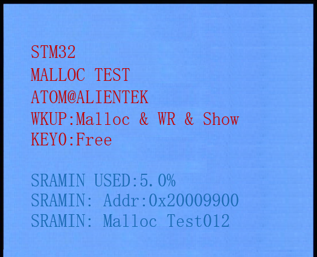
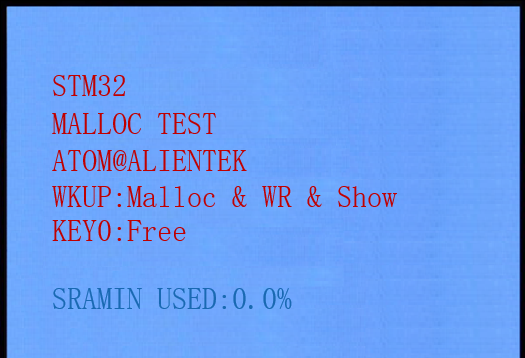

## MALLOC example<a name="brief"></a>


### 1 Brief
The function of this code is to press KEY0 to apply for memory and write content, 2K bytes of memory each time. The key WKUP is used to release the memory, only the memory applied last time can be released, and the memory management function can be tested through USMART debugging.
### 2 Hardware Hookup
The hardware resources used in this example are:
+ LED0 - PB5
+ USART1 - PA9/PA10
+ KEY - WKUP(PA0)
+ KEY - KEY0(PE4)
+ ALIENTEK  2.8/3.5/4.3/7 inch TFTLCD module

This example uses the memory management library as a software library, so there is no corresponding connection schematic.

### 3 STM32CubeIDE Configuration


We copy the **12_usmart** project and name both the project and the.ioc file **26_malloc**.
The memory management library used in this example is a software library, which does not involve configuration on hardware and peripherals. So just add our user file ``malloc.c\malloc.h`` to the project.

##### code
###### malloc.h
```c#
/* mem1 memory parameter setting.mem1 is the SRAM inside F103. */
#define MEM1_BLOCK_SIZE         32                              /* The memory block size is 32 bytes */
#define MEM1_MAX_SIZE           40 * 1024                       /* The maximum managed memory is 40K, with a total of 512KB of F103 internal SRAM */
#define MEM1_ALLOC_TABLE_SIZE   MEM1_MAX_SIZE/MEM1_BLOCK_SIZE   /* Memory table size */


/* Memory Management controller */
struct _m_mallco_dev
{
    void (*init)(uint8_t);              /* initialize */
    uint16_t (*perused)(uint8_t);       /* memory usage */
    uint8_t *membase[SRAMBANK];         /* The memory pool manages the memory of the SRAMBANK regions */
    MT_TYPE *memmap[SRAMBANK];          /* Memory management status table */
    uint8_t  memrdy[SRAMBANK];          /* Memory management in place */
};
```
The program uses the macro definition **MEM1_BLOCK_SIZE** to define the total size of the internal memory pool that malloc can manage. **MEM1_ALLOC_TABLE_SIZE** represents the memory management table size of the memory pool. We can define multiple memory management tables so that we can manage multiple blocks of memory at the same time.

Through the memory management controller **_m_mallco_dev** struct, we store information about chunked memory management, its initialization function, access usage, memory pool, memory management table, and memory management status to achieve management control of the memory pool.

###### malloc.c
```c#
static uint32_t my_mem_malloc(uint8_t memx, uint32_t size)
{
    signed long offset = 0;
    uint32_t nmemb;     /* The number of memory blocks required */
    uint32_t cmemb = 0; /* The number of contiguous empty memory blocks */
    uint32_t i;

    if (!mallco_dev.memrdy[memx])
    {
        mallco_dev.init(memx);          /* Uninitialized, initialized first */
    }
    
    if (size == 0) return 0XFFFFFFFF;   /* No allocation required */

    nmemb = size / memblksize[memx];    /* Gets the number of contiguous memory blocks to allocate */

    if (size % memblksize[memx]) nmemb++;

    for (offset = memtblsize[memx] - 1; offset >= 0; offset--)  /* Search the entire memory control area */
    {
        if (!mallco_dev.memmap[memx][offset])
        {
            cmemb++;                    /* The number of contiguous empty memory blocks is increased */
        }
        else 
        {
            cmemb = 0;                  /* Contiguous memory blocks are reset */
        }
        
        if (cmemb == nmemb)             /* nmemb consecutive empty memory blocks are found */
        {
            for (i = 0; i < nmemb; i++) /* Note that the memory block is not empty */
            {
                mallco_dev.memmap[memx][offset + i] = nmemb;
            }

            return (offset * memblksize[memx]); /* Returns the offset address */
        }
    }

    return 0XFFFFFFFF;                          /* No block suitable for allocation was found */
}
static uint8_t my_mem_free(uint8_t memx, uint32_t offset)
{
    int i;

    if (!mallco_dev.memrdy[memx])                   /* Uninitialized, initialized first */
    {
        mallco_dev.init(memx);
        return 1;                                   /* uninitialized */
    }

    if (offset < memsize[memx])                     /* The offset is in the memory pool. */
    {
        int index = offset / memblksize[memx];      /* The memory block number in which the offset is located */
        int nmemb = mallco_dev.memmap[memx][index]; /* Number of memory blocks */

        for (i = 0; i < nmemb; i++)                 /* Memory blocks are reset */
        {
            mallco_dev.memmap[memx][index + i] = 0;
        }

        return 0;
    }
    else
    {
        return 2;                                   /* The offset is out of range. */
    }
}
```
The above code is used for memory allocation and memory dealing.These two functions are internal calls only, and the external calls include **mymalloc** and **myfree**.

###### main.c
```c#
int main(void)
{
  /* USER CODE BEGIN 1 */
    uint8_t t = 0;
    uint8_t key;
    uint8_t *p_sramin = NULL;
    uint8_t *p_sramccm = NULL;
    uint8_t *p_sramex = NULL;
    uint32_t tp_sramin = 0;
    uint32_t tp_sramccm = 0;
    uint32_t tp_sramex = 0;
    uint8_t paddr[32];
    uint16_t memused;
  /* USER CODE END 1 */

  /* MCU Configuration--------------------------------------------------------*/

  /* Reset of all peripherals, Initializes the Flash interface and the Systick. */
  HAL_Init();

  /* USER CODE BEGIN Init */

  /* USER CODE END Init */

  /* Configure the system clock */
  SystemClock_Config();

  /* USER CODE BEGIN SysInit */
  delay_init(168);
  /* USER CODE END SysInit */

  /* Initialize all configured peripherals */
  MX_GPIO_Init();
  MX_USART1_UART_Init();
  MX_FSMC_Init();
  /* USER CODE BEGIN 2 */

  lcd_init();
  my_mem_init(SRAMIN);                /* Initialize the internal SRAM memory pool */
  my_mem_init(SRAMCCM);               /* Initialize the CCM memory pool */
  my_mem_init(SRAMEX);                /* Initialize the external SRAM memory pool */

  lcd_show_string(30, 50, 200, 16, 16, "STM32", RED);
  lcd_show_string(30, 70, 200, 16, 16, "MALLOC TEST", RED);
  lcd_show_string(30, 90, 200, 16, 16, "ATOM@ALIENTEK", RED);

  lcd_show_string(30, 110, 200, 16, 16, "KEY0:Malloc & WR & Show", RED);
  lcd_show_string(30, 130, 200, 16, 16, "KEY_UP:Free", RED);

  lcd_show_string(30, 162, 200, 16, 16, "SRAMIN USED:", BLUE);
  lcd_show_string(30, 178, 200, 16, 16, "SRAMCCM USED:", BLUE);
  lcd_show_string(30, 194, 200, 16, 16, "SRAMEX USED:", BLUE);

  /* USER CODE END 2 */

  /* Infinite loop */
  /* USER CODE BEGIN WHILE */
  while (1)
  {
    /* USER CODE END WHILE */

      key = key_scan(0);
      if (key == WKUP_PRES)
      {
          /* Apply for memory */
          p_sramin = mymalloc(SRAMIN, 2048);
          p_sramccm = mymalloc(SRAMCCM, 2048);
          p_sramex = mymalloc(SRAMEX, 2048);

          /* Check whether memory application is successful */
          if ((p_sramin != NULL) && (p_sramccm != NULL) && (p_sramex != NULL))
          {
              /* Uses the allocated memory */
              sprintf((char *)p_sramin, "SRAMIN: Malloc Test%03d", t + SRAMIN);
              lcd_show_string(30, 258, 239, 16, 16, (char *)p_sramin, BLUE);
              sprintf((char *)p_sramccm, "SRAMCCM: Malloc Test%03d", t + SRAMCCM);
              lcd_show_string(30, 274, 239, 16, 16, (char *)p_sramccm, BLUE);
              sprintf((char *)p_sramex, "SRAMEX: Malloc Test%03d", t + SRAMEX);
              lcd_show_string(30, 290, 239, 16, 16, (char *)p_sramex, BLUE);
          }
          else
          {
              myfree(SRAMIN, p_sramin);
              myfree(SRAMCCM, p_sramccm);
              myfree(SRAMEX, p_sramex);
              p_sramin = NULL;
              p_sramccm = NULL;
              p_sramex = NULL;
          }
      }
      else if (key == KEY0_PRES)
      {
          /* Release memory */
          myfree(SRAMIN, p_sramin);
          myfree(SRAMCCM, p_sramccm);
          myfree(SRAMEX, p_sramex);
          p_sramin = NULL;
          p_sramccm = NULL;
          p_sramex = NULL;
      }

      /* Displays the first address applied to memory */
      if ((tp_sramin != (uint32_t)p_sramin) || (tp_sramccm != (uint32_t)p_sramccm) || (tp_sramex != (uint32_t)p_sramex))
      {
          tp_sramin = (uint32_t)p_sramin;
          tp_sramccm = (uint32_t)p_sramccm;
          tp_sramex = (uint32_t)p_sramex;

          sprintf((char *)paddr, "SRAMIN: Addr: 0x%08X", (uint32_t)p_sramin);
          lcd_show_string(30, 210, 239, 16, 16, (char *)paddr, BLUE);
          sprintf((char *)paddr, "SRAMCCN: Addr: 0x%08X", (uint32_t)p_sramccm);
          lcd_show_string(30, 226, 239, 16, 16, (char *)paddr, BLUE);
          sprintf((char *)paddr, "SRAMEX: Addr: 0x%08X", (uint32_t)p_sramex);
          lcd_show_string(30, 242, 239, 16, 16, (char *)paddr, BLUE);
      }
      else if ((p_sramin == NULL) || (p_sramccm == NULL) || (p_sramex == NULL))
      {
          lcd_fill(30, 210, 239, 319, WHITE);
      }

      if (++t == 20)
      {
          t = 0;

          /* Displays internal SRAM usage */
          memused = my_mem_perused(SRAMIN);
          sprintf((char *)paddr, "%d.%01d%%", memused / 10, memused % 10);
          lcd_show_string(30 + 96, 162, 200, 16, 16, (char *)paddr, BLUE);

          /* Displays CCM usage */
          memused = my_mem_perused(SRAMCCM);
          sprintf((char *)paddr, "%d.%01d%%", memused / 10, memused % 10);
          lcd_show_string(30 + 104, 178, 200, 16, 16, (char *)paddr, BLUE);

          /* Displays external SRAM usage */
          memused = my_mem_perused(SRAMEX);
          sprintf((char *)paddr, "%d.%01d%%", memused / 10, memused % 10);
          lcd_show_string(30 + 96, 194, 200, 16, 16, (char *)paddr, BLUE);

          LED0_TOGGLE();
      }

      HAL_Delay(10);

    /* USER CODE BEGIN 3 */
  }
  /* USER CODE END 3 */
}
```

### 4 Running
#### 4.1 Compile & Download
After the compilation is complete, connect the DAP and the Mini Board, and then connect to the computer together to download the program to the Mini Board.
#### 4.2 Phenomenon
Press the **RESET** button to begin running the program on your Mini Board, observe the LED0 flashing on the Mini Board, open the serial port and the host computer ATK-XCOM can see the prompt information of the example, indicating that the code download is successful. 

We can press the **KEY0** button to apply for memory once, and then press the **WKUP** button to release the memory, as shown in the following figure:





[jump to title](#brief)
