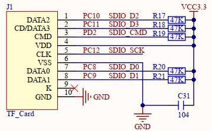
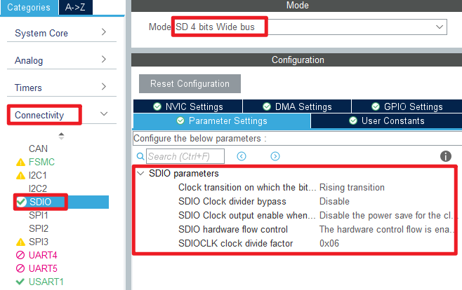
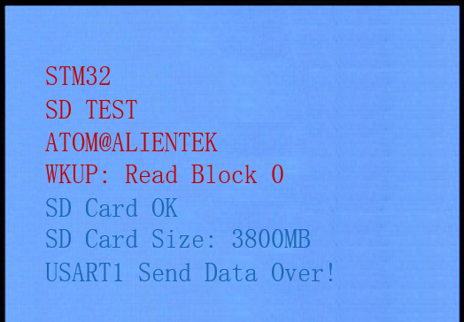
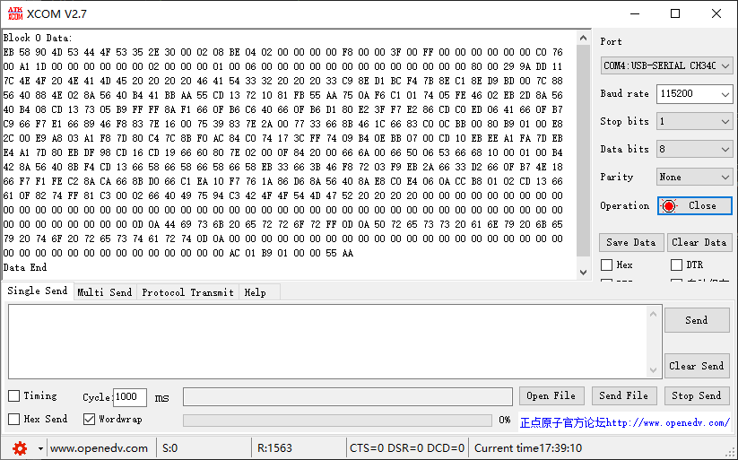

## SD example<a name="brief"></a>


### 1 Brief
The function of this example is to drive the SD card for SD card identification, reading and writing.
### 2 Hardware Hookup
The hardware resources used in this example are:
+ LED0 - PF9
+ USART1 - PA9/PA10
+ KEY - KEY0(PE4)
+ Micro SD card
+ ALIENTEK  2.8/3.5/4.3/7 inch TFTLCD module

This example uses the SDIO interface to connect with the SD card, and the schematic diagram of the connection between the SD card and the MCU.



### 3 STM32CubeIDE Configuration

We copy the project from **12_usmart** and name both the project and the.ioc file **27_sd**. Next we start the configuration by double-clicking the **27_sd.ioc** file.

Click **Connectivity -> SDIO**, the specific configuration is shown below:



Click **File > Save**, and you will be asked to generate code.Click **Yes**.


##### code
###### sdio.c

The sdio.c file needs to be rewritten each time new code is generated, as shown here:
```c#
void MX_SDIO_SD_Init(void)
{

  /* USER CODE BEGIN SDIO_Init 0 */

  /* USER CODE END SDIO_Init 0 */

  /* USER CODE BEGIN SDIO_Init 1 */

  /* USER CODE END SDIO_Init 1 */
  hsd.Instance = SDIO;
  hsd.Init.ClockEdge = SDIO_CLOCK_EDGE_RISING;
  hsd.Init.ClockBypass = SDIO_CLOCK_BYPASS_DISABLE;
  hsd.Init.ClockPowerSave = SDIO_CLOCK_POWER_SAVE_DISABLE;
  hsd.Init.BusWide = SDIO_BUS_WIDE_1B;
  hsd.Init.HardwareFlowControl = SDIO_HARDWARE_FLOW_CONTROL_ENABLE;
  hsd.Init.ClockDiv = 0x06;
  if (HAL_SD_Init(&hsd) != HAL_OK)
  {
	  return 1;
  }

  /* Getting SD information */
  HAL_SD_GetCardInfo(&hsd, &g_sd_card_info);
  /* USER CODE BEGIN SDIO_Init 2 */
  /* USER CODE END SDIO_Init 2 */

}
```
The following functions were added.

```c#
/* USER CODE BEGIN 1 */

uint8_t sd_init(void)
{
  /* Configure the 4bit bus width */
  if (HAL_SD_ConfigWideBusOperation(&hsd, SDIO_BUS_WIDE_4B) != HAL_OK)
  {
    return 2;
  }

  return 0;
}

/**
* @brief 	Get SD card information
* @param 	info: SD card information
* @retval 	gets the result
* @arg 		0: Get success
* @arg 		1: Get failed
*/
uint8_t sd_get_card_info(HAL_SD_CardInfoTypeDef *info)
{
    if (HAL_SD_GetCardInfo(&hsd, info) != HAL_OK)
    {
        return 1;
    }

    return 0;
}

/**
* @brief 	Reads the specified amount of block data on the SD card
* @param 	buf: start address for data saving
* @param 	addr: indicates the block address
* @param 	count: indicates the number of blocks
* @retval 	reads the result
* @arg 		0: read successfully
* @arg 		1: Read failed
*/
uint8_t sd_read_disk(uint8_t *buf, uint32_t addr, uint32_t count)
{
    uint32_t timeout = SD_DATATIMEOUT;

    if (HAL_SD_ReadBlocks(&hsd, buf, addr, count, SD_DATATIMEOUT) != HAL_OK)
    {
        return 1;
    }

    while ((HAL_SD_GetCardState(&hsd) != HAL_SD_CARD_TRANSFER) && (--timeout != 0));

    if (timeout == 0)
    {
        return 1;
    }

    return 0;
}

/**
* @brief 	Write the specified amount of block data on the SD card
* @param 	buf: start address for data saving
* @param 	addr: indicates the block address
* @param 	count: indicates the number of blocks
* @retval 	writes the result
* @arg 		0: write successfully
* @arg 		1: Write failed
*/
uint8_t sd_write_disk(uint8_t *buf, uint32_t addr, uint32_t count)
{
    uint32_t timeout = SD_DATATIMEOUT;

    if (HAL_SD_WriteBlocks(&hsd, buf, addr, count, SD_DATATIMEOUT) != HAL_OK)
    {
        return 1;
    }

    while ((HAL_SD_GetCardState(&hsd) != HAL_SD_CARD_TRANSFER) && (--timeout != 0));

    if (timeout == 0)
    {
        return 1;
    }

    return 0;
}

/* USER CODE END 1 */
```
The above two functions are called simple, which are to get the SD card information and the SD card status.


###### main.c
```c#
int main(void)
{
  /* USER CODE BEGIN 1 */
    uint8_t t = 0;
    uint8_t key;
  /* USER CODE END 1 */

  /* MCU Configuration--------------------------------------------------------*/

  /* Reset of all peripherals, Initializes the Flash interface and the Systick. */
  HAL_Init();

  /* USER CODE BEGIN Init */

  /* USER CODE END Init */

  /* Configure the system clock */
  SystemClock_Config();

  /* USER CODE BEGIN SysInit */
  delay_init(168);
  /* USER CODE END SysInit */

  /* Initialize all configured peripherals */
  MX_GPIO_Init();
  MX_USART1_UART_Init();
  MX_FSMC_Init();
  MX_TIM4_Init();
  MX_SDIO_SD_Init();
  /* USER CODE BEGIN 2 */

  lcd_init();

  my_mem_init(SRAMIN);                /* Initialize the internal SRAM memory pool */
  my_mem_init(SRAMCCM);               /* Initialize the CCM memory pool */

  lcd_show_string(30, 50, 200, 16, 16, "STM32", RED);
  lcd_show_string(30, 70, 200, 16, 16, "SD TEST", RED);
  lcd_show_string(30, 90, 200, 16, 16, "ATOM@ALIENTEK", RED);

  lcd_show_string(30, 110, 200, 16, 16, "WKUP: Read Block 0", RED);

  while (sd_init() != 0)
  {
      lcd_show_string(30, 130, 200, 16, 16, "SD Card Error!", RED);
      delay_ms(500);
      lcd_show_string(30, 130, 200, 16, 16, "Please Check! ", RED);
      delay_ms(500);
      LED0_TOGGLE();
  }

  lcd_show_string(30, 130, 200, 16, 16, "SD Card OK    ", BLUE);

  show_sd_info();

  /* USER CODE END 2 */

  /* Infinite loop */
  /* USER CODE BEGIN WHILE */
  while (1)
  {
    /* USER CODE END WHILE */

      key = key_scan(0);
      if (key == WKUP_PRES)
      {
    	  /* SD card read test */
          sd_read_test();
      }

      if (++t == 20)
      {
          t = 0;
          LED0_TOGGLE();
      }

      delay_ms(10);

    /* USER CODE BEGIN 3 */
  }
  /* USER CODE END 3 */
}
```


### 4 Running
#### 4.1 Compile & Download
After the compilation is complete, connect the DAP and the Mini Board, and then connect to the computer together to download the program to the Mini Board.
#### 4.2 Phenomenon
Press the **RESET** button to begin running the program on your Mini Board, observe the LED0 flashing on the Mini Board, indicating that the code download is successful. 

After we press WKUP, the LCD displays the information as shown in the following figure. The sector data read will be printed out through the serial port.





[jump to title](#brief)
