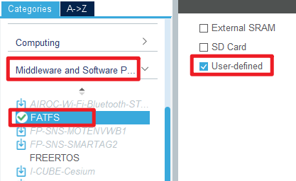
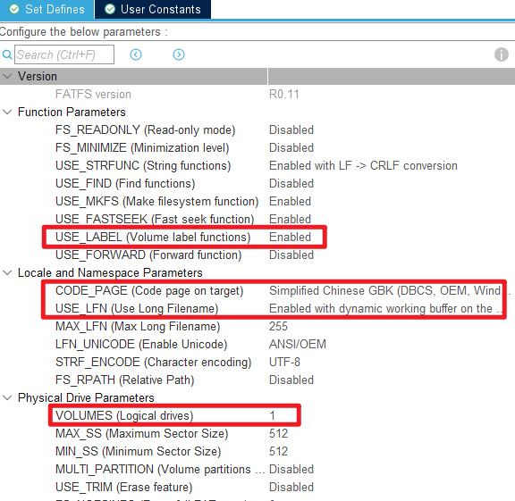
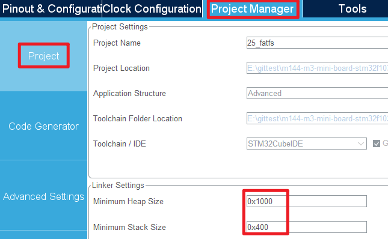
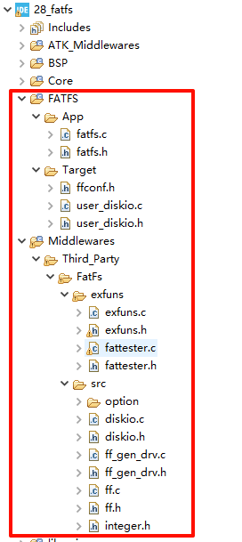
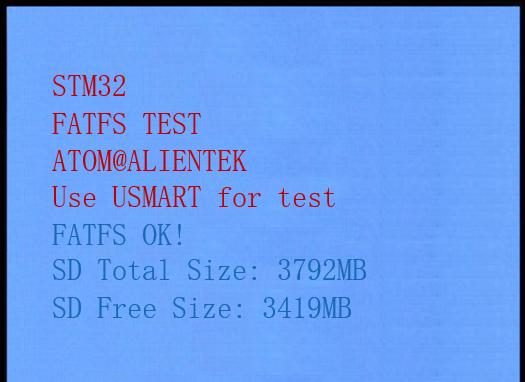
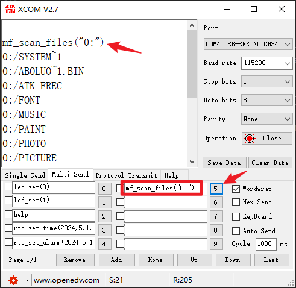

## Fatfs example<a name="brief"></a>


### 1 Brief
The function of this example is to use FATFS file system to manage the data in SD card and norflash.
### 2 Hardware Hookup
The hardware resources used in this example are:
+ LED0 - PF9
+ USART1 - PA9/PA10
+ KEY - KEY0(PE4)
+ Micro SD card
+ NORFLASH
+ ALIENTEK  2.8/3.5/4.3/7 inch TFTLCD module

The FATFS used in this example is a software library, so there is no corresponding connection graph.

### 3 STM32CubeIDE Configuration

We copy the project from **27_sd** and name both the project and the.ioc file **28_fatfs**. Next we start the configuration by double-clicking the **28_fatfs.ioc** file. For this example, we also need to configure the NORFLASH driver, which is covered in the SPI section.

Click **Middlewares and Software Packs -> FATFS**, the specific configuration is shown below:



The specific FATFS parameter configuration is as follows:



To avoid a stack overflow, we need to set the stack size larger.



Click **File > Save**, and you will be asked to generate code.Click **Yes**.The resulting project file is shown below:




##### code

###### diskio.c

We're going to change **diskio.c** to something that works for us, but note that each time we regenerate the code here, diskio.c will be replaced with the original code state, so we need to remember to add the changes back.

You can open the project to see the specific code, the file we mainly changed a few functions, respectively ``disk_initialize``,  ``disk_read``, ``disk_write``, ``disk_ioctl``.

1) **disk_initialize** : initialize the specified number of disk, disk specified storage area. 
2) **disk_read** : read sector data from the disk drive. The function takes four parameters:
3) **disk_wirte** : writes sector data to the disk drive.
4) **disk_ioctl** : control device specified features and miscellaneous functions in addition to read/write

###### exfuns.c
There are a few more files to add: exfuns.c, exfuns.h, fattester.c, fattester.h.You can open the project to see the specific code.


###### main.c
```c#
int main(void)
{
  /* USER CODE BEGIN 1 */
    FRESULT res;
    uint32_t total;
    uint32_t free;
  /* USER CODE END 1 */

  /* MCU Configuration--------------------------------------------------------*/

  /* Reset of all peripherals, Initializes the Flash interface and the Systick. */
  HAL_Init();

  /* USER CODE BEGIN Init */

  /* USER CODE END Init */

  /* Configure the system clock */
  SystemClock_Config();

  /* USER CODE BEGIN SysInit */
  delay_init(168);
  /* USER CODE END SysInit */

  /* Initialize all configured peripherals */
  MX_GPIO_Init();
  MX_USART1_UART_Init();
  MX_FSMC_Init();
  MX_TIM4_Init();
  MX_SDIO_SD_Init();
  MX_FATFS_Init();
  MX_SPI1_Init();
  /* USER CODE BEGIN 2 */

  lcd_init();

  my_mem_init(SRAMIN);                /* Initialize the internal SRAM memory pool */
  my_mem_init(SRAMCCM);               /* Initialize the CCM memory pool */

  lcd_show_string(30, 50, 200, 16, 16, "STM32", RED);
  lcd_show_string(30, 70, 200, 16, 16, "FATFS TEST", RED);
  lcd_show_string(30, 90, 200, 16, 16, "ATOM@ALIENTEK", RED);
  lcd_show_string(30, 110, 200, 16, 16, "Use USMART for test", RED);

  while (sd_init() != 0)
  {
      lcd_show_string(30, 130, 200, 16, 16, "SD Card Error!", RED);
      delay_ms(500);
      lcd_show_string(30, 130, 200, 16, 16, "Please Check! ", RED);
      delay_ms(500);
      LED0_TOGGLE();
  }

  exfuns_init();

  /* mount SD card */
  f_mount(fs[0], "0:", 1);

  /* mount NOR Flash, if NOR Flash does not have a file system, it needs to be formatted */
  res = f_mount(fs[1], "1:", 1);
  if (res == FR_NO_FILESYSTEM)
  {
      lcd_show_string(30, 130, 200, 16, 16, "Flash Disk Formatting...", RED);
      res = f_mkfs("1:", 0, 0, 0, _MAX_SS);
      if (res == FR_OK)
      {
          f_setlabel((const TCHAR *)"1:ALIENTEK");
          lcd_show_string(30, 130, 200, 16, 16, "Flash Disk Format Finish", RED);
      }
      else
      {
          lcd_show_string(30, 130, 200, 16, 16, "Flash Disk Format Error ", RED);
      }
      delay_ms(1000);
  }
  lcd_fill(30, 130, 239, 145, WHITE);

  /* Gets the SD card capacity */
  while (exfuns_get_free("0", &total, &free) != 0)
  {
      lcd_show_string(30, 130, 200, 16, 16, "SD Card FatFs Error!", RED);
      delay_ms(200);
      lcd_fill(30, 130, 240, 150 + 16, WHITE);
      delay_ms(200);
      LED0_TOGGLE();
  }

  lcd_show_string(30, 130, 200, 16, 16, "FATFS OK!", BLUE);
  lcd_show_string(30, 150, 200, 16, 16, "SD Total Size:     MB", BLUE);
  lcd_show_string(30, 170, 200, 16, 16, "SD Free Size:     MB", BLUE);
  lcd_show_num(142, 150, total >> 10, 5, 16, BLUE);
  lcd_show_num(134, 170, free >> 10, 5, 16, BLUE);

  /* USER CODE END 2 */

  /* Infinite loop */
  /* USER CODE BEGIN WHILE */
  while (1)
  {
    /* USER CODE END WHILE */

      delay_ms(200);
      LED0_TOGGLE();

    /* USER CODE BEGIN 3 */
  }
  /* USER CODE END 3 */
}
```


### 4 Running
#### 4.1 Compile & Download
After the compilation is complete, connect the DAP and the Mini Board, and then connect to the computer together to download the program to the Mini Board.
#### 4.2 Phenomenon
Press the **RESET** button to begin running the program on your Mini Board, observe the LED0 flashing on the Mini Board, indicating that the code download is successful. 

We take a microSD card to test, you can see the screen will show the following picture:



By opening the serial debug assistant, we can call the FATFS test functions we added earlier.



Other functions can be tested in a similar way. In addition, mf_unlink function, when deleting the folder, must ensure that the folder is empty, can be deleted normally, otherwise can not be deleted.

[jump to title](#brief)
