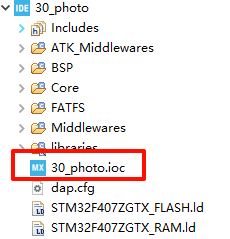
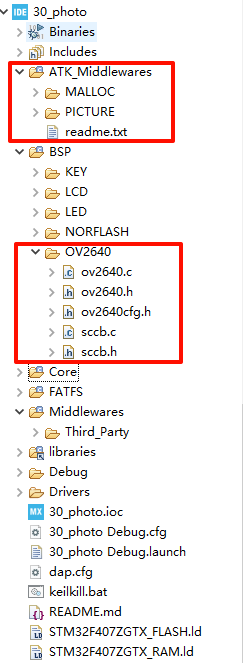

## OV2640 Camera example<a name="brief"></a>

### 1 Brief
This chapter will introduce the use of STM32F407 to drive the OV2640 camera, so as to obtain the image data output by the camera, and display it on the LCD, or send it through the serial port software.
### 2 Hardware Hookup
The hardware resources used in this example are:
+ LED0 - PF9
+ LED1 - PF10
+ USART1 - PA9/PA10
+ KEY - WKUP(PA0)
+ KEY - KEY0(PE4)
+ ALIENTEK  2.8/3.5/4.3/7 inch TFTLCD module
+ USART2 - PA2 
+ TIM6
+ ATK-MC2640 Camera Module：
+ OV_D0~D7 - PC6/PC7/PC8/PC9/PC11/PB6/PE5/PE6
+ OV_SCL - PD6
+ OV_SDA - PD7
+ OV_VSYNC - PB7
+ OV_HREF - PA4
+ OV_PCLK - PA6
+ OV_PWDN - PG9
+ OV_RESET - PG15
+ OV_XCLK - PA8

For the connection schematics of SD card, camera, LCD, etc. involved in this experiment, please refer to the corresponding previous chapters by yourself
Connection schematic diagram in.

### 3 STM32CubeIDE Configuration

We copy the project from  **29_picture** and name both the project and the.ioc file **30_photo**. Next we start the PHOTO configuration by double-clicking the **30_photo.ioc** file.



This experiment is modified on the basis of 29_picture, so there is no need for additional configuration and modification in SD card and picture code. However, since the OV2640 camera is also used in this experiment, the configuration of the camera is required. For more information about the camera configuration, see the contents of 24_ov2640_camera.

After following the preceding steps, the project file is as follows:



Then add the camera-related application directly in mian.c.

###### main.c
Your finished main() function should look like the following:
```c#
int main(void)
{
  /* USER CODE BEGIN 1 */
    uint8_t t = 0;
    uint8_t key;
    uint8_t res;
    uint8_t sd_ok = 1;
    uint8_t *pname;
  /* USER CODE END 1 */

  /* MCU Configuration--------------------------------------------------------*/

  /* Reset of all peripherals, Initializes the Flash interface and the Systick. */
  HAL_Init();

  /* USER CODE BEGIN Init */

  /* USER CODE END Init */

  /* Configure the system clock */
  SystemClock_Config();

  /* USER CODE BEGIN SysInit */
  delay_init(168);
  /* USER CODE END SysInit */

  /* Initialize all configured peripherals */
  MX_GPIO_Init();
  MX_DMA_Init();
  MX_USART1_UART_Init();
  MX_FSMC_Init();
  MX_FATFS_Init();
  MX_DCMI_Init();
  MX_SPI1_Init();
  /* USER CODE BEGIN 2 */

  lcd_init();
  piclib_init();
  my_mem_init(SRAMIN);                /* Initialize the internal SRAM memory pool */
  my_mem_init(SRAMCCM);               /* Initialize the CCM memory pool */
  exfuns_init();                      /* Request memory for exfuns */
  f_mount(fs[0], "0:", 1);            /* mount SD card */
  f_mount(fs[1], "1:", 1);            /* mount NOR Flash */

  while (ov2640_init() != 0)                                                              /* Initialize OV2640 */
  {
      lcd_show_string(30, 170, 240, 16, 16, "OV2640 Error!", RED);
      HAL_Delay(200);
      lcd_fill(30, 150, 239, 206, WHITE);
      HAL_Delay(200);
  }

  sw_sdcard_mode();
  while (g_sd_error == 1)
  {
  	  g_sd_error = 0;
  	  MX_SDIO_SD_Init();
      lcd_show_string(30, 130, 200, 16, 16, "SD Card Failed!", RED);
      HAL_Delay(500);
      lcd_show_string(30, 130, 200, 16, 16, "Please Check! ", RED);
      HAL_Delay(500);
      LED1_TOGGLE();
  }

  lcd_show_string(30, 30, 200, 16, 16, "STM32", RED);
  lcd_show_string(30, 50, 200, 16, 16, "PHOTO TEST", RED);
  lcd_show_string(30, 70, 200, 16, 16, "ATOM@ALIENTEK", RED);
  lcd_show_string(30, 90, 200, 16, 16, "WKUP: Take a picture(BMP)", RED);

  res = (uint8_t)f_mkdir("0:/PHOTO");                                                     /* Create a PHOTO folder */
  if ((res != (uint8_t)FR_EXIST) && (res != 0))                                           /* PHOTO folder does not exist and creation failed */
  {
      lcd_show_string(30, 150, 240, 16, 16, "SD Card Error!", RED);
      lcd_show_string(30, 150, 240, 16, 16, "The photo function will not be available!", RED);
      sd_ok = 0;
  }

  pname = (uint8_t *)mymalloc(SRAMIN, 30);                                                /* Allocates memory for the filename with path */
  while (pname == NULL)
  {
      lcd_show_string(30, 150, 240, 16, 16, "Memory allocation failure!", RED);
      HAL_Delay(200);
      lcd_fill(30, 150, 240, 146, WHITE);
      HAL_Delay(200);
  }

  sw_ov2640_mode();
  ov2640_rgb565_mode();                                                                   /* Set OV2640 to RGB565 mode */
  dcmi_dma_init((uint32_t)&(LCD->LCD_RAM), 0, 1);										  /* Configure DCMI DMA */
  ov2640_outsize_set(lcddev.width, lcddev.height);                                        /* Full screen zoom */
  dcmi_start();                                                                           /* Start DCMI transfer */
  ov2640_flash_intctrl();                                                                 /* Internal control flash */

  /* USER CODE END 2 */

  /* Infinite loop */
  /* USER CODE BEGIN WHILE */
  while (1)
  {
    /* USER CODE END WHILE */
      t++;
      key = key_scan(0);

      if (key != 0)                                                                       /* There are keys to press */
      {
          dcmi_stop();                                                                    /* First disable DCMI transmission */
          if (sd_ok == 1)                                                                 /* SD card is normal */
          {
              sw_sdcard_mode();                                                           /* Switch to SD card mode */
              switch (key)
              {
                  case WKUP_PRES:
                  {
                      camera_new_pathname(pname, 0);                                      /* The file name is in BMP format */
                      res = bmp_encode(pname, 0, 0, lcddev.width, lcddev.height, 0);      /* Encode and save the BMP file */
                      break;
                  }
                  default:
                  {
                      break;
                  }
              }
              sw_ov2640_mode();                                                           /* Switch to OV2640 mode */
              if (res != 0)
              {
                  lcd_show_string(30, 130, 240, 16, 16, "Write file error!", RED);

              }
              else
              {
                  lcd_show_string(30, 130, 240, 16, 16, "Photo success!", RED);
                  lcd_show_string(30, 130, 240, 16, 16, "Save as!", RED);
                  lcd_show_string(30, 130, 240, 16, 16, (char*)pname, RED);
              }

              HAL_Delay(1000);
          }
          else                                                                            /* SD card is not available */
          {
              lcd_show_string(30, 130, 240, 16, 16, "SD Card Error!", RED);
              lcd_show_string(30, 130, 240, 16, 16, "The photo function is unavailable!", RED);

          }
          HAL_Delay(2000);
          dcmi_start();                                                                   /* Resume DCMI transmission */
      }

      if (t == 20)
      {
          LED0_TOGGLE();
          t = 0;
      }

      HAL_Delay(10);
    /* USER CODE BEGIN 3 */
  }
  /* USER CODE END 3 */
}
```

### 4 Running
#### 4.1 Compile & Download
After the compilation is complete, connect the DAP and the Mini Board, and then connect to the computer together to download the program to the Mini Board.
#### 4.2 Phenomenon

After downloading the program to the development board, you can see that the LCD first displays some information about the experiment.The monitoring page is displayed. At this point, we can press KEY0 to take a picture.

[jump to title](#brief)
