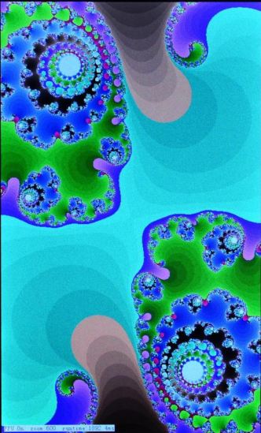
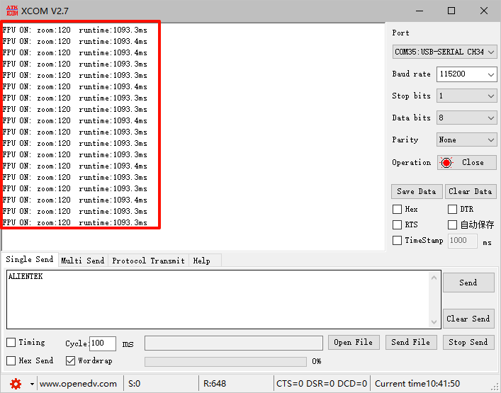
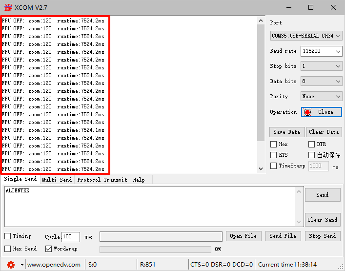

## Julia disable FPU example<a name="brief"></a>


### 1 Brief
This example differs from the previous one in that the previous example enabled FPU hardware floating-point computation, while this example will disable FPU hardware floating-point computation. By comparing the results obtained with the FPU hardware floating-point computation enabled and disabled, we draw conclusions from the example. This example is divided into two projects.:

1,32_1_julia_enable_fpu
2,32_2_julia_disable_fpu

Both projects share identical code, with the only difference being that one utilizes the hardware FPU to calculate the Julia fractal set (set by the IDE), while the other employs the IEEE-754 standard. Given the similarity in code, we will only introduce one of the projects.

### 2 Hardware Hookup
The hardware resources used in this example are:
+ LED0 - PF9
+ LED1 - PF10
+ USART1 - PA9/PA10
+ KEY - KEY0(PE4)
+ KEY - WKUP(PA0)
+ FPU
+ TIM6
+ ALIENTEK  2.8/3.5/4.3/7 inch TFTLCD module

The FPU used in this experiment is an on-chip resource of the STM32F407, thus there is no corresponding connection schematic diagram.

### 3 STM32CubeIDE Configuration

We copy the project from **32_1_julia_enable_fpu** and name both the project and the.ioc file **32_2_julia_disable_fpu**. Next we start the configuration by double-clicking the **32_2_julia_disable_fpu.ioc** file. For this example, we need to configure the TIM.

The configuration of the **TIM6** has been introduced in previous chapters, and thus, we will not elaborate on it here. We encourage readers to refer to the previous content for timer configuration.

In terms of code, no changes need to be made for this example. We only need to make some configurations, as follows:


Next step is：


However, we need to add the following code here:
```c#

/* USER CODE BEGIN 1 */

/**
 * @brief   HAL Library Basic Timer Overtime Interrupt Callback Function
 * @param   None
 * @retval  None
 */
void HAL_TIM_PeriodElapsedCallback(TIM_HandleTypeDef *htim)
{
    if (htim->Instance == TIM6)
    {
        g_timeout++;
    }
}

/* USER CODE END 1 */

```
In the **HAL_TIM_PeriodElapsedCallback** function, all we need to do is increment the **g_timeout** variable. Finally, multiplying the value of the **g_timeout** variable by the period of the timer update interrupt will give us the frame time. Of course, in the program, we also need to declare the g_timeout variable.

###### main.c
```c#

#if (__FPU_PRESENT == 1) && (__FPU_USED == 1)
#define FPU_MODE        "FPU ON"
#else
#define FPU_MODE        "FPU OFF"
#endif

#define ITERATION 		128 	/* Number of iterations */
#define REAL_CONSTANT 	0.285f 	/* Real part constant */
#define IMG_CONSTANT 	0.01f 	/* Imaginary part constant */

/* Color table */
static uint16_t g_color_map[ITERATION];

/* List of scaling factors */
static const uint16_t zoom_ratio[] =
{
    120, 110, 100, 150, 200, 275, 350, 450,
    600, 800, 1000, 1200, 1500, 2000, 1500,
    1200, 1000, 800, 600, 450, 350, 275, 200,
    150, 100, 110,
};

uint8_t g_timeout;

void julia_clut_init(uint16_t *clut)
{
    uint32_t i;
    uint16_t red;
    uint16_t green;
    uint16_t blue;

    for (i=0; i<ITERATION; i++)
    {
    	/* Produces RGB color values */
        red = (i * 8 * 256 / ITERATION) % 256;
        green = (i * 6 * 256 / ITERATION) % 256;
        blue = (i * 4 * 256 / ITERATION) % 256;

        /* Convert RGB888 to RGB565 */
        red = red >> 3;
        red = red << 11;
        green = green >> 2;
        green = green << 5;
        blue = blue >> 3;
        clut[i] = red + green + blue;
    }
}

/**
 * @brief 	Produces Julia fractal graphics
 * @param 	size_x: size of the screen in the X direction
 * @param 	size_y: indicates the size of the screen in the Y direction
 * @param 	offset_x: indicates the offset in the X direction of the screen
 * @param 	offset_y: indicates the offset in the Y direction of the screen
 * @param 	zoom: zoom factor
 * @retval 	None
 */
void julia_generate_fpu(uint16_t size_x, uint16_t size_y, uint16_t offset_x, uint16_t offset_y, uint16_t zoom)
{
    uint8_t i;
    uint16_t x;
    uint16_t y;
    float tmp1;
    float tmp2;
    float num_real;
    float num_img;
    float radius;

    for (y=0; y<size_y; y++)
    {
        for (x=0; x<size_x; x++)
        {
            num_real = y - offset_y;
            num_real = num_real / zoom;
            num_img = x - offset_x;
            num_img = num_img / zoom;
            i = 0;
            radius = 0;

            while ((i < ITERATION - 1) && (radius < 4))
            {
                tmp1 = num_real * num_real;
                tmp2 = num_img * num_img;
                num_img = 2 * num_real * num_img + IMG_CONSTANT;
                num_real = tmp1 - tmp2 + REAL_CONSTANT;
                radius = tmp1 + tmp2;
                i++;
            }

            LCD->LCD_RAM = g_color_map[i];
        }
    }
}

int main(void)
{
  /* USER CODE BEGIN 1 */
    uint8_t key;
    uint8_t zoom = 0;
    uint8_t autorun = 0;
    float time;
    char buf[50];
  /* USER CODE END 1 */

  /* MCU Configuration--------------------------------------------------------*/

  /* Reset of all peripherals, Initializes the Flash interface and the Systick. */
  HAL_Init();

  /* USER CODE BEGIN Init */

  /* USER CODE END Init */

  /* Configure the system clock */
  SystemClock_Config();

  /* USER CODE BEGIN SysInit */
  delay_init(168);
  /* USER CODE END SysInit */

  /* Initialize all configured peripherals */
  MX_GPIO_Init();
  MX_USART1_UART_Init();
  MX_FSMC_Init();
  MX_TIM6_Init();
  /* USER CODE BEGIN 2 */

  lcd_init();

  lcd_show_string(30, 50, 200, 16, 16, "STM32", RED);
  lcd_show_string(30, 70, 200, 16, 16, "FPU TEST", RED);
  lcd_show_string(30, 90, 200, 16, 16, "ATOM@ALIENTEK", RED);

  lcd_show_string(30, 110, 200, 16, 16, "KEY_UP:+", RED);
  lcd_show_string(30, 130, 200, 16, 16, "KEY0:Auto/Manul", RED);

  HAL_Delay(500);

  /* Initializes the color table */
  julia_clut_init(g_color_map);

  /* USER CODE END 2 */

  /* Infinite loop */
  /* USER CODE BEGIN WHILE */
  while (1)
  {
    /* USER CODE END WHILE */

      key = key_scan(0);
      if (key == WKUP_PRES)
      {
          if (++zoom > (sizeof(zoom_ratio) / sizeof(uint16_t) - 1))
          {
              zoom = 0;
          }
      }
      else if (key == KEY0_PRES)
      {
          autorun = !autorun;
      }

      if (autorun != 0)
      {
          LED1(0);
          if (++zoom > (sizeof(zoom_ratio) / sizeof(uint16_t) - 1))
          {
              zoom = 0;
          }
      }
      else
      {
          LED1(1);
      }

      /* Drawing and timing preparation */
      lcd_set_window(0, 0, lcddev.width, lcddev.height);
      lcd_write_ram_prepare();
      __HAL_TIM_SET_COUNTER(&htim6, 0);
      g_timeout = 0;

      /* Drawing and calculation time */
      julia_generate_fpu(lcddev.width, lcddev.height, lcddev.width / 2, lcddev.height / 2, zoom_ratio[zoom]);
      time = __HAL_TIM_GET_COUNTER(&htim6) + (uint32_t)g_timeout * 0x10000;
      sprintf(buf, "%s: zoom:%d  runtime:%0.1fms\r\n", FPU_MODE, zoom_ratio[zoom], time / 10);
      lcd_show_string(5, lcddev.height - 5 - 12, lcddev.width - 5, 12, 12, buf, RED);
      printf("%s", buf);
      LED0_TOGGLE();

    /* USER CODE BEGIN 3 */
  }
  /* USER CODE END 3 */
}
```

This program comprises three functions: **julia_clut_init**, **julia_generate_fpu**, and the **main** function.

The **julia_clut_init** function initializes the color table. It calculates the color table based on the iteration count (ITERATION), and these color values will be displayed on the TFTLCD screen.

The **julia_generate_fpu** function computes the Julia fractal set based on given conditions. It terminates the iteration when the iteration count reaches or exceeds ITERATION or when the radius becomes greater than or equal to 4. It then displays the corresponding color value on the TFTLCD based on the iteration count, resulting in a beautiful Julia fractal image. We can obtain different Julia fractal patterns by modifying the values of the REAL_CONSTANT and IMG_CONSTANT constants.

The **main** function is relatively straightforward. Here, we utilize a zoom ratio table, zoom_ratio, which stores various zoom factors for convenient demonstration of the effect.

### 4 Running
#### 4.1 Compile & Download
After the compilation is complete, connect the DAP and the Mini Board, and then connect to the computer together to download the program to the Mini Board.
#### 4.2 Phenomenon
Press the **RESET** button to begin running the program on your Mini Board, observe the LED0 flashing on the Mini Board, indicating that the code download is successful. 

We can observe that the LCD initially displays pertinent information related to the experiment, and subsequently commences to showcase the Julia fractal pattern along with its corresponding parameters:



Experiment 32_1_julia_enable_fpu is enabled with hardware FPU, so the Julia fractal picture is displayed faster. In addition to the LCD screen, you can also observe the relevant information through the serial debugging assistant, as shown in the following figure:



The following is the operation of the closed hardware FPU, as shown in the following figure:



By comparing the two graphs, we can deduce that under the same conditions, disabling the hardware FPU results in a roughly 6.8 times slower execution speed compared to enabling it, which significantly demonstrates the advantage of the STM32F407's hardware FPU.

[jump to title](#brief)
