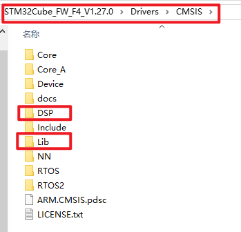
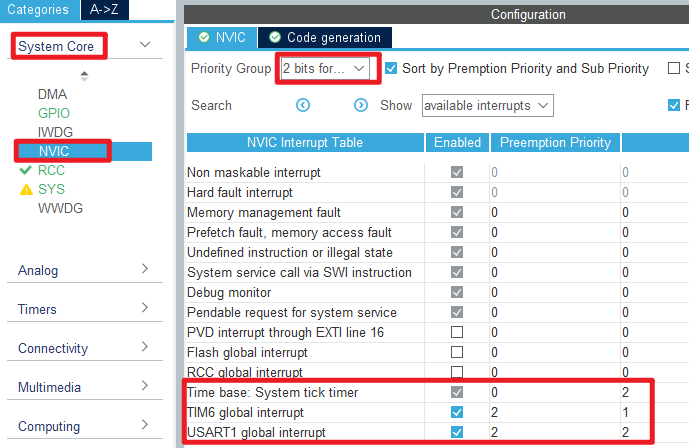

## DSP_BasicMath example<a name="brief"></a>


### 1 Brief
The function of this example is to test several basic mathematical functions in DSP library by building a test environment for DSP library.
### 2 Hardware Hookup
The hardware resources used in this example are:
+ LED0 - PF9
+ USART1 - PA9/PA10
+ KEY - WKUP(PA0)
+ KEY - KEY0(PE4)
+ TIM6
+ ALIENTEK  2.8/3.5/4.3/7 inch TFTLCD module

The mathematical library used in this example is a software library, so there is no corresponding connection schematic.

### 3 STM32CubeIDE Configuration

We copy the project from  **11_tftlcd_mcu** and name both the project and the.ioc file **33_1_dsp_basicmath**. 

Since the STM32F407 has a Cortex-M4 core, there is no built-in hardware FPU unit and no DSP instruction set. So we test by calling the DSP library. It can be found in the HAL library firmware package provided by ST.



Save these two folders in your path to **Core**.


We can filter the files we need, and we end up with the following files:


We modify the configuration to add the corresponding macro definitions.


Then add the header path. Right click on the project name -> Properties.


Add the Lib library path, you can directly copy the path we provided: ``"${workspace_loc:/${ProjName}/Core/Lib/GCC/libarm_cortexM4lf_math.a}"``.


Through the above steps, we have successfully ported the DSP library to the project. Next, we need to carry out the project configuration. To compare the difference in computing speed time with and without the DSP library, we need to configure TIM6 for timing.


To prevent time overflow, the timer update interrupt is enabled and the interrupt priority is configured.



Click **File > Save**, and you will be asked to generate code.Click **Yes**.


##### code

###### main.c
```c#
uint8_t sin_cos_test(float angle, uint32_t times, uint8_t mode)
{
    float sinx, cosx;
    float result;
    uint32_t i = 0;

    if (mode == 0)
    {
        for (i = 0; i < times; i++)
        {
            cosx = cosf(angle);                 /* Dsp-optimized sin, cos functions are not used */
            sinx = sinf(angle);
            result = sinx * sinx + cosx * cosx; /* It should be equal to 1 */
            result = fabsf(result - 1.0f);      /* Compare the difference with 1 */

            if (result > DELTA)return 0XFF;     /* Failure to judge */

            angle += 0.001f;                    /* Angle self-increasing */
        }
    }
    else
    {
        for (i = 0; i < times; i++)
        {
            cosx = arm_cos_f32(angle);          /* Using DSP optimized sin, cos functions */
            sinx = arm_sin_f32(angle);
            result = sinx * sinx + cosx * cosx; /* It should be equal to 1 */
            result = fabsf(result - 1.0f);      /* Compare the difference with 1 */

            if (result > DELTA)return 0XFF;     /* Failure to judge */

            angle += 0.001f;                    /* Angle self-increasing */
        }
    }

    return 0;   /* completion of task */
}

int main(void)
{
  /* USER CODE BEGIN 1 */
  float time;
  char buf[50];
  uint8_t res;
  /* USER CODE END 1 */

  /* MCU Configuration--------------------------------------------------------*/

  /* Reset of all peripherals, Initializes the Flash interface and the Systick. */
  HAL_Init();

  /* USER CODE BEGIN Init */

  /* USER CODE END Init */

  /* Configure the system clock */
  SystemClock_Config();

  /* USER CODE BEGIN SysInit */

  /* USER CODE END SysInit */

  /* Initialize all configured peripherals */
  MX_GPIO_Init();
  MX_USART1_UART_Init();
  MX_FSMC_Init();
  MX_TIM6_Init();
  /* USER CODE BEGIN 2 */
  lcd_init();                                         /* Initialize LCD */

  lcd_show_string(30,  50, 200, 16, 16, "STM32", RED);
  lcd_show_string(30,  70, 200, 16, 16, "DSP BasicMath TEST", RED);
  lcd_show_string(30,  90, 200, 16, 16, "ATOM@ALIENTEK", RED);
  lcd_show_string(30, 110, 200, 16, 16, " No DSP runtime:", RED);

  lcd_show_string(30, 150, 200, 16, 16, "Use DSP runtime:", RED);
  /* USER CODE END 2 */

  /* Infinite loop */
  /* USER CODE BEGIN WHILE */
  while (1)
  {
    /* No DSP optimization is used */
    __HAL_TIM_SET_COUNTER(&htim6,0);/* Resets the counter value of the TIM6 timer */
    g_timeout = 0;
    res = sin_cos_test(PI / 6, 10000, 0);
    time = __HAL_TIM_GET_COUNTER(&htim6) + (uint32_t)g_timeout * 65536;
    sprintf(buf, "%0.1fms\r\n", time / 10);

    if (res == 0)
    {
      lcd_show_string(30 + 16 * 8, 110, 100, 16, 16, buf, BLUE);      /* Displaying the running time */
    }
    else
    {
      lcd_show_string(30 + 16 * 8, 110, 100, 16, 16, "error", BLUE); /* Displays the current running status */
    }

    /* Using DSP optimization */
    __HAL_TIM_SET_COUNTER(&htim6,0); /* Resets the counter value of the TIM6 timer */
    g_timeout = 0;
    res = sin_cos_test(PI / 6, 10000, 1);
    time = __HAL_TIM_GET_COUNTER(&htim6) + (uint32_t)g_timeout * 65536;
    sprintf(buf, "%0.1fms\r\n", time / 10);

    if (res == 0)
    {
      lcd_show_string(30 + 16 * 8, 150, 100, 16, 16, buf, BLUE);      /* Displaying the running time */
    }
    else
    {
      lcd_show_string(30 + 16 * 8, 150, 100, 16, 16, "error", BLUE); /* display errors */
    }

    LED0_TOGGLE();             /* flashing LED0 indicates that the system is running */
    /* USER CODE END WHILE */

    /* USER CODE BEGIN 3 */
  }
  /* USER CODE END 3 */
}
```
There are two functions: ``sin_cos_test`` and the ``main`` function. The sin_cos_test function is used to perform a calculation given a parameter. After the calculation, the result is compared with the given error value.If it is not greater than the error value, the calculation is considered successful.

The main function calculates the time sin_cos_test takes with TIM6 to get a comparison. Inside the main loop, each loop will call the sin_cos_test function twice, first calculated without using the DSP library, and then calculated using the DSP library. The time of the two calculations is obtained and displayed on the LCD.

### 4 Running
#### 4.1 Compile & Download
After the compilation is complete, connect the DAP and the Mini Board, and then connect to the computer together to download the program to the Mini Board.
#### 4.2 Phenomenon
Press the **RESET** button to begin running the program on your Mini Board, observe the LED0 flashing on the Mini Board, indicating that the code download is successful. 

The running times with and without the DSP library can be seen on the LCD as shown in the following figure:


[jump to title](#brief)
