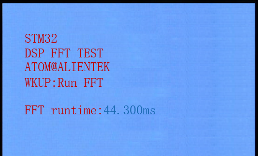

## DSP_fft example<a name="brief"></a>


### 1 Brief
The function of this example is to test the FFT function of the DSP library. Press the KEY0 button to perform the FFT operation and display the operation time on the LCD.
### 2 Hardware Hookup
The hardware resources used in this example are:
+ LED0 - PF9
+ USART1 - PA9/PA10
+ KEY - WKUP(PA0)
+ KEY - KEY0(PE4)
+ TIM6
+ ALIENTEK  2.8/3.5/4.3/7 inch TFTLCD module

The mathematical library used in this example is a software library, so there is no corresponding connection schematic.

### 3 STM32CubeIDE Configuration

We copy the project from  **33_1_dsp_basicmath** and name both the project and the.ioc file **33_2_dsp_fft**. 

Since the DSP library environment has been set up in the last project, this project only needs to modify the main.c file.

##### code

###### main.c
```c#
#define FFT_LENGTH      1024
float fft_inputbuf[FFT_LENGTH * 2];     /* FFT input array */
float fft_outputbuf[FFT_LENGTH];        /* FFT output array */

int main(void)
{
  /* USER CODE BEGIN 1 */
  float time;
  char buf[50];
  arm_cfft_radix4_instance_f32 scfft;
  uint8_t key, t = 0;
  uint16_t i;
  /* USER CODE END 1 */

  /* MCU Configuration--------------------------------------------------------*/

  /* Reset of all peripherals, Initializes the Flash interface and the Systick. */
  HAL_Init();

  /* USER CODE BEGIN Init */

  /* USER CODE END Init */

  /* Configure the system clock */
  SystemClock_Config();

  /* USER CODE BEGIN SysInit */

  /* USER CODE END SysInit */

  /* Initialize all configured peripherals */
  MX_GPIO_Init();
  MX_USART1_UART_Init();
  MX_FSMC_Init();
  MX_TIM6_Init();
  /* USER CODE BEGIN 2 */
  lcd_init();                                         /* Initialize LCD */

  lcd_show_string(30, 50, 200, 16, 16, "STM32", RED);
  lcd_show_string(30, 70, 200, 16, 16, "DSP FFT TEST", RED);
  lcd_show_string(30, 90, 200, 16, 16, "ATOM@ALIENTEK", RED);
  lcd_show_string(30, 110, 200, 16, 16, "WKUP:Run FFT", RED);
  lcd_show_string(30, 140, 200, 16, 16, "FFT runtime:", RED);

  arm_cfft_radix4_init_f32(&scfft, FFT_LENGTH, 0, 1);
  /* Initialize the scfft structure and set the FFT related parameters */
  /* USER CODE END 2 */

  /* Infinite loop */
  /* USER CODE BEGIN WHILE */
  while (1)
  {
    key = key_scan(0);

    if (key == WKUP_PRES)
    {
      for (i = 0; i < FFT_LENGTH; i++)	/* Generating signal sequences */
      {
        fft_inputbuf[2 * i] = 100 +
                  10 * arm_sin_f32(2 * PI * i / FFT_LENGTH) +
                  30 * arm_sin_f32(2 * PI * i * 4 / FFT_LENGTH) +
                  50 * arm_cos_f32(2 * PI * i * 8 / FFT_LENGTH);    /* Generate the real part of the input signal */
        fft_inputbuf[2 * i + 1] = 0;    /* The imaginary part is all 0 */
      }

      TIM6->CNT = 0;       /* Resets the counter value of the TIM6 timer */
      g_timeout = 0;

      arm_cfft_radix4_f32(&scfft, fft_inputbuf);                      /* FFT calculation (radix 4) */

      time = TIM6->CNT + (uint32_t)g_timeout * 65536;        	        /* Time taken to calculate */
      sprintf((char *)buf, "%0.3fms\r\n", time / 10);
      lcd_show_string(126, 130, 200, 16, 16, buf, BLUE);              /* Displaying the running time */

      arm_cmplx_mag_f32(fft_inputbuf, fft_outputbuf, FFT_LENGTH);     /* The magnitude is obtained modulo the complex number of the operation result */

      printf("\r\n%d point FFT runtime:%0.3fms\r\n", FFT_LENGTH, time / 1000);
      printf("FFT Result:\r\n");

      for (i = 0; i < FFT_LENGTH; i++)
      {
        printf("fft_outputbuf[%d]:%f\r\n", i, fft_outputbuf[i]);
      }
    }
    else
    {
      HAL_Delay(10);
    }

    t++;

    if ((t % 20) == 0)
    {
      LED0_TOGGLE();         /* flashing LED0 indicates that the system is running */
    }
    /* USER CODE END WHILE */

    /* USER CODE BEGIN 3 */
  }
  /* USER CODE END 3 */
}
```
By three functions: ``arm_cfft_radix4_init_f32``, ``arm_cfft_radix4_f32``, and ``arm_cmplx_mag_f32`` the FFT transform is performed and the modulus is taken. Each time WKUP is pressed, an input signal sequence is regenerated and an FFT is performed calculation, arm_cfft_radix4_f32 used time statistics, display on the LCD screen above.

### 4 Running
#### 4.1 Compile & Download
After the compilation is complete, connect the DAP and the Mini Board, and then connect to the computer together to download the program to the Mini Board.
#### 4.2 Phenomenon
Press the **RESET** button to begin running the program on your Mini Board, observe the LED0 flashing on the Mini Board, indicating that the code download is successful. 

Press WKUP to see how long the FFT takes.



[jump to title](#brief)
