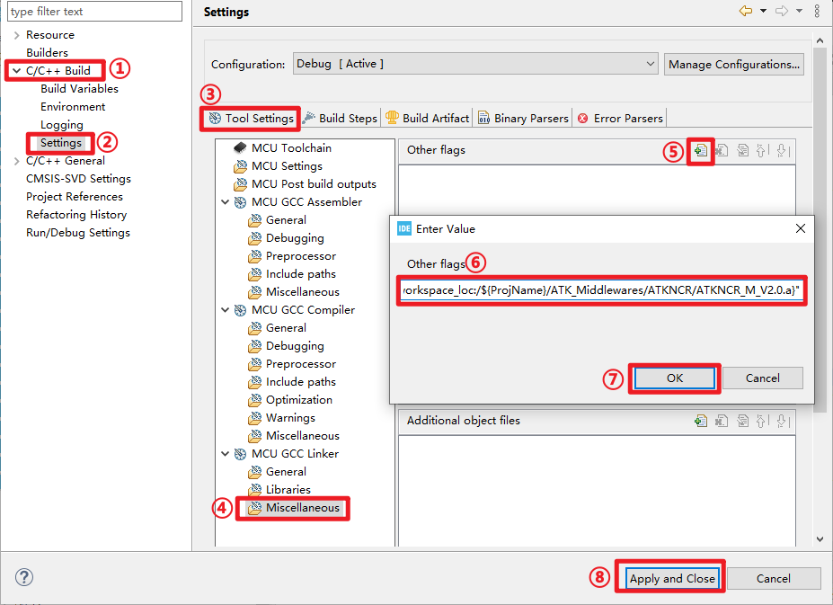
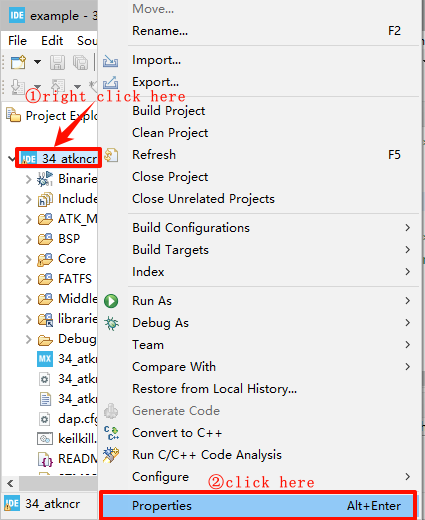
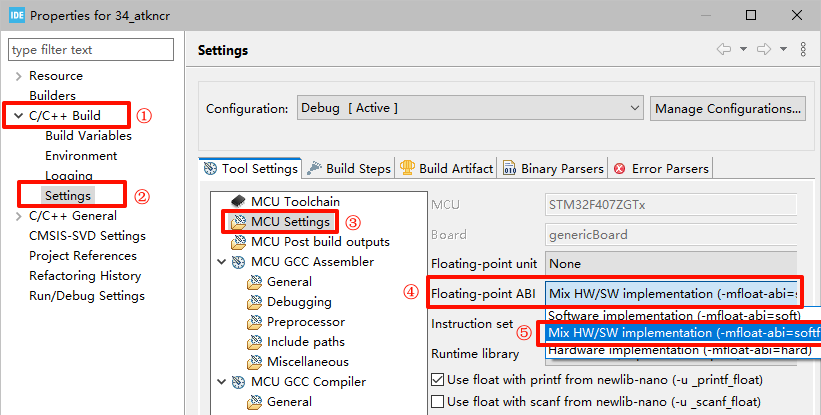

## ATKNCR example<a name="brief"></a>


### 1 Brief
This example through the handwriting recognition library can achieve some simple digital letter handwriting recognition functions.
### 2 Hardware Hookup
The hardware resources used in this example are:
+ LED0 - PF9
+ USART1 - PA9/PA10
+ KEY - WKUP(PA0)
+ KEY - KEY0(PE4)
+ Micro SD card
+ NORFLASH
+ ALIENTEK  2.8/3.5/4.3/7 inch TFTLCD module

The handwriting recognition library used in this example is a software library, so there is no corresponding connection schematic.

### 3 STM32CubeIDE Configuration

We copy the project from  **28_fatfs** and name both the project and the.ioc file **34_atkncr**. Inside the **ATK_Middlewares** folder, create a new folder called ATKNCR. In addition, our project will add the path to the handwriting recognition library as follows:



You can just copy the path we provided:``"${workspace_loc:/${ProjName}/ATK_Middlewares/ATKNCR/ATKNCR_M_V2.0.a}"``.

The next crucial step is configuration, as the floating-point types used in the handwriting recognition library might conflict with the STM32CubeIDE compilation environment, leading to compilation errors. Therefore, we need to perform the following configuration：






After completing the configuration steps outlined above, the entire project compiles without any issues


##### code

###### main.c
```c#
int main(void)
{
  /* USER CODE BEGIN 1 */
  uint32_t t = 0;
  uint8_t tcnt;
  uint8_t key;
  uint8_t mode = 4;
  uint16_t lastpos[2];
  uint16_t pcnt = 0;
  char sbuf[10];
  /* USER CODE END 1 */

  /* MCU Configuration--------------------------------------------------------*/

  /* Reset of all peripherals, Initializes the Flash interface and the Systick. */
  HAL_Init();

  /* USER CODE BEGIN Init */

  /* USER CODE END Init */

  /* Configure the system clock */
  SystemClock_Config();

  /* USER CODE BEGIN SysInit */

  /* USER CODE END SysInit */

  /* Initialize all configured peripherals */
  MX_GPIO_Init();
  MX_USART1_UART_Init();
  MX_FSMC_Init();
  MX_TIM4_Init();
  MX_SDIO_SD_Init();
  MX_SPI2_Init();
  MX_FATFS_Init();
  /* USER CODE BEGIN 2 */
  lcd_init();                         /* Initialize LCD */
  tp_dev.init();                      /* Initialize Touch */
  my_mem_init(SRAMIN);                /* Initialize the internal SRAM memory pool */
  exfuns_init();                      /* Request memory for exfuns */
  f_mount(fs[0], "0:", 1);            /* Mount SD card */
  f_mount(fs[1], "1:", 1);            /* Mount NOR Flash */
  alientek_ncr_init();                /* Initialize handwriting recognition */

RESTART:
  lcd_show_string(30, 10, 200, 16, 16, "STM32", RED);
  lcd_show_string(30, 30, 200, 16, 16, "ATKNCR TEST", RED);
  lcd_show_string(30, 50, 200, 16, 16, "ATOM@ALIENTEK", RED);
  lcd_show_string(30, 70, 200, 16, 16, "WKUP: Adjust KEY0: Mode", RED);
  lcd_show_string(30, 90, 200, 16, 16, "Identify the result:", RED);

  lcd_draw_rectangle(19, 110, lcddev.width - 20, lcddev.height - 5, RED);
  lcd_show_string(96, 130, 200, 16, 16, "Handwriting area", BLUE);
  tcnt = 100;
  /* USER CODE END 2 */

  /* Infinite loop */
  /* USER CODE BEGIN WHILE */
  while (1)
  {
    key = key_scan(0);
    if (key == WKUP_PRES)
    {
      /* Touch calibration of capacitive screen */
      if ((tp_dev.touchtype & 0x80) == 0)
      {
        tp_adjust();
        goto RESTART;
      }
    }
    else if (key == KEY0_PRES)
    {
      /* Switch recognition mode */
      lcd_fill(20, 115, 219, 315, WHITE);
      tcnt = 100;
      if (++mode > 4)
      {
        mode = 1;
      }

      if (mode == 1)
      {
        lcd_show_string(80, 207, 200, 16, 16, "Recognize digits only", BLUE);
      }
      else if (mode == 2)
      {
        lcd_show_string(64, 207, 200, 16, 16, "Recognize capital letters only", BLUE);
      }
      else if (mode == 3)
      {
        lcd_show_string(64, 207, 200, 16, 16, "Lowercase letters only", BLUE);
      }
      else if (mode == 4)
      {
        lcd_show_string(88, 207, 200, 16, 16, "All recognition", BLUE);
      }
    }

    tp_dev.scan(0);
    if (tp_dev.sta & TP_PRES_DOWN)
    {
      /* There are touches, and the touch trace is displayed and recorded */
      tcnt = 0;

      if (((tp_dev.x[0] < (lcddev.width - 20 - 2)) && (tp_dev.x[0] >= (20 + 2))) &&
         ((tp_dev.y[0] < (lcddev.height - 5 - 2)) && (tp_dev.y[0] >= (115 + 2))))
      {
        if (lastpos[0] == 0xFFFF)
        {
          lastpos[0] = tp_dev.x[0];
          lastpos[1] = tp_dev.y[0];
        }

        lcd_draw_bline(lastpos[0], lastpos[1], tp_dev.x[0], tp_dev.y[0], 2, BLUE);
        lastpos[0] = tp_dev.x[0];
        lastpos[1] = tp_dev.y[0];
        if (pcnt < 200)
        {
          if (pcnt != 0)
          {
            if ((ncr_input_buf[pcnt - 1].y != tp_dev.y[0]) &&
                (ncr_input_buf[pcnt - 1].x != tp_dev.x[0]))
            {
              ncr_input_buf[pcnt].x = tp_dev.x[0];
              ncr_input_buf[pcnt].y = tp_dev.y[0];
              pcnt++;
            }
          }
          else
          {
            ncr_input_buf[pcnt].x = tp_dev.x[0];
            ncr_input_buf[pcnt].y = tp_dev.y[0];
            pcnt++;
          }
        }
      }
    }
    else
    {
      /* The touch is released for handwriting recognition */
      lastpos[0] = 0xFFFF;
      tcnt++;
      if (tcnt == 40)
      {
        if (pcnt != 0)
        {
          printf("Total points:%d\r\n", pcnt);
          alientek_ncr(ncr_input_buf, pcnt, 6, mode, sbuf);
          printf("identify the result:%s\r\n", sbuf);
          pcnt = 0;
          lcd_show_string(60 + 72, 90, 200, 16, 16, sbuf, BLUE);
        }
        lcd_fill(20, 115, lcddev.width - 20 - 1, lcddev.height - 5 - 1, WHITE);
      }
    }

    t++;
    if (t % 20 == 0)
    {
      LED0_TOGGLE();  /* flashing LED0 indicates that the system is running */
    }

    HAL_Delay(10);    /* delay 10ms */
    /* USER CODE END WHILE */

    /* USER CODE BEGIN 3 */
  }
  /* USER CODE END 3 */
}
```
The above code obtains the dot matrix data through the touch screen, and after passing the dot matrix data into the handwriting recognition function, the handwriting recognition result is obtained, and then the handwriting recognition result is output through the serial port and so on. The handwriting recognition mode can be modified by KEY0 button, and the touch calibration of the resistive screen can also be carried out at any time by WKUP button.

### 4 Running
#### 4.1 Compile & Download
After the compilation is complete, connect the DAP and the Mini Board, and then connect to the computer together to download the program to the Mini Board.
#### 4.2 Phenomenon
Press the **RESET** button to begin running the program on your Mini Board, observe the LED0 flashing on the Mini Board, indicating that the code download is successful. 

Handwriting operation is carried out in the range of "handwriting area" indicated on the LCD, and the result of recognition can be seen on the LCD.

[jump to title](#brief)
