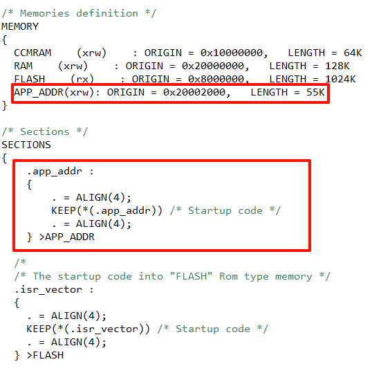
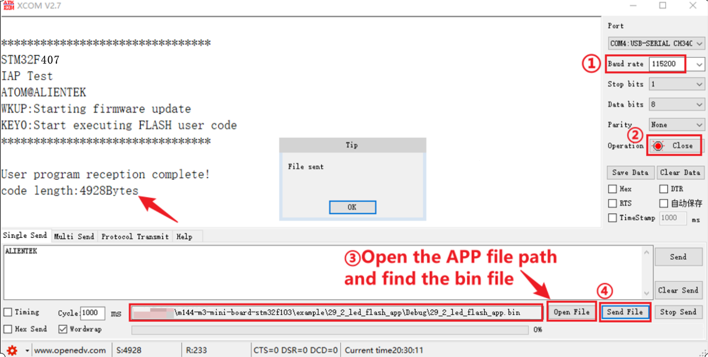
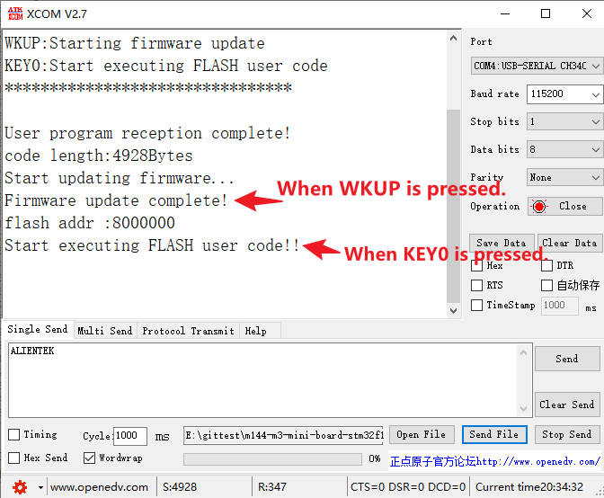

## IAP example<a name="brief"></a>

### 1 Brief
The function of this code is that after the program receives the APP's bin data, press the KEY0 and WKUP keys successively, and then load the APP's bin data into FLASH and jump to the APP's position and execute the APP's operation.
### 2 Hardware Hookup
The hardware resources used in this example are:
+ LED0 - PF9
+ LED1 - PF10
+ USART1 - PA9/PA10
+ KEY - WKUP(PA0)
+ KEY - KEY0(PE4) 

The IAP used in this example is a software algorithm, so there is no corresponding connection schematic.

### 3 STM32CubeIDE Configuration


We copy the **12_usmart** project and name both the project and the.ioc file **35_1_iap_bootloader**.
The iap used in the example of this chapter is a software algorithm, so no other configuration on STM32CubeIDE is needed, and the corresponding driver code ``iap.c\iap.h`` is added directly.

##### code
###### iap.h
```c#
#define FLASH_APP1_ADDR         0x08010000     
```
Here is our macro definition **FLASH_APP1_ADDR**, which points to the address where the APP is stored in FLASH. The following is also based on the address to jump to the corresponding APP.

###### iap.c
```c#
iapfun jump2app;
uint32_t g_iapbuf[512];       /* bytes cache */

/**
 * @brief   IAP writes to APP BIN
 * @param   appxaddr : The start address of the application
 * @param   appbuf   : the application CODE
 * @param   appsize  : Application size in bytes
 * @retval  None
 */
void iap_write_appbin(uint32_t appxaddr, uint8_t *appbuf, uint32_t appsize)
{
    uint32_t t;
    uint16_t i = 0;
    uint32_t temp;
    uint8_t * dfu;
    uint32_t fwaddr;

    dfu = appbuf;
    fwaddr = appxaddr;
    for (t=0; t<appsize; t+=4)
    {
        temp = (uint32_t)dfu[3] << 24;
        temp |= (uint32_t)dfu[2] << 16;
        temp |= (uint32_t)dfu[1] << 8;
        temp |= (uint32_t)dfu[0];
        dfu += 4;
        g_iapbuf[i++] = temp;
        if (i == 512)
        {
            i = 0;
            stmflash_write(fwaddr, g_iapbuf, 512);
            fwaddr += 2048;
        }
    }
    if (i != 0)
    {
        stmflash_write(fwaddr, g_iapbuf, i);
    }
}

/**
 * @brief   Go to the APP section (execute APP)
 * @param   appxaddr : The start address of the application
 * @retval  None
 */
void iap_load_app(uint32_t appxaddr)
{
    if (((*(volatile  uint32_t *)appxaddr) & 0x2FFE0000) == 0x20000000)  /* Check that the top address of the stack is valid */
    {
        /* The second word in the user code area is the program start address (reset address). */
        jump2app = (iapfun) * (volatile uint32_t *)(appxaddr + 4);
        
        /* Initialize the APP stack pointer (the first word in the user code area is used to store the top address of the stack) */
        __set_MSP(*(volatile uint32_t *)appxaddr);

        /* Go to the APP */
        jump2app();
    }
}

```
With a full APP saved in place, let's check the top of the stack. Then we jump, before jumping, we have to make sure that the program is set up correctly, and then we can jump the program to the correct position to perform the corresponding operation.

###### usart.c
```c#
/* Receive buffer, maximum USART REC LEN bytes. */
uint8_t g_usart_rx_buf[USART_REC_LEN]  __attribute__((section(".app_addr")));
```
This code means to put the array **g_usart_rx_buf** in a section called ``.app_addr``. The address of the segment points to the file ``STM32F407ZGTX_FLASH.ld``.

###### STM32F407ZGTX_FLASH.ld
Open this file and add the red boxed code shown in the following screenshot:



The preceding code sets the address of **g_usart_rx_buf** to 0x20002000. When we receive the APP bin file using the serial port, the file will be stored at 0x20002000.

###### main.c
```c#
int main(void)
{
  /* USER CODE BEGIN 1 */
  uint8_t t = 0;
  uint8_t key;
  uint32_t lastcount = 0;
  uint32_t applenth = 0;
  uint8_t clearflag = 0;
  /* USER CODE END 1 */

  /* MCU Configuration--------------------------------------------------------*/

  /* Reset of all peripherals, Initializes the Flash interface and the Systick. */
  HAL_Init();

  /* USER CODE BEGIN Init */

  /* USER CODE END Init */

  /* Configure the system clock */
  SystemClock_Config();

  /* USER CODE BEGIN SysInit */

  /* USER CODE END SysInit */

  /* Initialize all configured peripherals */
  MX_GPIO_Init();
  MX_USART1_UART_Init();
  MX_FSMC_Init();
  /* USER CODE BEGIN 2 */
  lcd_init();                                         /* Initialize LCD */

  lcd_show_string(30, 50, 200, 16, 16, "STM32", RED);
  lcd_show_string(30, 70, 200, 16, 16, "IAP TEST", RED);
  lcd_show_string(30, 90, 200, 16, 16, "ATOM@ALIENTEK", RED);

  lcd_show_string(30, 90, 200, 16, 16, "WKUP: Copy app 2 flash", RED);
  lcd_show_string(30, 110, 200, 16, 16, "KEY0: Run flash app", RED);
  /* USER CODE END 2 */

  /* Infinite loop */
  /* USER CODE BEGIN WHILE */
  while (1)
  {
	  if (g_usart_rx_cnt != 0)
	  {
	     /* If no new data is received in the new loop, the data is considered to be received */
	     if (lastcount == g_usart_rx_cnt)
	     {
	         applenth = g_usart_rx_cnt;
	         lastcount = 0;
	         g_usart_rx_cnt = 0;
	         printf("User program reception complete!\r\n");
	         printf("code length:%dBytes\r\n", applenth);
	     }
	     else
	     {
	         lastcount = g_usart_rx_cnt;
	     }
	  }

	  key = key_scan(0);
	  if (key == WKUP_PRES)
	  {
	      if (applenth != 0)
	      {
	          printf("Start updating firmware...\r\n");
	          lcd_show_string(30, 130, 200, 16, 16, "Copying app 2 flash...", BLUE);
	          if (((*(volatile uint32_t *)(0x20002000 + 4)) & 0xFF000000) == 0x08000000)
	          {
	              iap_write_appbin(FLASH_APP1_ADDR, g_usart_rx_buf, applenth);
	              lcd_show_string(30, 130, 200, 16, 16, "Copy app succedded!   ", BLUE);
	              printf("Firmware update complete!\r\n");
	          }
	          else
	          {
	              lcd_show_string(30, 130, 200, 16, 16, "Illegal flash app!    ", BLUE);
	              printf("Non-flash apps!\r\n");
	          }
	       }
	       else
	       {
	           printf("No firmware to update!\r\n");
	           lcd_show_string(30, 130, 200, 16, 16, "No app!", BLUE);
	       }
	       clearflag = 10;
	  }
	  else if (key == KEY0_PRES)
	  {
	      printf("flash addr :%x \r\n",(*(volatile uint32_t *)(FLASH_APP1_ADDR + 4)) & 0xFF000000);
	      if (((*(volatile uint32_t *)(FLASH_APP1_ADDR + 4)) & 0xFF000000) == 0x08000000)
	      {
	          printf("Start executing FLASH user code!!\r\n\r\n");
	          HAL_Delay(10);
	          iap_load_app(FLASH_APP1_ADDR);
	      }
	      else
	      {
	          printf("No firmware to run!\r\n");
	          lcd_show_string(30, 130, 200, 16, 16, "No APP!", BLUE);
	      }
	      clearflag = 10;
	  }

	  if (++t == 2)
	  {
	      t = 0;

	      if (clearflag != 0)
	      {
	          clearflag--;
	          if (clearflag == 0)
	          {
	              lcd_fill(30, 130, 240, 146, WHITE);
	          }
	      }

	      LED0_TOGGLE(); /* flashing LED0 indicates that the system is running */
	  }

	  HAL_Delay(100);
    /* USER CODE END WHILE */

    /* USER CODE BEGIN 3 */
  }
  /* USER CODE END 3 */
}
```
The above code uses the serial port to receive binary data from the APP. We will not introduce the APP code, you can open the source code of the routine to view, pay attention to reset the offset of the interrupt vector table at the main function, otherwise the APP will not run normally.


### 4 Running
#### 4.1 Compile & Download
After the compilation is complete, connect the DAP and the Mini Board, and then connect to the computer together to download the program to the Mini Board.
#### 4.2 Phenomenon
Press the reset button to restart the Mini Board, observe the LED flashing on the Mini Board, open the serial port and the host computer ATK-XCOM can see the prompt information of the example, indicating that the code download is successful. We send the bin file of the APP on the host computer of the serial port, and the phenomenon is shown as follows:



After receiving, press KEY0 and WKUP as shown below:



[jump to title](#brief)