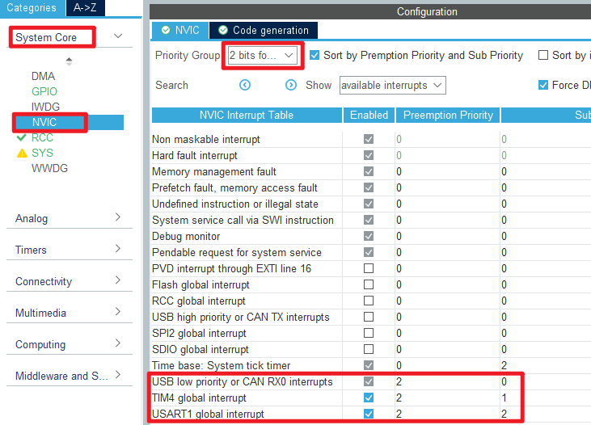

## USB virtual serial port example<a name="brief"></a>


### 1 Brief
The function of this example is to communicate with the PC through the virtual serial port.
### 2 Hardware Hookup
The hardware resources used in this example are:
+ LED0 - PF9
+ LED1 - PF10
+ USART1 - PA9/PA10
+ USB_DM - PA11
+ USB_DP - PA12
+ ALIENTEK  2.8/3.5/4.3/7 inch TFTLCD module

In this example, USB interface is used to connect with PC, and the connection schematic diagram of USB SLAVE interface and MCU is shown below:


### 3 STM32CubeIDE Configuration

We copy the project from **26_malloc** and name both the project and the.ioc file **36_2_usb_vsp**. Next we start the configuration by double-clicking the **36_2_usb_vsp.ioc** file.

Click **Connectivity -> USB**, activate the USB slave device:


Then start configuring the USB middleware, click **Middleware and Software Packs -> USB_DEVICE**:


The device descriptor is left to its default Settings as shown in the figure below:


After the above configuration, it is found that there is an error in the USB clock configuration, and the clock frequency exceeds 48MHz. So we need to make the following changes.


We need to get the USB connection status and configure the interrupt priority in the USB interrupt callback function.



Click **File > Save**, and you will be asked to generate code.Click **Yes**.The generated project has two more folders, USB_DEVICE and Middlewares.


##### code

In this example, several files need to be modified in the USB_DEVICE folder: **usbd_cdc_if.c**, **usbd_cdc_if.h**, **usbd_conf.c**, and **usbd_conf.h**.

**usbd_cdc_if.c** mainly use the hardware underlying driver of the Mini Board, and need to adapt to our hardware information.
**usbd_conf.c/.h** mainly implements USB hardware initialization and interrupt operations.


###### main.c
```c#
int main(void)
{
  /* USER CODE BEGIN 1 */
  uint16_t len;
  uint16_t times = 0;
  uint8_t usbstatus = 0;
  /* USER CODE END 1 */

  /* MCU Configuration--------------------------------------------------------*/

  /* Reset of all peripherals, Initializes the Flash interface and the Systick. */
  HAL_Init();

  /* USER CODE BEGIN Init */

  /* USER CODE END Init */

  /* Configure the system clock */
  SystemClock_Config();

  /* USER CODE BEGIN SysInit */

  /* USER CODE END SysInit */

  /* Initialize all configured peripherals */
  MX_GPIO_Init();
  MX_USART1_UART_Init();
  MX_FSMC_Init();
  MX_USB_DEVICE_Init();
  /* USER CODE BEGIN 2 */
  lcd_init();                         /* Initialize LCD */
  my_mem_init(SRAMIN);                /* Initialize the internal SRAM memory pool */

  lcd_show_string(30, 50, 200, 16, 16, "STM32", RED);
  lcd_show_string(30, 70, 200, 16, 16, "USB_VSP TEST", RED);
  lcd_show_string(30, 90, 200, 16, 16, "ATOM@ALIENTEK", RED);

  lcd_show_string(30, 110, 200, 16, 16, "USB Connecting...", RED); /* Prompts USB to start connecting */

  usbd_port_config(0);    /* The usb cable is disconnected */
  HAL_Delay(500);
  usbd_port_config(1);    /* USB connection again */
  HAL_Delay(500);
  /* USER CODE END 2 */

  /* Infinite loop */
  /* USER CODE BEGIN WHILE */
  while (1)
  {
    if (usbstatus != g_device_state)   /* The USB connection state has changed */
    {
      usbstatus = g_device_state;      /* Logging new status */

      if (usbstatus == 1)
      {
        lcd_show_string(30, 110, 200, 16, 16, "USB Connected    ", RED); /* USB connection is successful */
        LED1(0);    /* LED1 flashes */
      }
      else
      {
        lcd_show_string(30, 110, 200, 16, 16, "USB disConnected ", RED); /* USB disconnection is prompted */
        LED1(1);    /* turn off LED1 */
      }
    }

    if (g_usb_usart_rx_sta & 0x8000)
    {
      len = g_usb_usart_rx_sta & 0x3FFF;  /* Get the length of the received data */
      usb_printf("\r\nThe length of the message you send is:%d\r\n\r\n", len);
      cdc_vcp_data_tx(g_usb_usart_rx_buffer, len);
      usb_printf("\r\n\r\n");            /* Inserting line breaks */
      g_usb_usart_rx_sta = 0;
    }
    else
    {
      times++;

      if (times % 5000 == 0)
      {
        usb_printf("\r\nUSB Virtual USART TEST\r\n");
        usb_printf("ALIENTEK@ALIENTEK\r\n\r\n");
      }

      if (times % 200 == 0)usb_printf("Please enter data and end with the ENTER key\r\n");

      if (times % 30 == 0)
      {
        LED0_TOGGLE();     /* LED0 blinks to indicate that the code is running */
      }

      HAL_Delay(10);       /* delay 10ms */
    }
    /* USER CODE END WHILE */

    /* USER CODE BEGIN 3 */
  }
  /* USER CODE END 3 */
}
```

### 4 Running
#### 4.1 Compile & Download
After the compilation is complete, connect the DAP and the Mini Board, and then connect to the computer together to download the program to the Mini Board.
#### 4.2 Phenomenon
Press the **RESET** button to begin running the program on your Mini Board, observe the LED0 flashing on the Mini Board, indicating that the code download is successful. 

Connect the Mini Board with the PC through the USB interface. After the PC automatically completes the driver installation, you can see that there is a port device on the PC. It communicates with the port through the serial debugging assistant, which can receive data from the STM32 Mini Board and send data to the Mini Board.


[jump to title](#brief)
