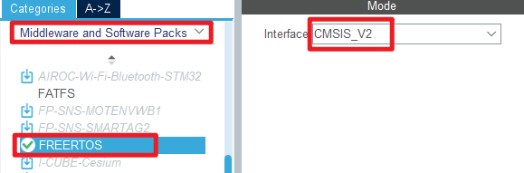
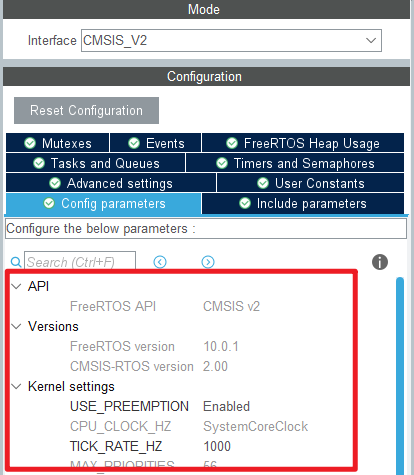
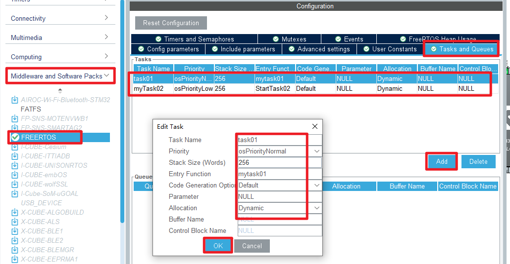
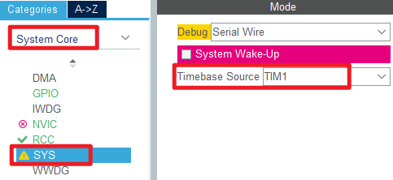
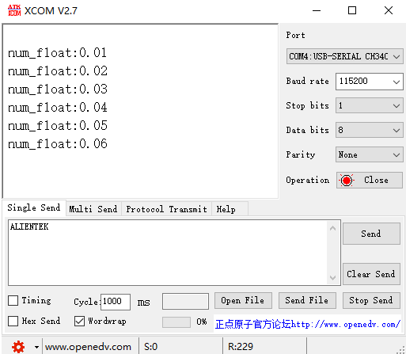

## FreeRTOS example<a name="brief"></a>


### 1 Brief
This example shows the simple use of FreeRTOS. LED0 is controlled by task01 task to flip the state every 1000ms. USART1 is controlled by task02 to print floating-point numbers every 500ms, and the floating-point numbers are incremented by 0.01 each time.

### 2 Hardware Hookup
The hardware resources used in this example are:
+ LED0 - PF9
+ LED1 - PF10
+ USART1 - PA9/PA10
+ ALIENTEK  2.8/3.5/4.3/7 inch TFTLCD module

The FreeRTOS used in this example is a software library, so there is no corresponding connection schematic.

### 3 STM32CubeIDE Configuration

We copy the project from **26_malloc** and name both the project and the.ioc file **37_freertos_demo**. Next we start the configuration by double-clicking the **37_freertos_demo.ioc** file.

Click **Connectivity -> FREERTOS**, choosing CMSIS_V2:



Leave everything else as default.



In this example, we create two tasks, task01 and task02.



Click **System Core->SYS**, the tick source is used to configure the hal library.



Click **File > Save**, and you will be asked to generate code.Click **Yes**.


##### code

Next, modify two files, freertos.c and main.c.

###### freertos.c

Here we implement the logic for two tasks, the first task is to make LED0 flip every 1 second, and the second task is to print a float every 500ms.

```c#
/* USER CODE BEGIN Header_mytask01 */
/**
  * @brief  Function implementing the task01 thread.
  * @param  argument: Not used
  * @retval None
  */
/* USER CODE END Header_mytask01 */
void mytask01(void *argument)
{
  /* USER CODE BEGIN mytask01 */
  /* Infinite loop */
  while(1)
  {
    LED0_TOGGLE();
    vTaskDelay(1000);
  }
  /* USER CODE END mytask01 */
}

/* USER CODE BEGIN Header_StartTask02 */
/**
* @brief Function implementing the myTask02 thread.
* @param argument: Not used
* @retval None
*/
/* USER CODE END Header_StartTask02 */
void StartTask02(void *argument)
{
  /* USER CODE BEGIN StartTask02 */
  /* Infinite loop */
  float num_float = 0.0;
  while(1)
  {
    num_float += 0.01;
    printf("num_float:%.2f\r\n",num_float);
    vTaskDelay(500);
  }
  /* USER CODE END StartTask02 */
}
```


###### main.c
```c#
int main(void)
{
  /* USER CODE BEGIN 1 */

  /* USER CODE END 1 */

  /* MCU Configuration--------------------------------------------------------*/

  /* Reset of all peripherals, Initializes the Flash interface and the Systick. */
  HAL_Init();

  /* USER CODE BEGIN Init */

  /* USER CODE END Init */

  /* Configure the system clock */
  SystemClock_Config();

  /* USER CODE BEGIN SysInit */

  /* USER CODE END SysInit */

  /* Initialize all configured peripherals */
  MX_GPIO_Init();
  MX_USART1_UART_Init();
  MX_FSMC_Init();
  /* USER CODE BEGIN 2 */
  lcd_init();                         /* Initialize LCD */
  my_mem_init(SRAMIN);                /* Initialize the internal SRAM memory pool */

  lcd_show_string(30, 50, 200, 16, 16, "STM32", RED);
  lcd_show_string(30, 70, 200, 16, 16, "FreeRTOS TEST", RED);
  lcd_show_string(30, 90, 200, 16, 16, "ATOM@ALIENTEK", RED);
  /* USER CODE END 2 */

  /* Init scheduler */
  osKernelInitialize();

  /* Call init function for freertos objects (in freertos.c) */
  MX_FREERTOS_Init();

  /* Start scheduler */
  osKernelStart();

  /* We should never get here as control is now taken by the scheduler */
  /* Infinite loop */
  /* USER CODE BEGIN WHILE */
  while (1)
  {
    /* USER CODE END WHILE */

    /* USER CODE BEGIN 3 */
  }
  /* USER CODE END 3 */
}
```

### 4 Running
#### 4.1 Compile & Download
After the compilation is complete, connect the DAP and the Mini Board, and then connect to the computer together to download the program to the Mini Board.
#### 4.2 Phenomenon
Press the **RESET** button to begin running the program on your Mini Board, observe the LED0 flashing on the Mini Board, indicating that the code download is successful. 

It can be seen that the LED0 on the Mini Board flips every 1 second, and the serial port one prints a floating point number every 500ms.




[jump to title](#brief)
